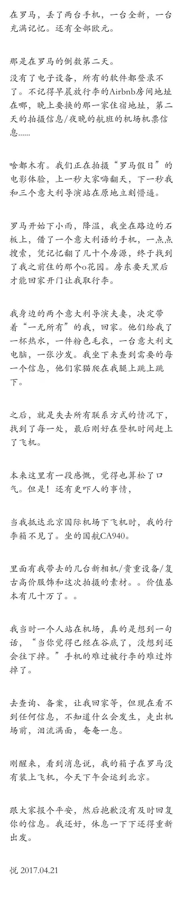
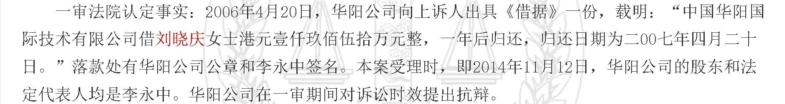
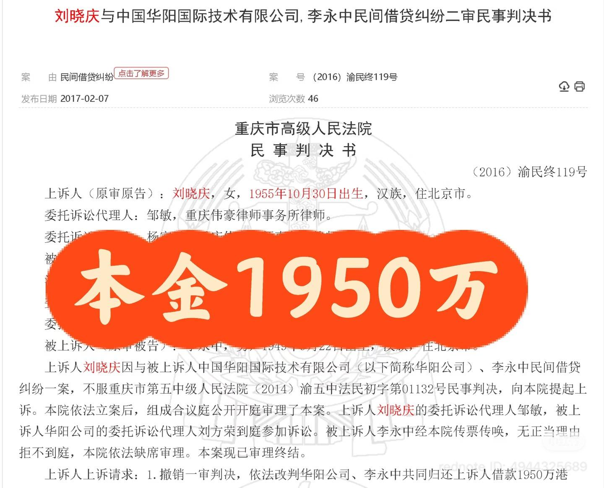
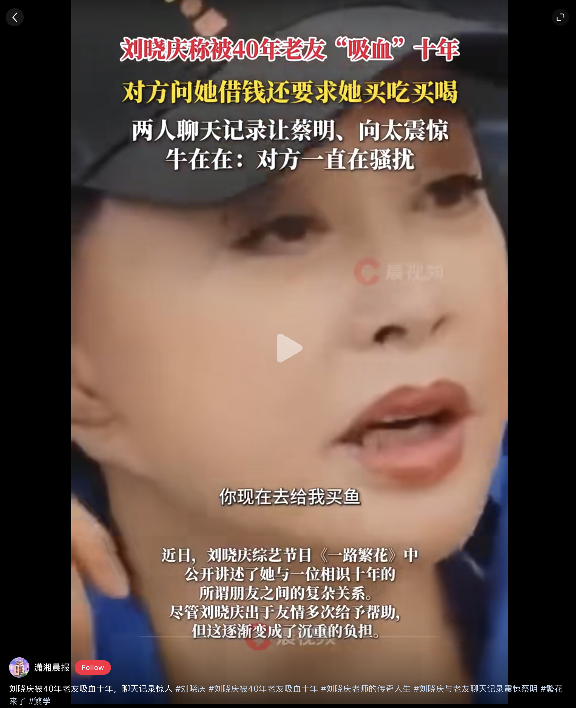
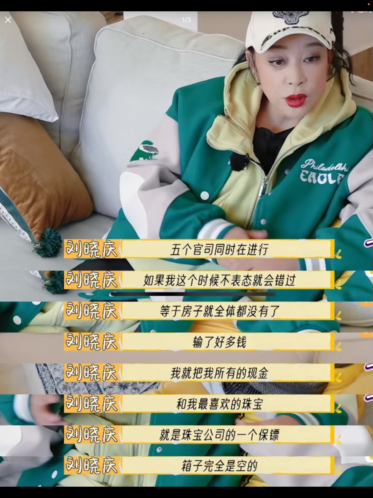

# 朋友向你借钱，要不要借？

> 来源：知乎专栏「张雪机车 | 极致热爱」
> 作者：耿悦

张雪的热爱、勇敢、纯粹、专注和韧性，我都很喜欢，但他借钱这件事已经超出了我的认知。

昨晚看了《面对面》，今天醒来这个问题还在脑子里转，就想写一下我的想法。

他借钱太疯狂了，没想到他能那么能借。

我个人有个原则：不会给朋友借钱，也不会问别人借钱。

并不是洁身自好，就是我经历过借钱那种非常微妙的处境。

会说明原因，也会举一些例子。

曾经给朋友借过钱，这种事会让你从两个无话不说的朋友，突然心生间隙。

在你的价值观里，钱完全比不上我们的友情。

大家都在异国他乡打拼，谁突然遇到急事，帮 ta 度过难关，理论上很正常。借钱帮朋友，就是要让这个友情延续，遇到难处雪中送炭。

但我的真实经验是，反而因此失去了很好的朋友。

我真的在生活中失去了两三个非常好的朋友：

一个是彻底不联系了。另一个是虽然有联系，但就有点尴尬。

这种感觉很差，因为原本你们是可以非常放松地聊一些有共同兴趣的话题。

钱能毁掉你们非常珍贵的东西。

如果你想让一个人跟你绝交，或者失去最好的朋友，你最好就借钱给对方，或者向对方借钱。

这是我的个人感觉。

但是这个事情你要是没经历过的话，你就永远没有这种感觉，只会直觉地认为：在你的印象当中，钱借了就是会立刻还的。

但其实借出去基本都是很难回来的。

即使你们之后避而不谈这件事，气氛也会就此改变。

包括在这个问题里这么多的答案，网上你都能看到很多亲身的例子，

朋友借钱这件事，大概率还是会闹得不愉快。最后两人反目成仇，多年的友情因为借钱断交。

所以你看，借钱不仅帮不了别人，反而会毁掉一段关系。

与其最后撕破脸，不如一开始就坚决拒绝。我经历过后就觉得，那种拖着的泥泞感很消耗能量。

我想了一下，张雪造车是工业事业，难度太大，因为造车确实烧钱：

需要买配件

需要工厂和场地

需要工程师和这么多员工

维护管理的无数环节支出

这些无处不在的投入，都是巨大的烧钱机器。

研发要大量投入，而且不一定每次都能成功，前面可能有大量失败，这些统统都是钱。

况且他不是只做个小摩托车厂（那种小富即安的），他要做世界冠军，做特别好的车，那投入就不可能是作坊式的。

所以他能到处借钱到很夸张的程度，我能想明白这个逻辑。

相比之下，我们平常上个班，或者做独立工作的这种模式，简单很多。

但之前在知乎写过，觉得要账是我工作过程中最难、最痛苦、最排斥的的一个环节。

钱非常难要回来，哪怕我有工作热情、工作能力、敬业精神，但我们这行很多都是做完之后，会经历一个长期的结款期，时间长了对方就开始赖账。

这种感受和借钱给朋友有些相似，从很信任，到拖拉，然后失去信任。

我丝毫不害怕创造，也能尽情燃烧，

但我害怕的就是不付钱，或者说并没有给你支付对应匹配价值的钱。

我在知乎上也分享过这种极其痛苦的要账经历，到现在还有好几笔钱没要回来，其他地方也还有一部分。

对一个自尊心强、完全不想在琐事上浪费时间的作者来说，真的非常难受。

我之前写过，大部分的环节全部交完、从无到有交付完之后，「工作」对我来说才刚刚开始，那就是要账。

因为前面是我热爱擅长的部分，做起来并没有多少心理难点，最多就是工作量大小、时间 Deadline 紧张这些可以调节的压力。

但一个是给的钱少，另一个就是要钱结款，这是我的一个痛点，相信所有做我们这行的都经历过。

明明道理在你这边，但你却要完全换一种心态去问。当然长期合作里有非常爽快的公司，他们的机制和系统很好，这对你来说就是顺畅的。这是大概率的。

我们的工作再怎么有难度和挑战，相比于造车造飞机这种复杂的工程，产出过程相对来说还是难度低一些。

就拿我自己来说，我当时环游世界，旅行的花费相比正常本地办公也是昂贵的，在路上的分分秒秒都在燃烧钱，特别是几乎都在国外。

但我这个环游世界的旅行梦想，是靠自己一边工作一边实现的。

我一上路就在做付费的拍摄和内容工作，和品牌合作，属于一边工作一边旅行。因为热爱、擅长，收入还不错，能支撑我继续路上自由探索。

所以我昨天在想，虽然我也说要追求自由，但看了张雪的故事，我突然意识到：在借钱这件事上，我可能还是太保守了。

相比他来说，我们这些人在面对如此大的风险时，还是会本能地选择安全。

这里面最重要的一点是，我的"心量"做不到那种欠了别人很多钱，比如百万，还能睡得着觉。

比方说，你上路的时候，整个状态应该是一个装满的油箱。

但如果你借了别人的钱，或者对不起了某个人，你的能量在泄露，油箱就漏了。

漏了之后，整个人就处于一种"跑油"的状态。对我来说，那样我就无法专注了，我追求那种"劲往一处使"的心流。

但也可能，比如说你有很多来自四面八方的支持，钱对你来说源源不断地流动，托举你的梦想，那你其实就跟打游戏一样也不用操心金币的事情，能够更好地升级，结果可以获得更多金币，而不是匮乏，那也很好。

我旅行中不得不跟人借钱，只发生过一次。

那次在欧洲，钱和手机都被偷了。回国的时候已经筋疲力竭，结果我的行李箱没有上飞机。里面装着当时带的服装、一些设备，是要拿去拍广告的，价值大概几十万。

当时的记录，朋友圈图片：

我的钱包和通讯设备全都没有了，在机场失物招领的地方给朋友打了电话，想先问她借个手机用，说了境遇。

朋友来的时候给我带了几万块钱，和一部手机。

因为我们当时都觉得那几十万的东西不会回来了，就丢在了欧洲，得面对给客户进行一些赔偿的准备。

倒时差睡了一觉后，国航打电话说行李给我装上飞机了，下午去取，也就意味着没有经济损失了——

即使是朋友主动帮忙，但事情悬而未决时，我想到要背负这个旅行事件的负债，心里还是有种油然而生的压力。

张雪真的不是一般人，他在借钱方面有巨大的天赋。

看到他笑着说，借钱把员工工资发了。我们是很难的，但没事儿，困难都可以解决。笑着说自己是亿万负翁。

就在想这人心怎么能这么大，几千万说出来超级自然，好神奇。

他还说为发工资借过高利贷，好吓人。但央视都给放出来这部分采访了，说明这是他创业无法遮盖的最难的事。

这就说明了，小的创业公司走到今天极其艰难。

做实事的人要借钱发工资，那些纸面上好看的虚的 PPT 反而能拿到很高的经费。

对于他借钱这个事情，我相信，他不是没有信誉的那种借，

他是有技术、有战略、有技能储备，能做出很好质量的车。

应该是万事俱备只差钱，不然也不会那么多人凑出500万借给他，

但我很好奇，他为什么能借到那么多钱？

我看到星姐（张雪妻子陈星伊）有个手写账本，

从 2013 年记到 2017/18 年，密密麻麻记录着每一笔借款和还款。

单笔金额从几千到几万不等。

这些借款几乎全部来自星姐的娘家人——妈妈、小舅、大姑、小姑。没有合同、利率或还款期限。

账本由星姐细致管理，还款后画勾或小心心。

张雪在采访中说，他甚至不太记得自己欠了多少钱，借了多少账。这些账，都是星姐细心在管。

这些钱用来维持事业运转、购配件、开模、申请专利、发工资和日常生活开支，甚至包括为 20 元饭钱发愁的窘境。

除了娘家亲戚，最大的一笔亲属借款来自张雪母亲何琼。

她抵押房子贷款拿出 55 万借给他。

她说："我懂机车行业特烧钱，却仍愿为他的梦赌上家当。"

一路遇到不少困境，张雪造的车被模仿，需要 30 万开模申请专利，不得不四处借钱。

这笔钱用于支持他造车、开模、申专利、研发等高投入环节。

母亲何琼明知机车行业"特烧钱"，却仍抵押房子拿出 55 万，说明在她心中，儿子的勤奋和坚持值得押注。

前篇里提到的他妹妹张娅，毫不犹豫拿出准备买房的首付，帮哥哥走出创业的前几步。

当时张雪的业务还不稳定，经常入不敷出。

张娅辞掉了镇上稳定的工作，直接搬到重庆，进了哥哥的公司。

一边帮忙打理业务，一边还要四处借钱补贴公司的资金缺口。

最难的时候，她因为还不上借的钱，被人堵在办公室里讨债。

有人笑她："你傻啊，干嘛为你哥折腾成这样？"

她很平静："这是我哥，我不帮他，谁帮他？"

除了家人，还有昨天写的师傅牙哥。

牙哥回忆，张雪多次在讨薪失败、没钱吃饭、研发遇阻时打电话或当面求助："师傅我这边撑不住了。"

他则多次主动说"我再帮你想想办法"，几十次慷慨解囊，并帮他追回被加工厂拖欠的工程款。

牙哥说投资的是他的未来，他和张雪是极致热爱的同类人，更看中他"不跑、不躲、肯死磕"的性格。

牙哥是让项目不至于夭折在早期技术攻关阶段的关键人物。

更神奇的是车友圈。

大概 2010 年代中期，论坛和 QQ 群是张雪非常重要的舞台。

他长期在群里回答技术问题、分享改装经验，大家都觉得他是"懂车的朋友"，技术大拿。

后来他需要钱的时候，就在 QQ 群里公开说要借钱做车，以一瓶机油作为利息。

这个"一瓶机油利息"其实挺有意思的，就是一种象征性的东西——如果你产品不行，这利息也没啥吸引力；但如果你产品好，这反而是种专业背书。

他借款的时候会明确写出用途，让车友知道"这笔钱在造什么"。有些车友甚至是买他车的客户，借钱给他本身就是一种支持和认同。

后来张雪夺冠了，很多车友提起"当年借过他钱"都觉得特别自豪，就像自己也参与了这个传奇一样。

最让我震惊的是房东。

我看到网上有人说："现实中估计人格魅力爆表，你能跟房东借钱还借这么多的估计没几个，我从未听说谁创业跟房东借钱的。"

我也是，我真的服了。

2025 年 2 月，公司发不出工资，张雪到处找人借，包括朋友、同行、供应商，最后还向房东借了 100 万。一共借了约 700 万，把工资发掉。

房东一次性拿出 100 万，这明显超出普通房东"只管收租"的职责了。更像是对"这群人很拼"的情感认同。

张雪对房东坦白说明公司发不出工资，需要 100 万周转，并强调业务的前景和即将开始的交付。直到 3 月发布会开完、开始交付、经销商保证金与供应商账期形成资金池，情况才好转。

如果那次现金流断档撑不过去，后续 WSBK 冠军、浙创投 9000 万 A 轮都无从谈起。这 100 万是真正的生死线。

到后来，最近两年，张雪也开始接触正规的投资机构和银行了。

这时候就不是"借钱"了，进入了标准化的项目融资——路演、尽调、正式谈判，由投资机构内部决策。

投资人在访谈里提到，他们在张雪身上看到的是"专注、热爱、韧性、能死磕"这些人格特质，加上对产品的理解，让他们认为这是可以与海外高端品牌正面竞争的机会。

报道还提到，张雪在创业过程中多次砍掉不赚钱的产品，把有限资源集中到核心车型和发动机研发上，这也是投资人愿意投他的原因之一。

但不管是早期向亲友借钱，还是后来拿到正规融资，张雪有个原则一直没变："欠多少写多少、还多少划多少。"

他在接受采访时自嘲"以前欠了一屁股债"，但同时强调这个原则，把它看作信任与责任的体现。

高兑现、透明沟通、适度借款不过度透支，这些是对所有创业者都有参考价值的。

看到这里，我突然想到了之前看电影《流浪地球》的幕后故事。

郭帆当时也是到处"化缘"，被吴京笑称"骗子"。那种为了一个大项目到处借钱、到处找人帮忙的状态，和张雪有点像。

我记得当时很喜欢看《流浪地球》的幕后，有些印象特别深。

发现郭帆和张雪身上有个共同点——

他们都属于那种”哪怕啥都没有，也能立刻开一家公司，还能吸引各种能人帮忙”的人。

他们能吸引到别人帮他们找钱、帮他们做事，一起去赚钱。

我在想，是不是成功的创业者们，身上都有这样一个特质？

是一种”让别人看到你在拼命，然后愿意跟你一起拼”的凝聚。

虽然有画大饼的嫌疑，但也真的在践行，不是在空口承诺，你已经把能做的都做了，现在就差这临门一脚。

这种时候，别人帮你，不只是因为相信你能成，也是因为”如果这事儿黄了，我也觉得可惜”。

《流浪地球》从一开始就是个高风险项目。

国产硬科幻，业界都觉得悬，投资方不敢大规模投钱。

结果拍到 2018 年中后期，主要投资方之一撤资了，资金链一度接近断裂，剧组面临"停机甚至黄掉"的风险。

这时候项目已经开机了，大量布景都搭好了，巨额成本已经砸进去了。

撤资意味着前期投入全打水漂。

这时候，郭帆找到了吴京。

最开始，郭帆找吴京的理由很简单——"就是让我来客串一场戏"。

语气里带着"很惨、很需要帮忙"的状态。吴京想起自己当年拍《战狼》时到处求人帮忙的日子，于是答应来演。

真正的转折点，发生在酒桌上。

在后期资金越来越紧张、投资方撤资后，郭帆在饭局上向吴京倾诉剧组的困难：钱不够、场景搭了、工程量巨大、如果停机就全毁。

吴京看到郭帆"像当年的自己一样"——精疲力竭但仍硬扛。

这种"过来人"视角使他更难袖手旁观。

他去片场看了，看见剧组的人如何拼命，让他感受到"如果这事黄了，我也觉得可惜"。

这不算是很理性的商业决策，但是在人的情绪、信任、愿景在高压之下集中爆发的场景：

导演坦陈"要散了"，演员/朋友说"那我来顶一把"。

最后，吴京自掏 6000 万投入这个无人看好的科幻项目，并分文不取片酬。

为什么敢投呢？

吴京后来说自己"算是为中国科幻电影尽一份力"。

郭帆在沟通中并没有简单承诺"票房一定好"，

而是强调"这是一件值得做的事，即使失败了也有价值"。

吴京曾为《战狼》抵押房产、几乎"孤注一掷"，深知很多类型突破都是靠"有人先赌一次"完成的。

他看到了项目已经实实在在搭起的工业基础、现成的硬件投入和导演的专业程度，认定"这不是空话项目"。

郭帆实质上是把"风险"，转化成"共同承担的命运"

——如果项目失败，不只是郭帆输，"我们一起为中国科幻交学费"；

如果成功，则一起建立行业新范式。

对一个已经成功过的创作者来说，这种"参与一次里程碑"的心理价值，往往足以抵消部分财务不确定性。

正因为不确定，所以一旦做成就是里程碑；

失败也能给后来的科幻电影者提供经验、铺一段实实在在的路。

这笔投资，改变了两个人的关系。

随着《流浪地球》系列的成功，两人共同站在"中国科幻代表人物"的舞台上。

把风险叙事升级为"共同完成一件有意义的事"，让对方的回报不只是金钱，还有身份、荣誉和心理成就感。

他们都对自己All IN的这件事有很深的理解。

《流浪地球》是中国电影工业第一次真正意义上的硬科幻工业化尝试，是"为整个行业铺路"的项目。

制作需要真实的、工业化的布景和特效流程，从概念设计到结构建模再到数控编程、激光雕刻等，极其耗费资源。

如果中途缩减规模或停机，前期搭建的大量东西全部报废，

不仅是钱的问题，还有"错过中国科幻工业窗口期"的问题。

国产科幻不能永远停留在口头上，总要有人先冲出去试一次。

写到这里，我突然发现郭帆和张雪身上有个共同规律。

这些帮他们的人，除了亲属的托举，

也不能算传统意义上的"老朋友义气"，

更像是一种"创作者认同+专业尊重+共同价值观"的组合。

这些人其实是在投资他们的未来，投资一份梦想和希望。

毕竟，你平常把钱花在一些很无聊的事情上，投资理财也很有可能亏损涨跌，

和你投给了一个世界冠军的梦想，这两者的成就感，那就是不可同日而语的。

真诚的长期互动、共同的工作经历，人品在高压下的见证，这些成了高风险合作的保险；

临时的商业演示，很难替代这种"共苦"建立的信任。

写到这里我梳理出了为什么这些人敢于借钱，大家愿意给他几千万的钱去投资，

我在想，也许做大事就需要这种能力。

也许大部分人，包括我就是为了晚上能睡一个很好的安稳的睡眠，还是选择了不要太找事，就觉得我目前就做力所能及的事情，尽量做好。

但如果做大事，这种能力也许也是需要的，是不是？

就是那种世界级别的要管理无数个人的巨型项目，或者说已经有了足够的探索，有钱让你放手一搏，不至于夭折，

只要你在尽力做项目，最后大家能共享荣光，是值得投入的方向，也许就是靠谱的。

他们为啥借钱呢，是要去炸开前路，换取高无数倍回报的注意力、试错权和可能性。

比如天崩开局的张雪，通过这样的叠加折腾，反而上限完全没有封顶了。无限向上的，给炸开了。

创业、投资、跨界、探索没有地图的世界，充满了混沌和末知。

但恰恰是这种未知、不确定性，混乱是上升的阶梯，逼出来了真正的极限。

我又想到刘晓庆，

我喜欢的永远朝气蓬勃、生命力旺盛的她。

其实在看《一路繁花》之前，我觉得刘晓庆是天花板级别的女性，既能挣钱又活得洒脱。

但看完之后我发现，她其实在反复不停受伤害。

她有不少官司缠身，其中好几个都是民间借贷。

庆奶这些年借出去的钱，有不少完全没要回来。

2005年，庆奶借给一家公司250万，借期一年，有借据。

到期后她说电话、口头催过，但没留证据。

结果她2014年才起诉，一审、二审都败诉，理由是超过诉讼时效。

还有一笔更大的，2006年她借出去港币1950万，也是因为没及时追账，过了诉讼时效，惨遭败诉。

图片来自小红薯的律师分享

2006年的2000万是什么概念？

要知道，庆奶2004年税案才宣判，公司被罚710万，她名下19套房产拍卖掉661万补交税款，财产基本归零。

2005年，她就借出去250万。2006年，又借出去近2000万。

从法律上说，败诉没问题。从道义上说，真的很难评。

图片来自小红薯的律师分享

庆奶有精彩丰富、望尘莫及的人生，但人情上就是一路荆棘。

她真的很容易因为”过度信任”他人，而导致自己身陷困境中。

她对家人非常好，家人却把她重伤。

保安弄走了她最喜欢的珠宝和现金。

信任年轻的男朋友，陷入负面新闻。

信任朋友，那个朋友十年来一直指使她，肆无忌惮地向她要钱，甚至到现在她还说只要自己有钱就一定会给对方。

你会觉得，她虽然是一个强大的人，却没有任何外在的保护。

为人仗义，非常慷慨，但反复被人背刺。

就像你抱着一堆金子，非常张扬地走在没有任何保护的街头。

那么你再有能力、再对人好，也一样会被抢得一干二净。

人性如此。

所以她上节目的时候说养老金都没了，但本领长在身上，还可以凭自己去挣。

出来大量工作，拍短剧还熬夜，上节目摔了一跤。

看到这些新闻，都为她感到担心。

她还乐呵呵地在机场健步如飞，奔来跑去。

还是会佩服她。但在我们看来无所不能的庆奶，

她为啥不会保护自己呢，

观众当然喜欢看她营业露面，但她本身是那么富有呢，

为人善良、真情义，但不设边界感，让人看着很心疼。

所以说，张雪的成功故事，你不能啥都学，要辩证地看。

在看他的时候，我觉得他的热情和对事业的热爱是和我同频的，有一些激发。

他那种朴实、真诚、实干的特质，没得说，棒呆。

他的热爱、他的纯粹、他的一往无前，这些东西是可以学习的，是当代社会的清流。

但有些东西，你确实搞不定，那就真的别硬学。

大部分人借钱可能就是万劫不复。你可能一次信贷或者一次欠款，就永远活在这个阴影里了。

关于信贷和贷款这些，千万别碰，提前消费之类的也别碰。

当然，如果你极度需要，或者有本事快速还清，对你的心态毫发无损，那可能有极端情况。但最好别碰。

我觉得大部分人碰了以后，就会进入一个恶性循环或深渊。

我们要学的，是在有能力的同时，也有保护自己的能力。

不给任何恶意的人和事可乘之机，这是对自己负责，也是对真正爱自己的人负责。

写到这里，我突然想到一个事。

你我不需要像张雪那样借几千万，背负如此高的压力造车，圆梦。

但你可以用自己的方式，在自己的领域里，建立起属于你的"车间"。

在这个时代，AI 的妙用，你完全可以建立起自己的"电子工作流"，可以找到AI时代属于自己的位置，清醒、独立、自由。

我后面会推出一些 AI 产品，可以改变认知，加速行动。

让我们可以很低成本地试错，去尝试把不可能变成可能。

不确定性不是敌人，它是电光石火，是提高生产价值、生产效率、财富和可能性的地方。

总之这个事情颠覆了我的认知，它一直在大脑里，就写出来。

4.16 新写

我是理想主义者，但这个世界确实也没有很理想，所以你才觉得他们稀少而珍贵。

但也会奉劝那些不值当、没必要的消耗。

比如刘晓庆，如果她的有限的精力，都用在表演、和她热爱的事情上，

而不是不停地不得不打那么多官司（这个对于律师团体来说除外，不断打官司是Ta们的工作嘛）、在各种琐事上浪费消耗大好年华，那该多好！

她拖了那么久没有起诉对方，估计一个是信任那些人，一个是下不了狠心那样对ta认为的朋友吧，还有就是觉得需要耗费很多时间。

就像不给庆奶还钱的人，在乎她如何想和辛苦吗？

她七十五了去短剧熬通宵，对身体会没有磨损吗？

但那些人根本就是不还。

她只是渴望被爱，而那么多人就此辜负她。

我后来想到，我们这样问：她为什么不懂得保护自己？

但这就像一个女生被欺负，你去问她"你为什么这么漂亮？为什么要打扮得这么好看？你为什么要走出来见人？"

你不去指责伤害她的人，反而责怪她自己有问题，她不够小心。

她只是倒霉碰上了。

刘晓庆所谓"时代没有赶上她"，这么一个引领时代的女人，却被亘古不变的人性，像靶子一样多次无情地伤害。

被伤害成这样，现在还笑颜如花，就是因为她不仅引领了时代，也战胜了人性。

这就是两种借钱的对比：

刘晓庆借钱出去，是信任被辜负，是自私险恶的人，压根配不上她。

张雪、他师傅、郭帆等人，他们借钱是为了共同创造价值，是共赢。

我写的这些人，他们身上有个共同点：

他们都在奋力做着一件"值得做的事"。

赚到钱也就只是结果，是行动和时间累积之后的必然。

专业的冒险者，有专业、有技能、有不可替代的东西。

实干的梦想家，有准确的方向，真正的行动，而且乘以时间、趋势、土壤。

所以那些帮他们的人，投的不只是钱，投的是未来，是梦想，是希望，

是相信有人在这个世界上能够创造奇迹，是我站在了我相信的这一边。

这种关系，是共赢的，是共同创造价值的。

而不仅仅是单方面的被消磨消耗，和利用。
