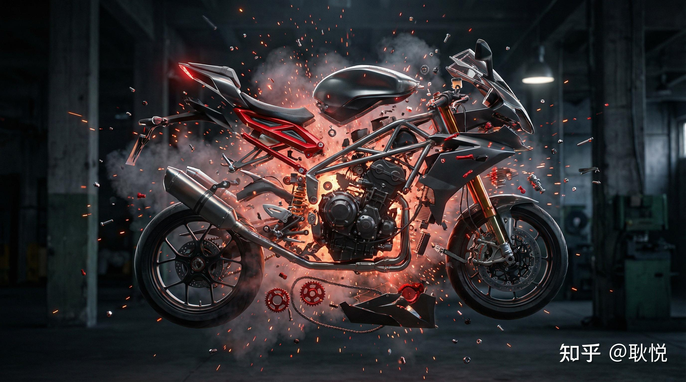
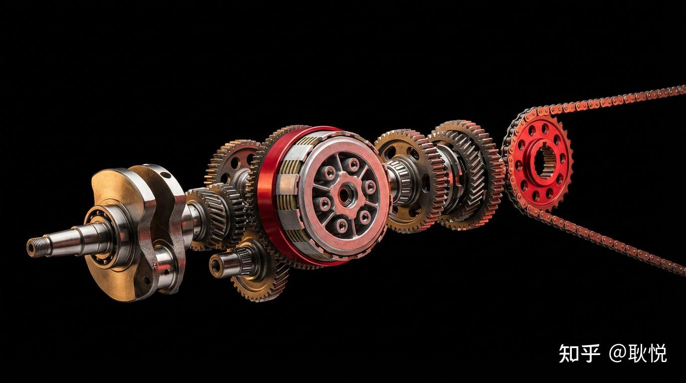
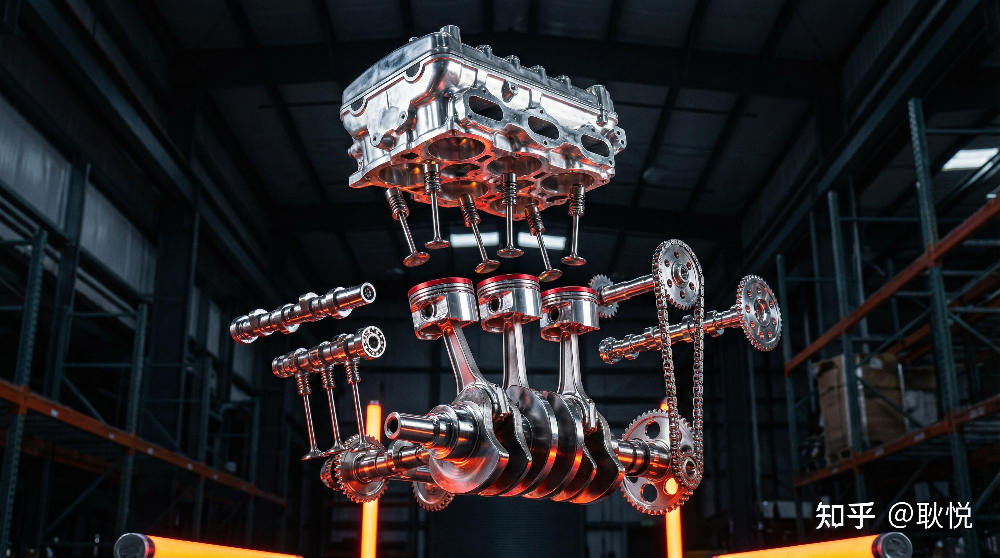
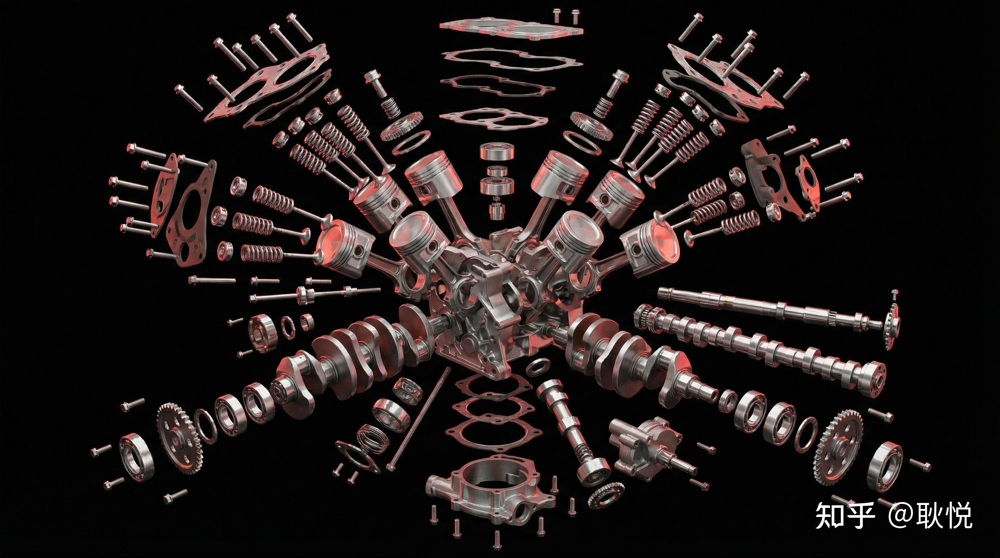
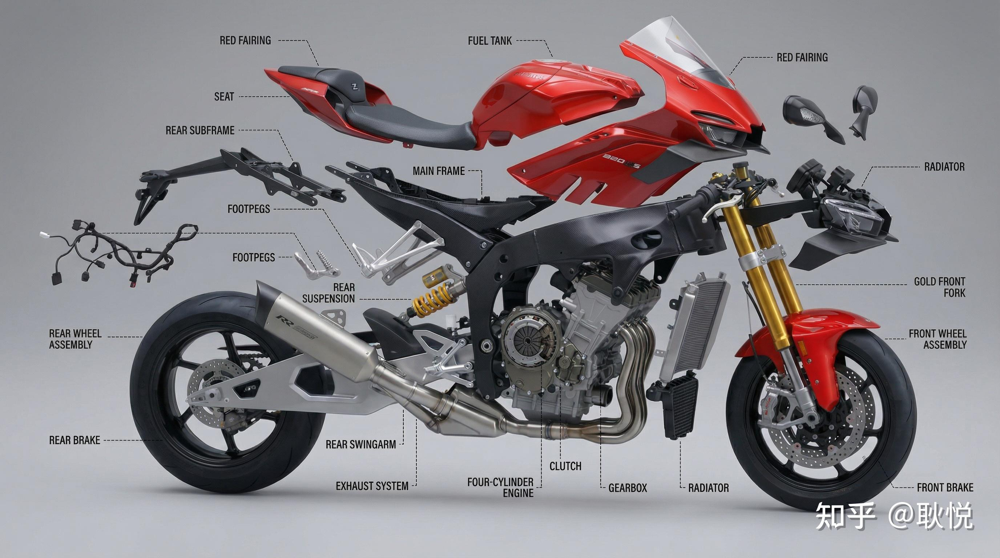
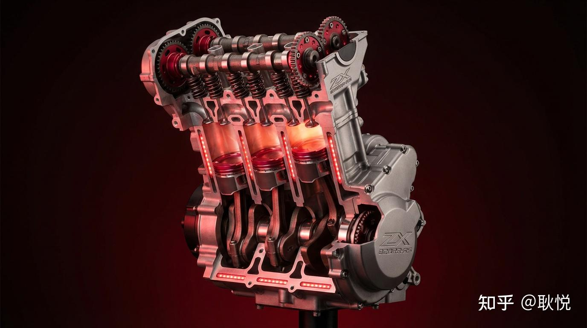

# 张雪机车发动机怎么做到这么快造出来的？

> 来源：知乎专栏「张雪机车 | 极致热爱」
> 作者：耿悦

发动机，是张雪的执念。

此生必须造就的，不做不休。是他认为的国产摩托车的命门/天花板。如果不能做，就不要玩了。

写到这里我才真正意识到，张雪最在乎的，原来一直都是发动机。

回头看那场让我们振奋的比赛，你就会明白，“快”到底快在哪里。

弯道里一度落后，可一进入直道，前面两辆雅马哈，他直接“生吃”。

直道上拼的到底是啥？

说到底就是拼发动机。

Explosive view: 820cc inline-three engine architecture

功率够不够强，转速能不能拉得更快，出弯之后动力能不能接上。

能赢不是靠运气，靠的是发动机的硬实力，把车速硬生生顶上去。

那个超速，从第三飙到第一，关键时刻就是发动机起了决定作用。

发动机就好像武侠里最致命的武器。

那么张雪为它玩命折腾到什么程度？

他在各种不同的对话里都在说这件事。

Core assembly: the heart of performance

他反复说“发动机是摩托车的心脏”，直接决定性能上限。

尤其是赛用发动机，是材料、设计和精密制造的综合天花板。

只做车架、外壳、调校，永远在别人给定的天花板下活动。

他不甘心只当“调音师”。

他讲得很直白：

”没有自主研发的发动机，永远只能做组装厂，永远被国外品牌卡脖子。”

这是他在产业链一线的切身感受：关键件在别人手里，价格、供货、技术路线都受制于人。

Precision assembly: complex systems built from countless components

投资人提到，最打动他的，是张雪”凭听发动机的声音就能判断问题并做出改进”的能力。

这种能力没有虚头巴脑的花哨，靠的是多年修车、改车、比赛、做整车一点点打磨练成。

他是从修车铺拆旧发动机一路走上来的。

最早接触、理解最深的就是发动机这个部件，对”心脏”有一种本能的亲近感和控制欲——”我闭着眼都能装起来”的熟悉。

在越野赛、拉力赛和后来做整车的过程中，他反复体验到：

关键时刻是发动机的能量——能不能冲、冲多久、冲得稳不稳，全看心脏行不行。

这人对失败的包容度无比地高，完全不怕试错：

想到就干，错了就重来。这种性格会天然往”最硬的骨头”上撞，做”要在最难的地方赢一把”的人。

自研高转速三缸发动机、冲击WSBK，本身就是把目标选在世界级最难赛道。

发动机，就成了张雪实现壮志雄心的核心战场。

在他看来，如果中国品牌要在全球长期站住，不掌握发动机这种核心技术，只靠堆配置、拼价格，是站不稳的。

于是选择坚持原创路线，绕开欧美日专利壁垒，把核心部件高国产化率做在中国自己的供应链上。这里面有很强的”技术尊严感”。

为了发动机，他愿意把一切押上。

All-in: betting everything on the engine

在凯越时，他坚持要做发动机，和股东理念不合。

他提出：可以自己借钱研发，成功了归公司，失败了自己背。

但最终，公司还是没有同意这条路线。

凯越对他来说，不只是工作过的地方，几乎像亲儿子一样，是他上半生能力、经验和心血积累出来的作品。

但他想做真正属于自己的”心脏”。

于是2024年，他选择离开，净身出户，放弃35.88%的凯越股份。

裸辞重新开始，也要去做发动机。

正因为他认定发动机必须做，才会走到离开的那一步。

对张雪来说，“国产车有没有一颗自己的心脏”比短期利润重要。

即便呆下去，不断能有爆款车，也能够挣钱，但不是他想要的。

自立门户后，他把所有身家砸进发动机项目里。

抵押资产、个人筹资，拉新融资，带着一身压力起步，他提供设计方案、技术参数、性能要求，找隆鑫通用（动力系统）、银轮股份（热管理系统）、鸿泉技术（电控系统部件）、长盈精密（轻量化结构件）等国内顶尖供应商落地制造，

自己带着团队反复调校、测试、验证，推翻，重来。

这种”把人生All in在一个零件上的”程度，是一场要么赢、要么不做的战役。

发动机这件事，对张雪来说不是普通零部件，是核心、灵魂，是整台车真正的”心脏”。

他最执着的东西，其实一直都不是某一场比赛、某一波流量，甚至也不只是某一台车，是发动机本身。

在张雪的判断里，发动机是摩托车领域的命门。

Breaking point: leaving everything behind for the dream

那为什么能这么快呢？

他不是从0开始搞，只是从0开始“自己当老板搞”。

很多人会误以为：张雪是不是2024年才突然开始搞发动机，结果一两年就搞出来了？

其实不是。

前面十几年，他一直在用别人的发动机、拆别人的发动机、围着别人的发动机做整车。

决绝挥别了凯越，在2024年之后，自己再从头开始，正式创立张雪机车。

他不再是”在现有平台上尽量把发动机调好”，

开始”从一开始就围绕一颗发动机构建整台车和整套供应链”，把十几年的经验全部押到自己的三缸平台上。

你可以把它理解成：

你看到的是”这本书只写了两年”，但实际上他为了这本书已经长期锻炼，打了十几年的草稿，最后再书写。

Deconstructed: 20 years of experience, 2 years of execution

发动机当然是极其复杂的系统，但它不是凭空出现的奇迹，是长期经验、成熟供应链和资源集中投入一起砸出来的结果。

真正关键的，不只是他个人技术高，是“人、产业、时代”刚好对齐了。

至少有三层东西叠在一起。

人的层面：

张雪是极少数”自己修过车、参加比赛、工厂力量、又做过产品线和公司”的复合型人物，既懂车感，也懂工程，和市场，而且传播的能力太牛了。

他的执念也很极端，愿意把绝大部分资源砸在发动机和底盘上，不是先追求更安全的商业回报。

很多人懂技术，但不敢把公司压在一次发动机豪赌上。

产业的层面：

这几年，中国本土的机加工、铸造、精密制造供应链已经成熟到能支撑高性能发动机的地步。

一大批给汽车、摩托配件供货的企业，具备了这种项目需要的能力，成本还远低于欧美日。

十年前，就算有人想做，配套跟不上。要么造价吓人，要么精度不过关。

规则和市场的层面：

世界超级摩托车锦标赛的技术规则，给了中排量三缸一个窗口。

国内市场对中大排量国产车的接受度和支付能力也上来了。

有人买单，才有持续砸研发的可能。

张雪突破的，其实是一个很少见的交集：

他个人经历刚好把”车手、修理工、工程师、产品经理、个人IP、企业家”这几种能力串了起来；

中国制造业发展到能给他提供高质量零部件和成本优势；

赛事规则和舆论环境又给了国产品牌一个被放大的机会。

前面十几年，他一直在为这件事打基础。

只不过之前是在别人的公司里帮别人积累，

2024年之后，才终于变成集中火力做自己的发动机。

也不是之前完全没人想做，是以前缺人、缺钱、缺供应链，也缺规则窗口。

到他这一代，刚好人、产业、时代都对上了，他就成了那个把门推开的第一批人之一。

Breakthrough: the first to push the door open

回到那场比赛，你就会明白，这场胜利归根到底赢在哪里。

820RR-RS用的是819cc直列三缸水冷发动机。

比双缸更能拉高转速，比四缸又保住了中低转的响应。

在波尔蒂芒那种高低起伏剧烈的赛道上，出弯以后动力能更快接上去。

为了让这颗”心脏”真正跑起来，张雪机车在轻量化和强化上下了功夫：

钛合金气门、钛合金连杆，降低往复运动的惯性。

红线转速拉到15250转，峰值功率150马力。

赛车版大量使用碳纤维覆盖件，副车架、凸轮罩盖、油底壳都做了轻量化处理。

避震系统换成顶级调校，卡钳用的是布雷博竞技系列。

Technical specs: 819cc inline-three, 150hp @ 15250rpm

整车干重降到160多公斤，满油状态也就175公斤左右。

比市售标准版轻了20多公斤。

这种推重比的提升，让德比斯能在每一圈都拉开距离。

弯里稍慢一点，直线段靠动力就能把对手“吃回来”。

这就是葡萄牙站第二回合里，德比斯失误后仍能在直道上“生吃两台雅马哈”的底气。

从核心发动机、关键零部件到整车调校，全部自主国产化，勇夺双冠王。

张雪反复说，

发动机就是国产摩托车的命门。
没有自己的发动机，永远只能给别人打工。

十四岁开始摸车，快四十岁制作出爱车的心脏。

两年看似快，二十年磨一剑。

这是张雪的离职信，

The resignation letter: choosing the harder path

而他，真的追求到了属于他的星辰大海，和未来。

The journey continues: reaching for the stars

配图说明：被张雪激发了想象创造力。这篇是我用AI做的创意图，非实际产品图。
