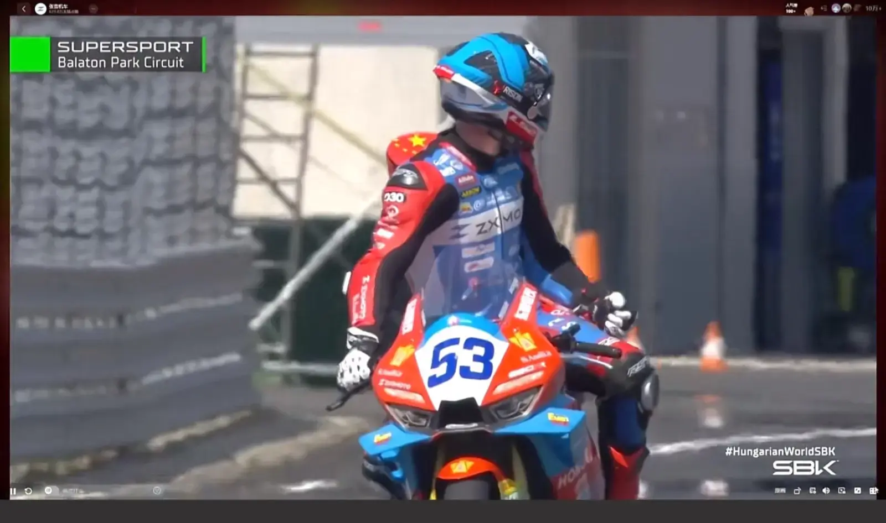
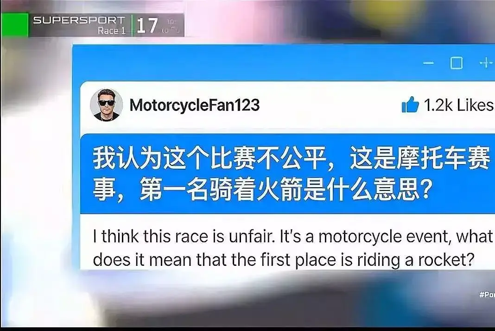

# WSBK 匈牙利站次回合张雪机车德比斯突然丢失动力遗憾退赛，具体出了什么问题？

> 来源：知乎专栏「张雪机车 | 极致热爱」
> 作者：耿悦

## 01

从帅爆的夺冠，到遗憾分站退赛，过山车的心情我懂。

网友估计有一些和我一样，准备好了吃的喝的。

啤酒好菜，准备等着赛事一起开整，结果发现咋刚跑两圈，就停下来了呢，还退赛了呢？……

那个失落感，对比反差过大，我这啤酒还为啥喝呢，

这比赛就变得索然无味，

主要是观看体验一下子就下来了，

德比斯不在里面跑，就感觉好像和自己没啥关系，雅马哈瞬间又垄断在前头就失去了乐趣你懂，

## 意难平！

感觉5月2号那一天的比赛，好多人其实没看，或者随意点开看了，但是没想到冠军了。

第二天就做好准备，正经八板坐在大屏幕前面，准时点开，各种吃的，非常有仪式感，

我看还有人开赛前吃好了降压药，hhh，**怅然若失，无法接受。**

主要是这个情绪波动太大，让人天上一下地上一下的，无法消化。

但是网民现在素质，在评论区看的还挺感动，竟然都在安慰和鼓励德比斯。

张雪回应的好快哦，

## 02

之前在知乎曾经看到过摩友说，大部分摩托车品牌，很大的品牌、很贵的车，即使出了问题，也不是很爱回复具体问题，处理起来磨磨唧唧的，遮遮掩掩的。

要么来一堆不痛不痒的公关话术，根本不走心，要么问好多轮才有点表示，不情不愿改一点。

我们在不同的领域都经历过，看到一个事不符合你的判断、认知和期待，然后等了半天，就来一个掩耳盗铃、无伤大雅的回复。客服装死，一堆糟糕记忆。

张雪这种坦诚，直面问题，有啥说啥，还是动人的。这是一个很好的体验。

刚出现问题，直接录制视频，给大家说啥情况，车手那边也非常诚恳。

没有任何遮掩，回应那么快，没有公关话术，就是技术的复盘。

老板和骑手各自揽责都不推卸责任，

一个说我的车机械故障所致，一个也是在各种反思自己每一圈骑行的问题。

如果出现错了就认，坦荡告诉你，然后立刻改进问题。

## 03

**科普部分来了，这部分可以不断拓展新知。**

机械故障在极限运动赛事里很正常，来了解一下：

**MotoGP/WSBK这种顶级赛场里，**

**机械故障、引擎问题、传动/电控问题、轮圈或胎压相关故障，都会真实导致退赛，是长期存在的。**

各个品牌都会出现，像杜卡迪Ducati、雅马哈Yamaha、阿普利亚Aprilia、本田Honda这种大厂，

认知中以耐用闻名的顶级品牌，在赛场上也有很多次故障退赛记录，也一样会中招。

本赛季杜卡迪甚至直接出现过爆缸，我记得看到一个车手一边跑一边车在冒烟。

## 真实可核实的机械故障退赛案例表

年份赛事车手厂牌故障类型（中文/English）结果备注2024MotoGP印尼站马尔克·马奎斯MarcMárquez本田Honda发动机故障（enginefailure）退赛（DNF）报道明确写明发动机故障2026MotoGP泰国站马尔克·马奎斯MarcMárquez杜卡迪Ducati后轮轮圈损伤引发失压（rearrimdamage/tyrepressureloss）退赛（DNF）轮圈/胎压链路问题2026MotoGP美国站小椋蓝AiOgura阿普利亚Aprilia引擎相关问题（engine-relatedissue）/保护模式（protectionmode）退赛（DNF）技术故障2016MotoGP意大利站Mugello瓦伦蒂诺·罗西雅马哈Yamaha发动机故障（enginefailure）退赛（DNF）发动机故障2020MotoGP赛季瓦伦蒂诺·罗西/马弗里克·维纳莱斯/弗兰科·莫比德利雅马哈Yamaha多台引擎异常（engineissues）赛季受影响多台发动机送回分析2021EWC勒芒24小时YART雅马哈车队雅马哈Yamaha机械故障（mechanicalfailure）退赛（DNF）耐力赛机械故障2025WorldSBK阿森站尼科洛·布莱加NicolòBulega杜卡迪Ducati电气故障（electricalissue）双退赛（twoDNFs）两次技术故障2025MotoGP英国站法比奥·夸塔拉罗FabioQuartararo雅马哈Yamaha机械故障（mechanicalfailure）退赛（DNF）原本有争胜机会

极限运动车子就是不好说。

那么AI咨询了一下：

比如张雪机车，上午热身赛还是第一名呢，在比赛刚开始就不好了，为什么？

顶级比赛把所有东西都推到了"临界值"。

同一台车上午还能快，下午就可能出问题，这种事情也可能发生。

## 04 为什么会这样

在顶级摩托车比赛里，车的设计思路就是"在极限边缘榨性能"，可靠性和速度本来就要做交换。

发动机、润滑、温度、电子控制、传动、轮胎压力、气门和轴瓦这些地方，只要任何一个环节偏一点，就可能从"还能跑"直接变成"保护模式"或退赛。

这也是为什么你会看到大厂也会机械故障。

他们追求的就是赛道上每一圈都尽可能快，跟街车那种"很保守的耐用"完全两回事。

## 上午热身赛第一，下午出问题

"上午热身第一，下午就不好了"，这种情况在赛车里很常见。

上午的条件通常和正赛不一样：路面温度、胎压、油温、风向、燃油负载、赛事节奏都会变。

有些故障一开始没坏，某个部件在早上勉强撑住，到了比赛时候的高温、高负载、长时间全油门之后，润滑压力掉下去或者温度超阈值，保护系统就会触发。

更准确说法是"**极限开发下，任何车都有暴露短板的可能**"。

像Yamaha曾被报道过引擎存在制造缺陷或可靠性问题，Aprilia也出现过进入安全模式的情况，

Ducati也一样会有轮圈、胎压、机械相关退赛，这说明问题并不专属于某一个品牌。

真正的差别往往在于：哪个厂更快发现问题、修正问题、把故障率压下去。

热身赛第一不代表正赛就稳，因为热身赛的负荷、节奏、环境和正赛完全不一样。

赛车很像把一台机器长期放在**临界区**运行，上午没事不代表下午也没事。很多问题只有在高温和长时间全负荷下才会出现。

## 05 新的知识

张雪机车这次公开说法里，核心是**机油压力下降触发保护机制**，

这类情况在MotoGP、WSBK这种级别尤其正常，来新的知识：

故障类型典型原因（中文/English）真实案例说明发动机（Engine）活塞、曲轴、气门、轴承等在高转速下承受极限负荷（Pistons,crankshaft,valves,bearingsunderextremehigh-rpmload）马尔克·马奎斯（MarcMárquez）在印度尼西亚站因发动机故障（enginefailure）退赛；瓦伦蒂诺·罗西（ValentinoRossi）在Mugello因发动机故障（enginefailure）退赛这是最直观的“硬件扛不住”类型（themostdirect“hardwarecouldn’tholdup”case）润滑系统（Lubricationsystem）机油压力下降、供油不足、油温过高、油路不稳定（oilpressuredrop,insufficientoilsupply,excessiveoiltemperature,unstableoilcircuit）张雪机车在匈牙利站退赛，官方初步排查为发动机机油压力下降（engineoilpressuredrop）这类问题是触发保护或突然失效（oftennotanimmediatebreakdown,butatriggerforprotectionmodeorsuddenfailure）电控系统（Electronics/ECUsystem）ECU、传感器、牵引力控制、发动机制动、线束异常（ECU,sensors,tractioncontrol,enginebraking,wiringissues）MotoGP官方说明电子系统会实时控制喷油、点火、扭矩和牵引力（fuelinjection,ignition,torque,tractioncontrol）；阿普利亚（Aprilia）在美国站出现保护模式（protectionmode）电控出问题时，车可能不一定“坏死”，但会被降功率或保护退赛（thebikemaynotfullyfail,butitmaybederatedorretiredforprotection）传动系统（Drivetrain/Transmission）变速箱、离合器、链条、输出机构受冲击（gearbox,clutch,chain,outputdriveunderstress）顶级赛车在高扭矩输出下，传动系统故障常导致突然掉速或退赛这类故障常见于强加速和频繁升降挡场景（commonunderhardaccelerationandrepeatedshifting）轮胎与轮圈（Tyresandwheels/rims）轮圈损伤、胎压异常、轮胎过热或结构受损（rimdamage,abnormaltyrepressure,overheating,structuraldamage）马尔克·马奎斯在2026年泰国站因后轮轮圈损伤引发失压退赛（rearrimdamageleadingtotyrepressureloss）这类问题很像“车没完全散架，但已经不能安全跑”（thebikeisnotcompletelybroken,butnolongersafetocontinue）温度与保护模式（Temperatureandprotectionmode）过热、冷却不足、系统检测到风险后自动限功率（overheating,insufficientcooling,automaticpowerreductionafterriskdetection）小椋蓝（AiOgura）在美国站因阿普利亚进入保护模式（protectionmode）退赛现代赛车很多时候还没有“爆掉”，会先进入保护状态（modernracebikesoftenenterprotectionbeforeafullfailure）

## 06

赛车品牌参加比赛，当然目标是为了赢，

**同时也是为了验证设计、测试强度和可靠性。**

比赛环境比日常用车苛刻得多，发动机散热、底盘耐久、电控适应性、传动和制动系统，都会在极限工况下被放大检验；

一旦在赛场上暴露问题，车队和厂家就能把这些数据带回去，继续改良和升级。

所以，**"赛场上出问题"本身就是研发的一部分**。

很多技术之所以能最后走向量产车，正是因为先在赛车里反复验证过。

赛场上的失误、退赛，甚至机械故障，都是研发过程的一环。

赛车运动真正的价值，除了看谁跑得最快，**更重要的是看谁能在极限条件下把问题找出来，并把经验转化成后续的技术进步。**

## 07顶级车手

顶级车手们，也在陆续摔车、鱼雷、出现很多意想不到的情况。

MotoGP官方对电子系统的说明很清楚：

ECU会每秒多次读取数据，实时调喷油、点火、牵引力、抬头控制和发动机制动，这意味着赛车本来就是在一个极度复杂、极度敏感的系统里运行。CycleWorld的解释，

现代发动机故障很多已经被传感器提前检测并通过ECU做成"故障安全模式"，也就是说，很多时候车也没到"完全坏了"，系统先主动把它限制住。在世界比赛里，品牌追求的性能边界太高，出问题的可能性也被一起抬高，就会导致退赛，水涨船高。

## 5号

比赛的运气也很重要。

像技术那么好的5号，看起来最近也不太顺，杆位赛他经历了很早摔车，第二天又经历了被后车冲击后退赛的情况，

「被鱼雷」在赛车里通常指的是后方车手晚刹车强插、顶撞、线路失控导致前车受损或摔车，英文里常接近torpedo/divebomb/sendittoohard这类说法。

## 37号

37号，他就是红旗那场，摔车的主角，被送去了医院，车子倒在中间，等于是匈牙利的第一场比赛，他刚出院就直接上场了。

那天一度排在第一名，领跑了很久，可惜快到终点的时候摔车出去了，

到第三天，他终于登上了领奖台。

你想想，第一次摔车直接住院，肯定很受打击；好不容易恢复了，重回赛场又跑到第一，结果再摔出去，那得多难受。

听他说的那番话，能感觉到他一直没有放弃，一直在享受比赛，这个人的心态也很好。

## 22号

还有一位非常特别的女骑手安娜·卡拉斯科（AnaCarrasco）。

我在开始时写过她的故事，

这个女孩是摩托车赛场上很有名的女性车手之一；她拿过世界超级运动300组别年度冠军，是一位成绩很强的选手。

在德比斯退赛那天，她后来跑着竟然也摔车了，

然后大家才知道，哇塞，这组里居然还有个女生在跑。

张雪机车WBSK荷兰站排位赛获得第二名，4月18日第一回合正赛你有什么期待？215赞同·38评论回答

## 08

其他每个能参加世界顶级赛车比赛的人，也都挺有故事的，也走了很远的路。

**个个带着头盔，有时候看不清长啥样，但都有一颗热爱摩托车的心，有时候那股拼搏的劲儿、不放弃的劲儿，还是能同频到。**

不过德比斯和张雪机车就是电影人生，频出高光、精彩剧情。

听张雪直播里分享，说每个车队、车手都是很热爱摩托车的人，（比如如果搞那种在前面摔车扎你轮胎之类的事这句我扩展的），会被人看不起的，应该不会有人搞这种事。

## 09

赛车参赛的意义，就是在极限工况下验证设计、发现问题、持续改进。

**任何机械在高负荷比赛中都可能出故障，关键在于能不能在比赛里尽快把问题找出来，随后判断是优化方案、调整设定，还是保留现有配置继续验证。**

对车队来说，赛场本身就是最严格的测试场。

对厂商来说，比赛积累的数据，最终都会变成研发和量产车升级的基础。

我们记得匈牙利第一站的快乐就好了。

看这个评论乐了

哈哈骑着火箭超车

## 10

关于失败，我其实储备了很多好的案例和数据，但这部分放进来，一个会让文章很长，另一个其实也没必要长篇大论讲道理。

这部分后面等我升级版的行动力专栏里，给大家讲吧。

在这种帖子里，娓娓道来感觉不合适，这部分只适合有这方面需求的人听。

## 11

我放弃了一部分具体的好例子，只引用其中一个案例。

如果面对成功时不得意忘形，灾难当前亦将处之绰然……

你的心便是宽广的大地，包容万物。

——鲁迪亚德·吉卜林（RudyardKipling）

「**现在，假设你自己是一个火箭工程师。**

现代宇宙飞船，是人类工程学的奇迹，由数百万个精密零部件和数百英里盘绕的电线构成的复杂系统。

当这样一个精密仪器挑战大气层、穿越太空环境的无情考验时，每一个连接点都可能成为失败的源头。

这个现实很残酷：某些部件必然会遇到故障。

面对这无数可能的错误，火箭工程师必须像侦探一样去排查。

而火箭工程师学会的第一件事是：把一切都视为成功的一部分。

所有事情都导向你的成功，产生你的成功，都是你经验成功过程的组成部分。《像火箭科学家一样思考》」

## 12

「真正能建立判断力的方式，是在真实的、有代价的决策中积累，不是看书上别人的案例，

是自己去承担决策的后果，从失败里学，从教训里学，把这些东西反复复盘，

用那些基本模型去消化，慢慢地，判断力才会真正生长出来。

比如Shivani在那次失败之后就改了做法。

她先把数据拿出来，和团队一起看哪一段漏斗最值得优先优化、哪一处对转化提升空间最大。

如何在失败之后持续坚持、不断推出新产品，

他构建产品，快速发布，并不断迭代优化。

整个过程都是公开进行的。

**他们记录成功，也记录失败，非常真实。**

**正是这种真实，激励了大量开发者和创业者去创造真正有用的产品。**」

## 13

失败、尴尬、挫折，这些都是创造力旅程的一部分。

从科学的角度看，失败从来都不是路障，它是通往进步的门户。

这种规避失败的天性，反而是失败的源泉。

**每一枚未发射的火箭，每一幅未画的画布，每一个未尝试过的目标，每一本未写成的书，每一首未唱的歌，都源自害怕失败。**

## 14

在这个夜晚，可以坦诚地聊聊失败。

**其实5月2号已经给了我们如此光明、纯粹、快乐的时光和体验。**

对每个观看的人来说，你自己的人生也不惧怕困难，我们要有好心态，大起大落。

拥抱不确定性，在失败、失望中看到问题，解决，再战，就很勇敢，一定会更好！

## 15

胜利与失败，得意与失意，都是精彩的人生。

这个旅程蛮长的，这样很正常，来日方长。

我们不能老想着一帆风顺。

像咱们天天都会被打击，但那口气一直在，然后一直往前走。

我觉得这就是比赛的一部分，很真实。

我们要直面真实，这反而可以让我们勇敢地去做事情。

对了，因为这篇文章，我把"行动力"专栏又重新翻看、回味了一遍。觉得可以再重新update一下，加入一些新的实践内容。

这些挫折其实都是精彩人生的一部分。

任何一个冠军，他的人生一定经历、承载过各种失败。

即使最天才的创造者，也会有失败的时刻。

失败的次数，一定比成功多。

而所谓「学习者」，是因为目标就是投入和学习本身。

他们了解挫折与错误是自然的，更能克服起头的难、过程中的冲击与变化，不计天赋与能力，完成心中所愿，并拓展自己。

张雪要不参加这个比赛，咱们都看不到，摩托车这个圈子还是相对小众，他们平常在创造自己的产品，希望更多人去门店购买，从而带动销售。

其实他没有义务一直给咱们科普比赛的事，但现在这事儿太火了，成为全民的心之所向。

实在人估计都是很希望大家能高兴、一起高兴，所以会额外付出很多。

我是觉得他们已经做得够好了，那么多具象化的精神能量。

就像我今天这样，收获了一些新知识。

作为一个普通人，我学习到了哪怕遇到挫折，只要那股气劲还在，坦诚地面对失败，那么所有的尝试和做事都是值得的，

长路漫漫，感受当下，未来可期。

GoodNight❤
