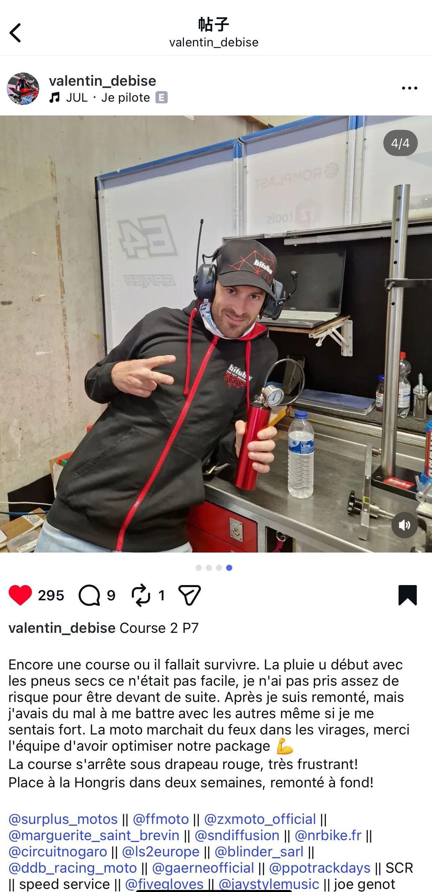
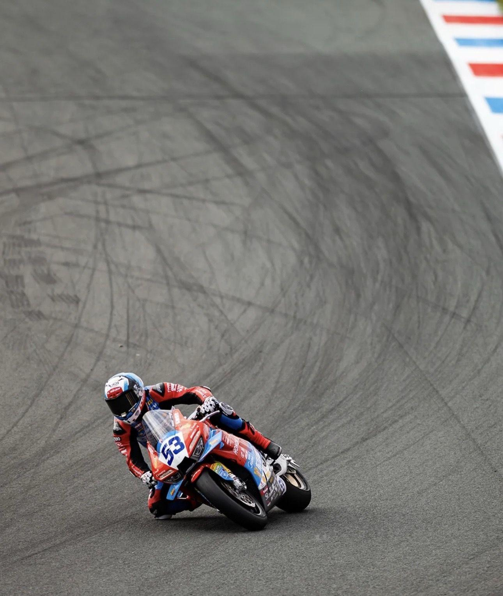
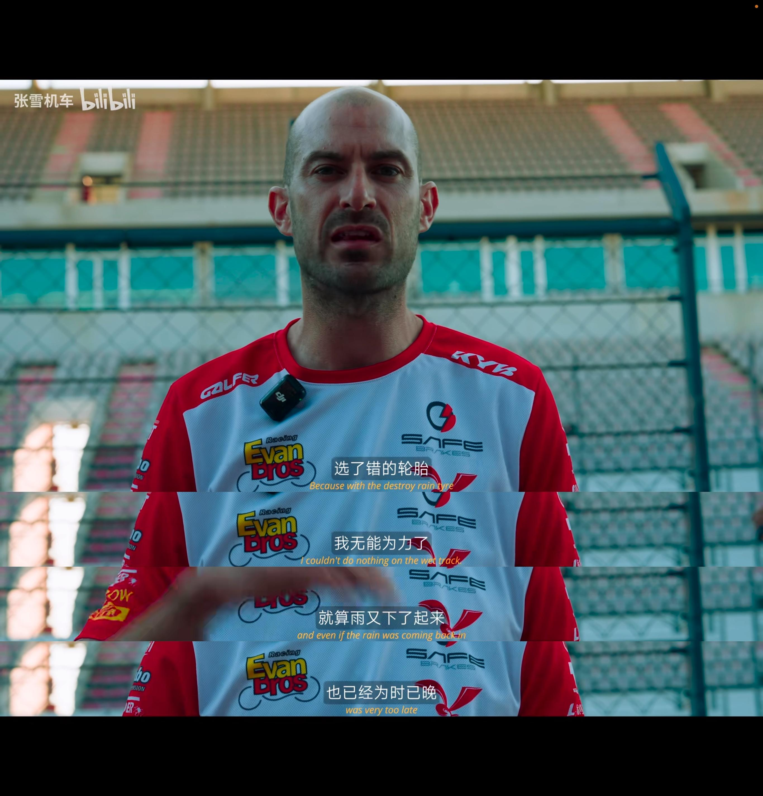
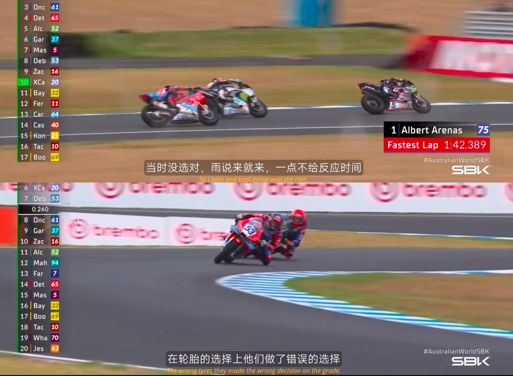
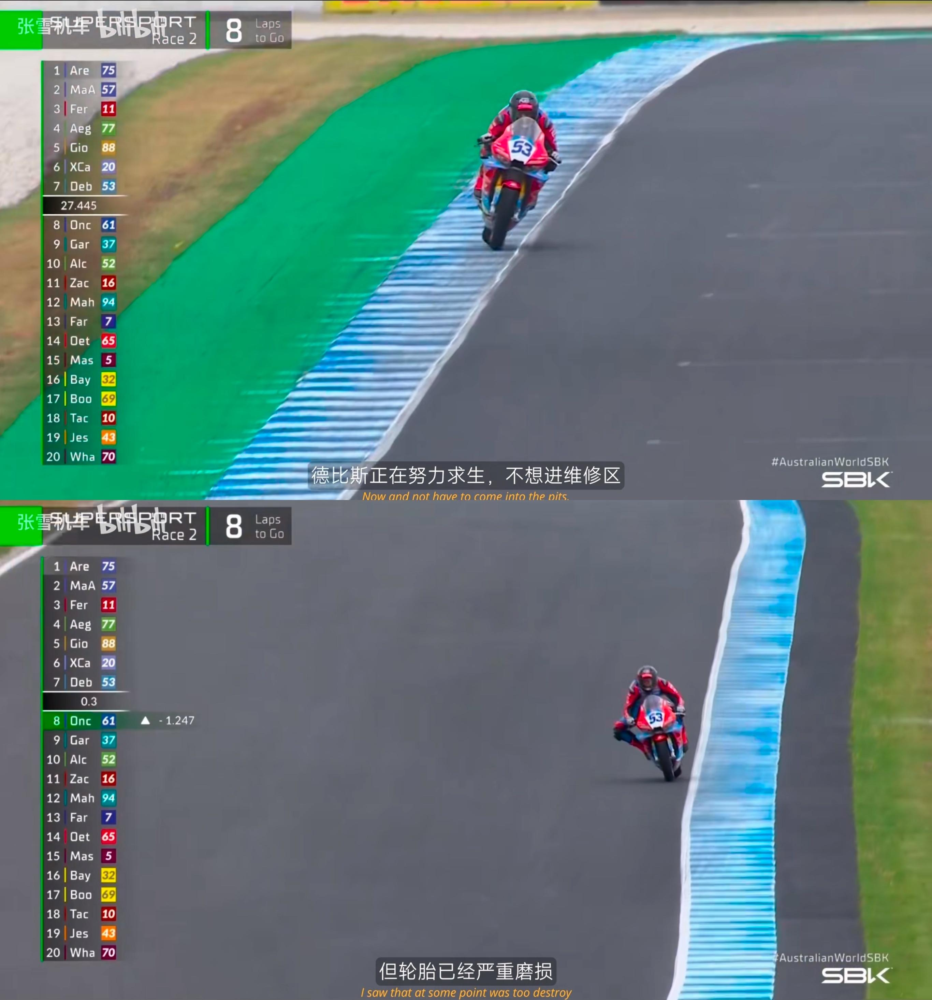
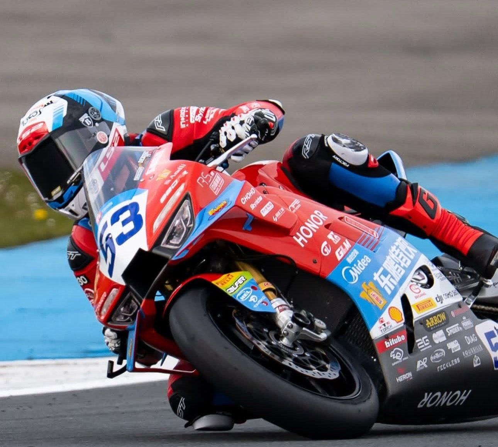
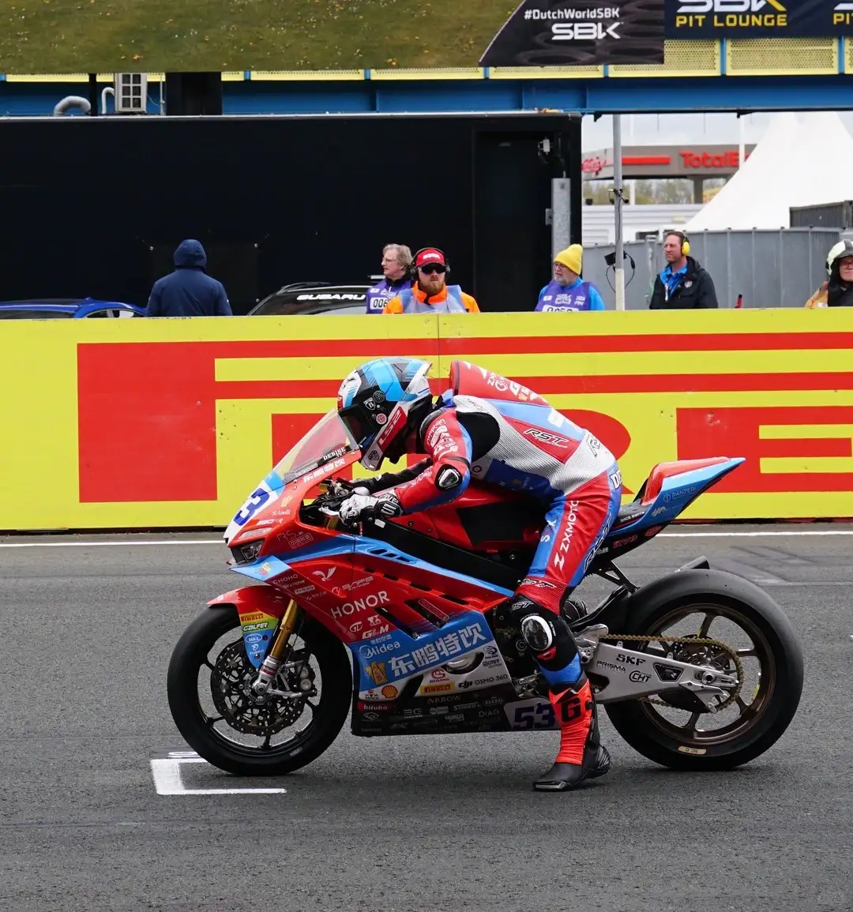
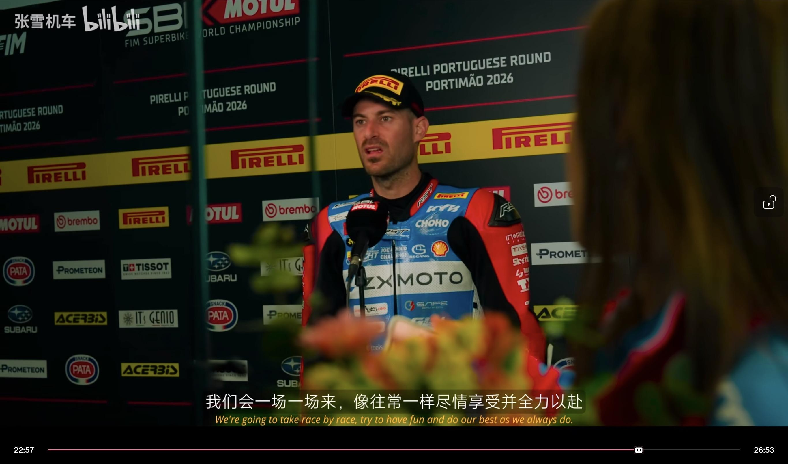

# 张雪机车荷兰站的成绩让你失望了吗？

> 来源：知乎专栏「张雪机车 | 极致热爱」
> 作者：耿悦

## 01

荷兰站第二回结束，德比斯发了一条ins。

看得我愣了一下。

又是一场得靠“硬撑”才能完成的比赛。

比赛刚开始就下雨，我用的却是干地胎，起步非常艰难，没敢冒足够的风险冲到前面。

**后来我一路追了上来，但即使感觉自己状态很好，和其他车手缠斗时还是很吃力。**

**不过我的车在弯道里跑得像着火一样猛，感谢团队帮我们把赛车调校到了最佳状态！**

比赛因为红旗提前结束了，真的太让人沮丧了！

接下来是两周后的匈牙利站，我会全力以赴重新冲回来！

Cr.德比斯ins

**赛车也有无常，这场比赛里藏着什么无常？**

## 02. 第一种无常：红旗

2026年4月19日，荷兰阿森站。

37号车手罗伯托·加西亚（RobertoGarcia）在5号弯高速摔车，赛车燃油/机油泄漏在赛道上。

非常危险，一圈时间来不及清理，赛会立即出示红旗，比赛终止。

事故只给了2秒镜头。车倒在赛道中间，车手倒的地方离赛道也很近。

那名车手后来送医，确诊为左脚挫伤和左大腿擦伤。

比赛就是什么都会发生，这是一种"世事无常"。

但网友的不爽也能理解——正看得兴奋，戛然而止。车手准备发力还没开始发，就停了。

又看到抖机灵的评论，说"张雪你选我去当赛车手，等德比斯跑到第一，我就马上摔车躺那里。红旗一打，我们夺冠。"

咱不能拿生命开玩笑。

但总能感到网友的热心和可爱。

## 03. 第二种无常：轮胎策略的赌局

天气问题很难保证。

比赛刚开始就下雨，德比斯用的却是干地胎，起步非常艰难。

他在澳洲那次摔车，纪录片里也提到了，和轮胎选择有关。

澳洲菲利普岛站后采访Cr.张雪机车让我们来学习下轮胎（现学）。

摩托车比赛里，轮胎就像车手的"鞋底"，决定了抓地力、速度和安全。

和F1不同，摩托车比赛不能随时换胎，全程20-30圈都靠一对胎撑下来。

**为什么轮胎会消耗？**

每一次加速、刹车、过弯，轮胎都在和赛道摩擦生热。

橡胶表面变薄、变硬，抓地力从100%掉到80%甚至更低。

车手每一次进攻或防守，都在消耗轮胎。拼得越厉害，轮胎用得越快。

所以车手不会一路猛冲，而是要算计着用胎。

澳洲菲利普岛站前期稳跑节奏、少急刹、少进攻，保留轮胎的"新鲜度"，等对手轮胎磨平了，再在最后几圈发力超车。

除非实力断档领先，不然十几圈没人能做到一直领跑。

跟第二名对抗也会加大轮胎磨损，在第一梯队的后几位跑自己的节奏、后端发力，反而能拿到更稳的名次。

澳洲菲利普岛站

**雨胎和干胎的区别**

摩托车比赛有两种轮胎：干地胎和雨胎。

干地胎：橡胶硬，抓地力强，适合干燥赛道，速度快。

雨胎：橡胶软，花纹深，能排水防打滑，但在干地上磨损极快，而且速度慢。

比赛前，车队要根据天气预报选胎。

如果赌错了——用雨胎遇到干地，或者用干胎遇到下雨——速度和抓地力都会大打折扣。

更麻烦的是，你选好了胎，天又突然变了，也没法换。他们已经、正在经历着这种情况。

**18号和19号的策略对比：**

荷兰站18号第一场正赛，德比斯前10圈一直领跑，前期push太猛，轮胎磨损太大，最后几圈加减速和压弯都不敢极限操作，被保胎选手反超。

荷兰站19号第二场正赛，可能车队调整了策略，改走"前保后发"战术：

前期稳跑保留轮胎，准备最后五六圈发力。。

结果刚要发力，红旗出来了，比赛提前6圈结束，只能遗憾收下第七。

## 04. 不可重来

我那天看到19号德比斯在出发前，蓄势待发那张图，想到：

**如果18号那个跑法，放在19号那天**

——前10圈领跑，红旗突然出来，他就是冠军。

**如果19号这个保胎战术，放在18号那天**——没有红旗打断，后几圈爆发，至少能上领奖台。

两场策略一换，至少能拿一个第一。

但比赛没有如果。红旗什么时候出现，天气什么时候变，轮胎什么时候磨到极限——这些都不由人控制。

你只能在当下那一刻，做你认为最对的选择。然后接受结果。

## 05  一期一会

这就是"**一期一会**"吧。

这让我联想到我们以前经历的一些事情。

回忆起来，很多经历都是"一次性"的，比如你去了某个地方，往往就那一次。

当时完全凭你的全部经验和那种发挥。

我后来有很多次回顾，总觉得如果让我现在去做，我可以处理、完成得比那时候好很多。

可以看得到提升的空间，但生命最有意思的地方就在于你无法回看，你基本上只有那一次机会。

有的时候我们碰到某个人，错过了一些事，当时可能确实表现得不怎么样，但事情过去也就过去了。有时候写文章，也是当时有那一口气，就表达出来，第二天你倾诉欲就过去了。

这就是比赛的真实、魅力，和人生的奇妙，

如果一切都有可能补救，人反而不会珍惜。正因为不可逆，你就要彻底面对失去——这种无可奈何，反而让人成长。

Cr.张雪机车车队纪录片

每一次都要全力以赴，把握并珍惜当下，尽量过得无愧于心。

之后也要学会接纳这些遗憾，可以总结经验，但不用反刍心理去想"如果那时候怎么样"。

没有如果，一切都是最好的安排。继续向前走吧。

**每一场比赛都是独一无二的，每一个瞬间都无法重来。**

所以才珍贵。所以才不浪费时间，全力以赴。

**因为他们都是一直往前走的人。我们也得是。**
