# WSBK荷兰站正式赛，张雪机车因压线被罚第三变第四，怎样评价他们的表现？

> 来源：知乎专栏「张雪机车 | 极致热爱」
> 作者：耿悦

这场比赛是真够好看的，各种反超再反超，荷兰站阿森赛道可真是个凶险的赛道。

开局第一个弯德比斯是落到了第四的位置，虽说最后的排名也是第四，但这中间真是发生了太多跌宕起伏的反转。

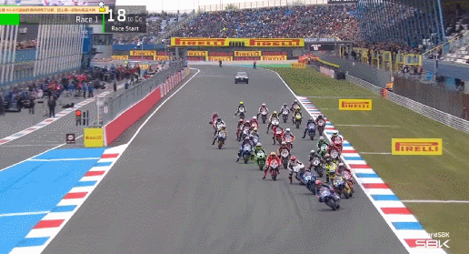

很快德比斯就完成了对阿雷纳斯的超越来到了第三名的位置，当然比赛才刚刚开始，后面这个阿雷纳斯拿到了第二名。

这个赛道确实比较窄，超车的时候看着很惊险刺激，然后直道距离不是很长，可能刚直道冲起来没多久就要减速过弯，对车手体能和集中里的消耗真挺大。

不过还是能在直道上看出张雪820RR的优势，德比斯也是利用这个优势短暂超越雅马哈车手来到第二位置。

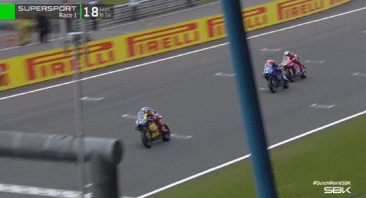

之后德比斯反超81号短暂来到了第一名的位置，这个81号这两场真是有够倒霉，其实开的一直不错，但是老发生意外。

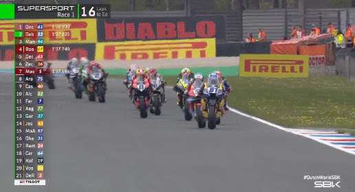

这个赛道经常出现摔车，挺难开的。

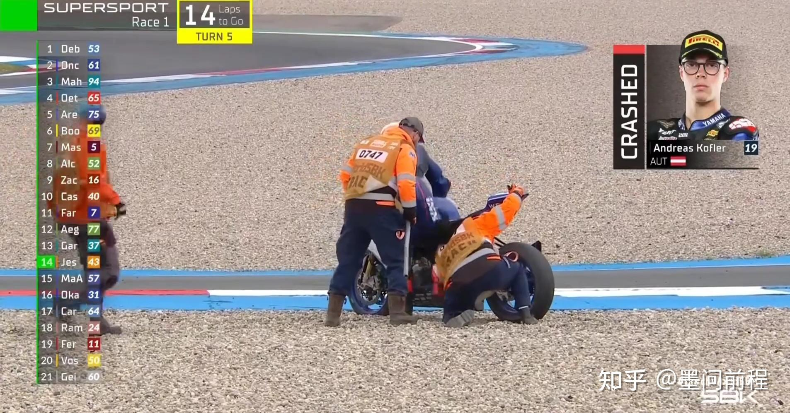

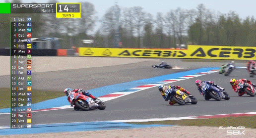

之后场边开始了飘雨，给赛场上增加了更多不确定因素，毕竟正赛钱调试赛车的环节以及排位赛的时候都没有下雨。

下雨对比赛肯定是会有影响的，更考验车手们的人车合一的能力。

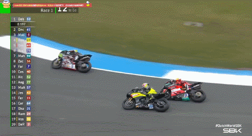

在比赛还剩下九圈的时候的比赛在一个左手湾被对手反超。

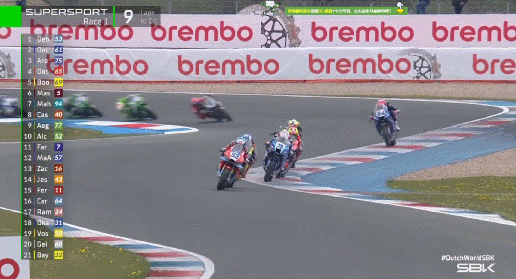

随后德比斯接连被对手超车，来到了第五的位置，比赛还剩下八圈，追逐还在继续。

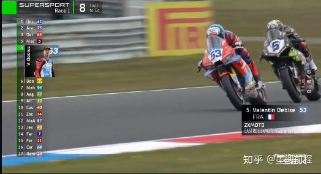

在比赛来到最后第五圈的时候，德比斯前面的两位车手突然撞车了。

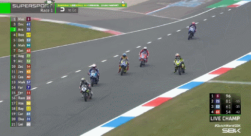

德比斯也是趁这机会完成了反超甚至一路追到了第二名，给解说看激动了，一直在那里喊什么东方的神秘力量发力了哈哈哈哈哈哈。

果然笑容不会消失，只会转移哈哈哈哈哈哈。

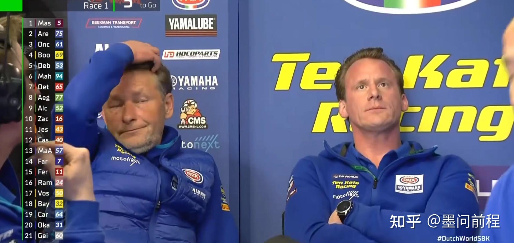

形势突然一片大好，在倒数第三圈的时候德比斯反超对手再次夺回第一位，张雪机车再次看到胜利的曙光。

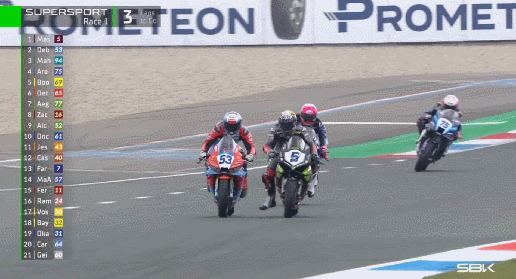

可惜对手在下一个弯道就把德比斯又给超了回去，这场比赛的竞争真是空前激烈，排在前五位的车手选择的超车路线也是越来越激进。

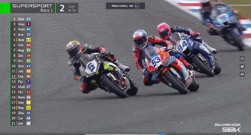

后续德比斯又一次完成对前车的超越。

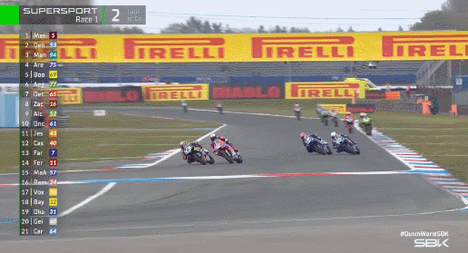

不得不说这名叫马西亚的选手是真的厉害，在比赛还剩最后两圈的时候他再次选择了激进的超车路线反超了德比斯。

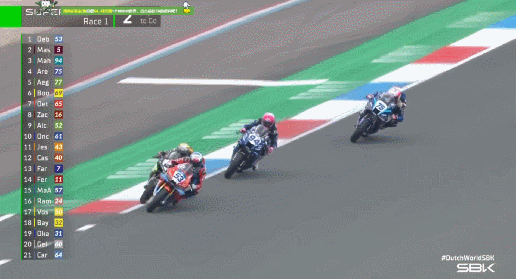

和马西亚的不断颤抖显然消耗了德比斯相当大的体能，过下一个弯的时候他不慎走大了，被后续两辆伺机而动的雅马哈反超。

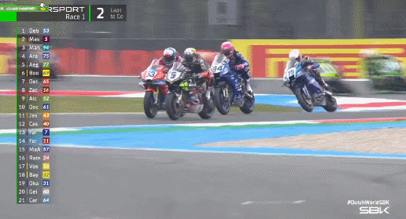

最后德比斯也是以第三名的位置冲过了终点。

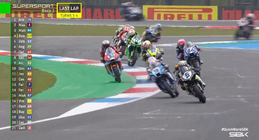

不过最后德比斯因为开到了绿色的区域，因为压线犯规被罚，第三名成绩取消，变成了第四名，不过好在积分还是拿到了。

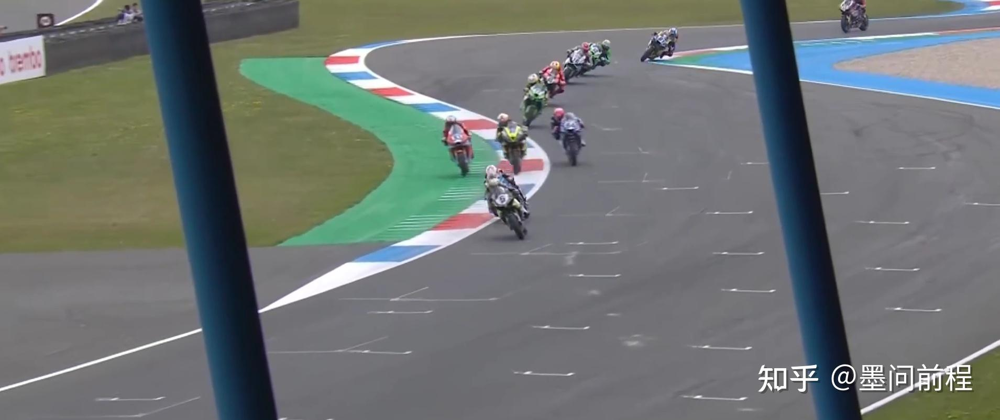

目前德比斯总积分排在第三名，还有机会冲击年度总冠军。

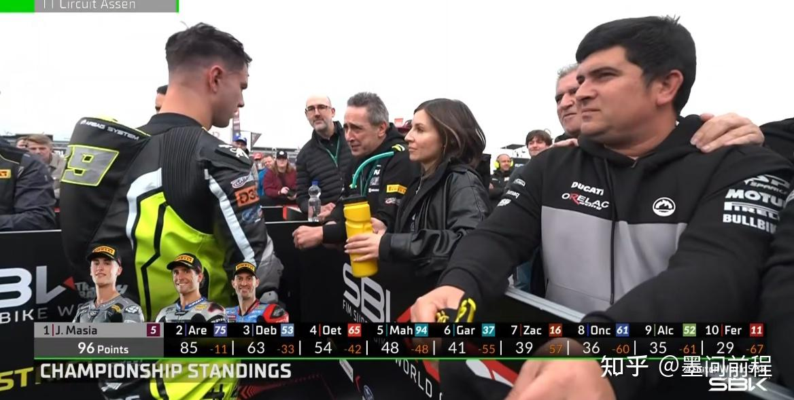

结果最后排位赛前两名都没登上领奖台，也真是活久见了，这比赛的激烈程度太夸张了，不得不说荷兰阿森赛道是真的刺激。

小直道加大转弯，主打一个让你心里七上八下，发生啥事都有可能。

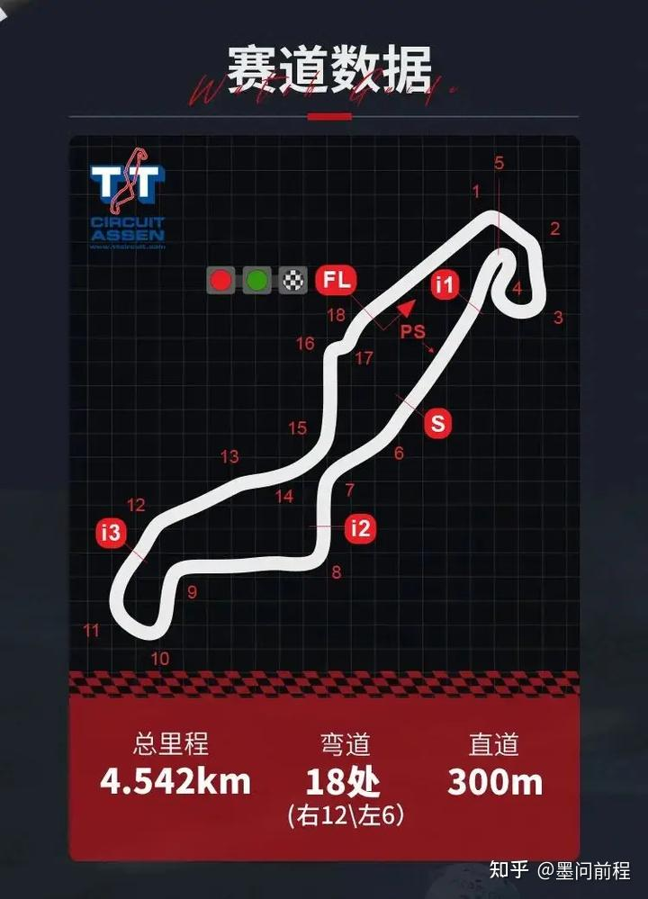

真的很考验车手的体能，感觉车子还可以再调试一下，张雪机车第一次跑这个赛道，能那这个成绩也不容易了。

德比斯队友昨天摔车了，一直孤军奋战面对各路对手的绞杀，确实很不容易。

我不认同德比斯开车太保守这种说法，这场确实是对手实在是很牛逼，这个马西亚是真有东西，跟德比斯之间长时间的拉距是真的精彩，全程高能，紧张刺激，观赛体验真的很棒。

相信很多以前没看过摩托车比赛的朋友应该会因为看这场比赛直播而喜欢上看WSBK。

最后我再次辟谣啊，这场比赛张雪机车是没有受到额外BOP限制的，说什么额外加了重量也都是骗人的，张雪机车的解说已经在两场比赛里辟谣过很多次了，以后据说可能会有，但这次是真没有。

真是精彩的比赛，下一场希望德比斯继续加油，我认为这一场他还是可圈可点的，在赛后做一些调整应该会有很大提升。
