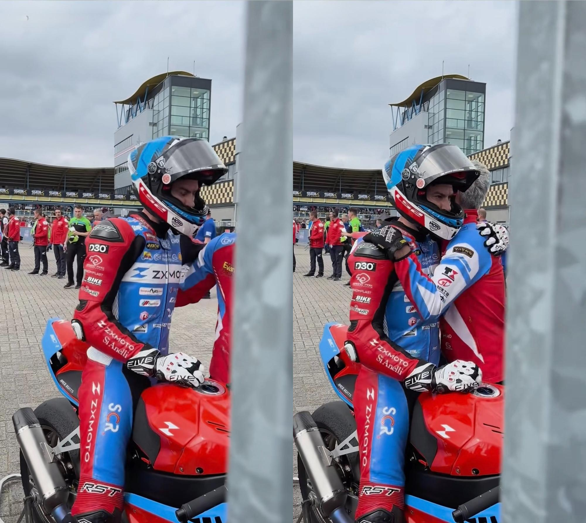
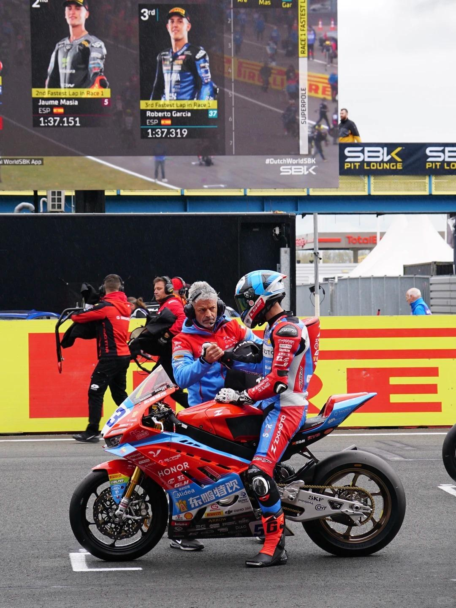
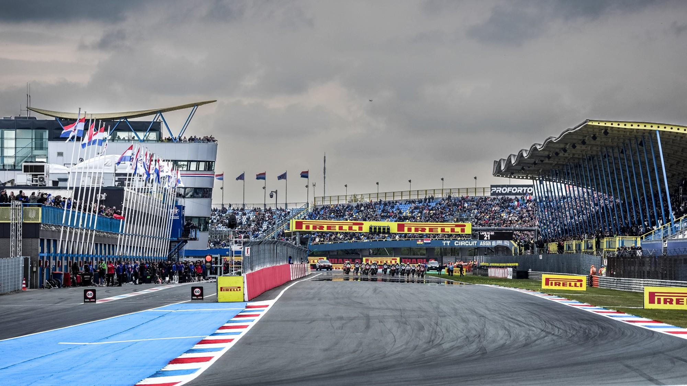
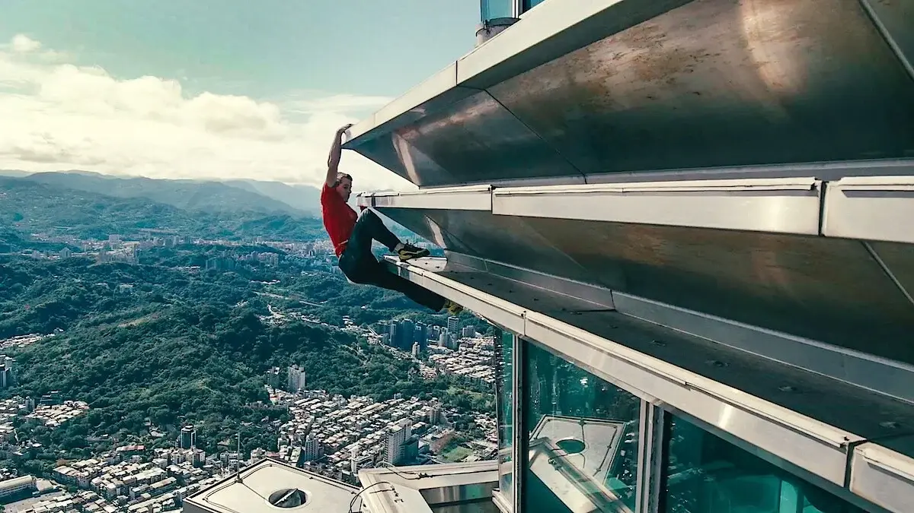
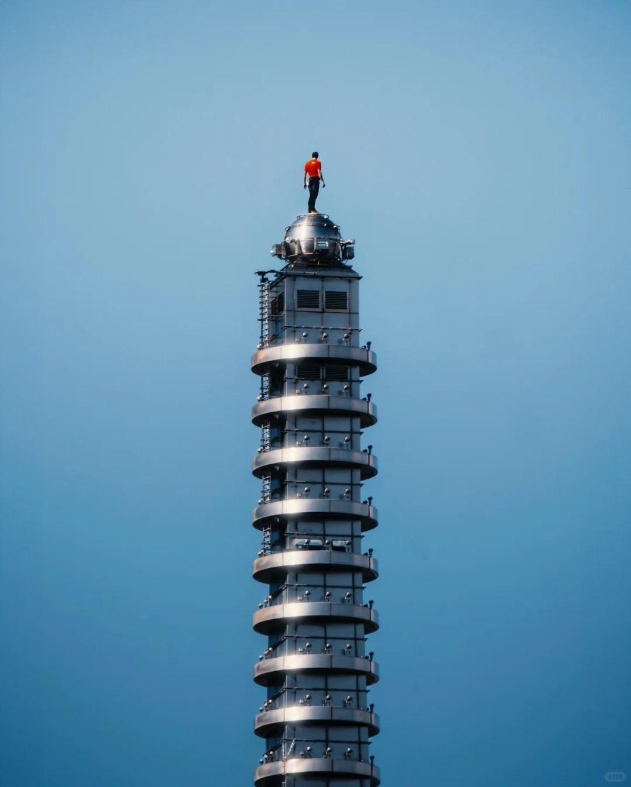
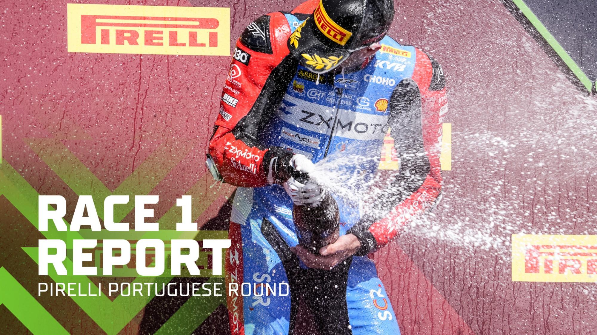
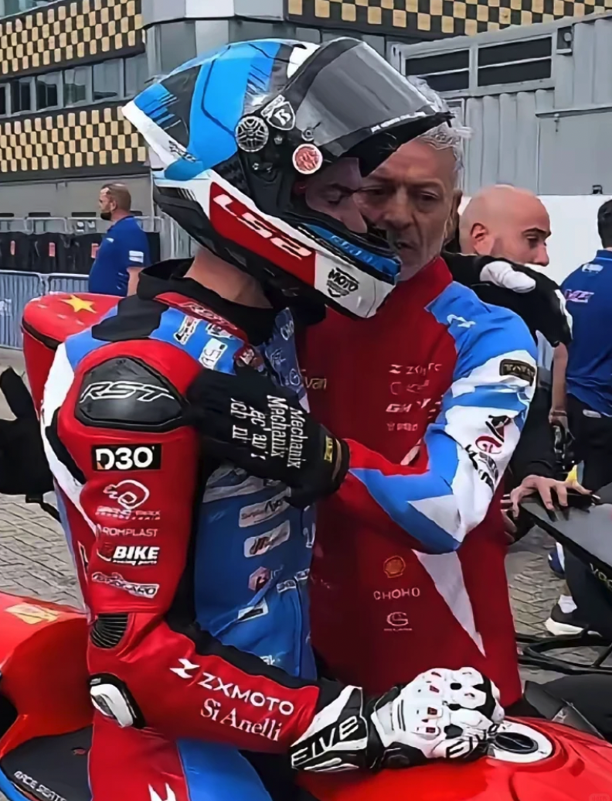
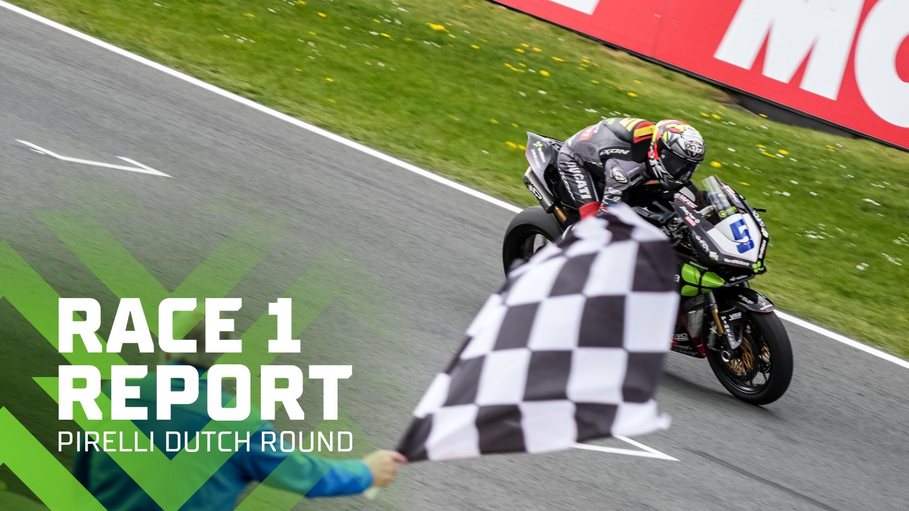

# WSBK荷兰站第二轮正赛张雪机车斩获第七名，此前SSP组热身赛拿下第一，如何评价张雪机车表现？

> 来源：知乎专栏「张雪机车 | 极致热爱」
> 作者：耿悦

不要着急，给张雪机车多一些时间和耐心。

这篇就是帮你把遗憾心理去除，提升你的观赛体验。

以后不论赛事如何出乎意料，都会让你有锚点，心态好到不行。

420新放几张照片

这是德比斯在荷兰阿森站4月18日那场，压线瞬间从第三变成第四。

在下场后神情有些失落，车队成员立刻迎上来，拍拍肩膀，和他拥抱，

看到这个画面，感觉很有爱。有点感动。

荷兰站419上场出发之前

看照片感觉是在蓄势待发的

之前的正文 8160字

今晚突然红旗，就结束了？戛然而止，问号脸，莫名奇妙。

2026 荷兰站 4月19日 Race 2 红旗事件

37号车手罗伯托·加西亚（Roberto Garcia）在5号弯发生高速摔车，赛车燃油/机油泄漏在赛道上，

非常危险，一圈时间来不及清理的，形成严重安全隐患，裁判立即挥动红旗终止比赛，

最终成绩以红旗前最后一个完整圈的排名为准。

什么是红旗？

在世界超级摩托车锦标赛（WorldSBK）中，

红旗（Red Flag）是 FIM 官方规定的安全措施，表示"赛道不再安全，比赛必须立即停止"。

红旗触发条件（FIM 官方规则） 赛道安全受损：

事故、油污、碎片、异物（如动物）等
极端天气：暴雨、浓雾、赛道湿滑、能见度过低
严重事故：多车碰撞、大量碎片遗留、车手受伤需长时间救援

也不用懵在原地。

我们可以像踏上一个顶级摩托车之旅一样，领略壮丽、惊险、刺激的非凡赛事。

这篇是荷兰阿森站第二场结束后4.18写的，

比赛昨天精彩，今天失落，我知道你心里有遗憾，但真的别着急。

01 | 并没有输

摩托车比赛，酣畅淋漓的交锋多么刺激，比赛也经常出人意料，

当你的心系主力车队，知道了赛车的故事，心里有强烈认同感，看起来就更加有参与感，特别燃。

各种追赶、缠斗、反超，各种意想不到，这不才是竞技体育最好看的地方吗？

结果很多人还在那说遗憾，说我们输了。

哪输了？？看完这篇分析，再不会有这个心理了，请往下阅读。

拿到积分了啊，德比斯也是拼尽全力的。

02 | 数据积累的价值

张雪机车精挑细选的车手瓦伦丁· 德比斯，就是因为他的经验丰富，做事精确，

可以给品牌提供源源不断的骑车反馈信息，从而不断调试，把车持续调到最佳状态。

这些从一线厮杀中得到的最宝贵的数据和经验，是无可替代的，对新车的企业来说极为关键。

现在不仅参了赛，还进入了第一梯队，保持了极高的曝光度，保持住自己的节奏，后来获得更大的关注，资源和商业价值都会更多。

无论从哪个方面看都是稳赢稳赚，没有任何值得失望的地方。

03 | 把期待放低

我昨天看完比赛，本来看得屏住呼吸，很感激能看到如此好的赛事，意犹未尽吧，

然后去看了眼张雪的评论区，发现太多人对胜利太渴望了，太迫切了，稍微没达到预期就失望。

一直不断在问：为什么这次没上领奖台？

领奖台有那么容易上吗？这是世界赛事，人家那是多少年的积累啊。

我看到有人说，怕张雪变成下一个刘翔，高处不胜寒。

这种担心确实有，所以我才写了这篇文。

对非常多的人来说，只有第一名才是赢，

不拿冠军，不上领奖台，就觉得输了。

张雪本来就说荷兰站大家放低期待。

在难度很高的「速度大教堂」阿森站，排位赛得了第二，

昨天这场拿了第四，第三场只跑了十来圈得到第七名，

已经说明车好、车手也好，本身已经很优秀了，没什么问题。

感觉张雪应该给大众的期望值再降低一些。

不用总说"我们争取下一次一定赢"，"一定要站上领奖台"。

得冠军大家都高兴，大家都是高手，谁不想赢呢？

谁都想有荣誉感，都花了那么多钱。

但，水能载舟亦能覆舟，流量和互联网的舆论压力，都是很残酷，容易失控。

那么多迫切的、失望的、安慰的、不满足的情绪，

对于一个很好的人，只想做好车的人来说，难承其重。

想起来黄仁勋说的那句：

“我最大的优势之一，是我对自己的期望很低。

对自己期望很高的人，往往韧性很低；

而韧性对成功很重要。"

在这种狂热的流量期待里，适度压低大家的期待，反而会健康。

而且现在大家甚至有一种，像用战争思维去看体育赛事，

想着要用中国的一家摩托车企，去对抗所有的外国车企，这个要求完全不合理。

可以为中国品牌感到骄傲，但也可以去陪伴一个品牌成长，观看这种国际级比赛的竞争。

后面我会放个对比，放低预期，能拿积分就完成任务，更加明白。

04 | 新人 vs 老手：

张雪机车的性能强，这个毋庸置疑。

但别人根本不弱，我们的赛车路还很长。

比如荷兰阿森的赛道，我们可是第一次来。

但是像雅马哈（1887年起家，1955年开始做摩托车）、铃木（1909年成立）这样的百年老牌企业，已经在赛道上积累了几十年的经验，

杜卡迪自1988年起参与WorldSBK，到现在也有近40年的赛道历史，同样非常有竞争力，在这儿拿过无数次冠军，反反复复在这里刷弯。

就拿这次荷兰站阿森赛道来说，杜卡迪在这里94次登上领奖台，34次夺冠。

雅马哈也有30次登台、3次夺冠的记录。

94次登台，你知道这是什么概念吗？这得跑多少年？积累了多少数据？

而咱们的张雪机车，公司才成立两年，这还是第一次来这个赛道跑？！

你需要对赛道有丰富的数据，才能调节车辆参数、进行电控设定。

你做数据采集或者试车的时候，跟比赛时候的温度、气候条件不一样的话，就可能会出现偏差。

而那些顶级国际品牌在这些赛道跑了几十年了，数据积累肯定更丰富。

现在是第一年，先收集数据，后面会越跑越顺的。

车子可以收集试错的反馈，即使摔车了也都正常，不断收集经验，更好地调整，这需要大量经验的积累，时间的问题。

张雪机车已经列入世界第一梯队了，鼓掌就好了，给予耐心。

05 | 举个例子

刚突然想到一个我喜欢了多年的攀岩者，你们年初应该都看过他徒手攀爬台北101的视频。

他叫 Alex Honnold，是全球最知名的 Free Solo（无保护独攀）高手。

台北101是他从大自然的悬崖岩壁，转向人工超高层建筑的转型项目。

表面看，他没有任何防护就直接往上爬，大家会觉得他是"神"吗？

实际上，他做了无数次的演练，每一个角落、每一个细节，都有技术对策，早已做到了了如指掌、对爬如流。

假设你也是一个攀岩高手，但你是个新人，第一次来到这栋楼。

其实你刚进入攀岩圈才两年，但和顶流大神能一起出现在这个画面，

来进行你追我赶、真实角逐、凭实力竞争，那已经说明了你的实力。

你久仰Alex的大名，但是你心里暗暗想：我觉得我要比你厉害多了。

你们同时站在这里开始比赛，他已经极其熟练每一个细节了，而你对这栋楼却并不熟。

虽然你想着"我要比他强，我的天赋、才能和技能都比他厉害"，你就这样初次去硬爬。

但这种挑战其实是需要数据支撑的。

Alex 从2025年9月开始侦察，做了路线侦察、天气窗口分析、直播协作、退出预案。

在准备期间，他对台北101进行了练习攀爬，并与团队反复规划"如果疲劳如何安全撤离"的方案。

不但追求"能爬上去"，他们把执行失败后的退出路径也设计清楚，后来因为天气的缘故，他也拍板要求更换日期。

这是经过长期准备的技术项目，不是单纯寻求刺激。

虽然他做这个事情其实有些降维打击了，酋长岩更危险，但都是玩命的项目，哪里敢掉以轻心。

阶段	时间跨度	核心任务	核心挑战	关键突破
决策期	2025夏末	项目可行性评估、许可谈判	法律阻力、拍摄协调	9月scout确认技术可行性
侦察期	2025年9-11月	路线验证、抓点识别	建筑细节复杂、无成熟路径	确定"直接+刺激"双路线
训练期	2025年12月-2026年1月	体能/技术迁移	垂直耐力不足、玻璃摩擦适应	塔体练习爬完成退出预案
冲刺期	2026年1月23-25日	天气窗口捕捉、直播排练	突发雨天、团队同步	1月25日完美天气窗口

从2025年9月侦察到2026年1月执行，他用了整整4个月的准备，包括大量细节。

这就是数据积累的重要性。

我写到数据这部分时，突然意识到：连 Alex 这样的神级攀岩，都如此注重数据。

而在我们心里， Alex 对岩壁的热爱，和张雪对赛车的热爱是一样的。他们都是那种非常无畏的人。

虽然现在还有些挫折，和需要积累的一些距离，但我相信他可以成为那样的高度，只是需要时间。

06 保护选手

昨天看比赛，能明显感觉到德比斯是真的拼尽全力了。

他是个实在人，在赛场上那种豁出去的劲儿特别感染人。

你完全能感觉到他在拼尽全力。一个人用没用心，都能感受到。

车队的长期规划

我在写德比斯为什么全力以赴张雪车队故事的时候，

了解到，ZXMOTO Factory X Evan Bros Racing 当初签的是三年合约的长期计划。

车队的计划其实不是今年立刻夺冠，

张雪有一个很稳健的长期目标：今年先进前15名，后期再进前10，最后冲击前5，把车调试到越来越好，一点点累积积分，或：

今年能站领奖台，明年能拿奋战冠军，后年能冲击年度冠军。

但是车子牛掰，就是提前了如此早的阶段，在葡萄牙就拿到了双冠军，大家的期待感瞬间爆棚。

但你想想，后面还有八站比赛啊，强度很大。

最核心的一点是车手千万不要受伤。

像雅马哈、杜卡迪这种大厂，他们有好多辆赛车，好多个赛车手，资源都很丰厚。

而咱们车队目前只有两辆车，两个车手，冲锋就只靠德比斯一个人了。

所以现在要做的就是安安稳稳地把每一站跑好，把数据拿到手。

稳住。留得青山在。

像星姐乐观人，说跑完整圈不要爆缸，哈哈哈。

关于64号车手

大家觉得他老摔车，觉得他是在"白吃饭"，提议让张雪换掉车手。

但实际上他也在承担数据采集的任务。

看他的历史成绩，其实比以前的德比斯还要好不少。

加上资源相对倾斜在53号。

当你看到德比斯孤军奋战，你就会着急，64号为什么不去帮他呢，感觉他很拉胯。

Evan Bros Racing 这个车队很有经验，对赛车有极高的热爱和激情，有过四十多次冠军经验，张雪当初就说只想和他们合作，否则都不想找其他人。

他们的赛季目标一开始就不是今年激进夺冠，而是磨合加完赛。

车队战术很稳，一个车手冲积分，另一个保完赛。当初的战略不是两个配合保名次。

搜了下当时合作时的赛车圈新闻

埃文兄弟

ZXMoto 820RR 原定于明年首次亮相，但提前推进时间表并非一场豪赌——甚至可以说，这更像是一个绝佳的机遇。首场赛道测试仅在几个月前，而现在这款中国赛车已经跻身头排发车位。

这是位于拉文纳的小型团队 Evan Bros 创造的又一个奇迹。

多年来，他们一直是雅马哈 Supersport 项目的头号先锋。

该团队丰富的经验极大地推动了研发部门的进展，而ZXMoto 显然拥有足够的技术与预算，在这条赛道上走得极远。

419的图片

但现在大家都为冠军去拼了，张雪昨天说每个人都顶到极致、绷到100%去使劲。

但在赛场上谁都说不好，一点点差别、细节处理，局面就变了。

昨天听解说员提到，德比斯好像有一些着急，这确实是一个常见现象，很多车手在末段冲刺时会情绪急躁、动作冒进，但这也是什么“坏毛病”，正常的，是“人在高压下的本能反应”。

但能看出来他到后面确实太想赢了，有点急，太拼了。

这种时候反而要给他情绪上的缓冲，让他平静下来，让他在“想赢”和“别急”之间找到平衡点。

舆论压力别让他更加急切，群众支持已经给到他信心。

但其实他作为老手，心态和经验应该是非常稳的，这个拭目以待。

我们一定要给车队和车手足够的信心。

看到他这么努力，如果大家再去苛责他、给他更大的压力，会有担心。

冠军不是一场比赛就能拿下的，每一场比赛的“数据积累”，都是在为未来的冠军做铺垫。

赛车背后的复杂性

我也是边看边了解，一个赛车背后的复杂系统的支撑。

其实不只是车手技术好、赛车调校准，冠军就到手了。

实际上，一场顶级赛事的背后，是全方位、多维度的体系在运转。

车手的精神疏导、按摩理疗、对手数据分析、场地数据分析、车况调整方案、轮胎方案，这些背后有巨量的细节工作，没有那么简单。

比如精神疏导，车手在高压下，心理状态是决定性因素之一。

赛后复盘、情绪疏导、团队交流，是必不可少的"心理保险"。

再比如按摩理疗，长时间高强度的骑行，身体承受巨大压力，赛后必须有专业理疗师、按摩师、康复教练的介入，帮助车手恢复，避免旧伤复发。

还有数据分析，车队每天都在分析对手的圈速、线路选择、刹车点、油门开度、失误点，帮助车手在下一站做得更精准。

很多人可能不太了解，能进前十其实就算完成任务了，能进前五就已经很好了。

世界冠军不是那么容易拿的，要摆正心态，实事求是。

「稳中求胜，在安全可控的范围内，再去冲刺领奖台。」

（4/20张雪采访新说）

车队第一集团的都是世界高手和狠人缠斗。

每个运动员能参与到顶级极限体育赛事，拿到好名次就意味着自己的商业价值也在提高，如此直接的正反馈，全世界机车圈关注着呢，这谁不愿意拼命努力呢。

谁也不让谁，除了队员，这样比赛才好看啊。

比如说荷兰4.18夺冠的杜卡迪 5 号车手 Jaume Masia，他确实技术很厉害，他是2023 年 Moto3 世界冠军，今年才25岁。

在赛季前的采访里，Masia 表示 WorldSSP 是他"最后的机会"，会用来在摩托车世界顶级体系中再次证明自己。

那些着急的人，你要还是难受，那你花钱把马奎斯请来为咱们夺冠吧，

我也迫不及待想看这一场，我看到还有人说让张雪把五号签下来………

咱们现在这些都是现有条件下能找到的很适合的好选手，是热爱的双向奔赴。

祝福他健康，发挥稳定水准，不断积累一路的数据，服务张雪机车的持续蜕变。

07 长期主义

WSBK赛事，不是冲几次就彻底结束了，是年复一年的长期战斗，

要不断调整，去适应不断变化的规则。

你不能每一场都极限冲刺。

如果你只有强烈的胜负欲，觉得只能赢，那这个氛围其实是不健康的。

打仗攻地是一个漫长的过程，而且是布局全世界的那种。

好比万里长征，前面需要有计划、路线，一步一步地去打。

你不是要在头两个月就疯狂地把子弹全部打完，得讲究循序渐进，对吗？

虽然前期可能多次不如所愿，但只要对车子好、对品牌提升有好处，这就是张雪新车最需要的东西。

你已经进入了世界第一线的顶级比赛，好比是一个选手走上了世界舞台。

通过一场又一场的现场演出，你会积累大量的现场经验，这些都是无可替代的。

你不可能每一场都得第一名，虽然多赢几次肯定更好，但关键在于不断地历练。

这种状态很健康，然后随着自己的节奏去发展，这就是非常有智慧的体现。

这种数据极为丰富，锻炼也同样非常珍贵。维度很丰富，不只是为了赢。

赢当然更好，但要随着规律去生长。

别紧张，长长久久。

植物生长

我很喜欢植物，自己也种了很多。

这就像植物一样，你不可能刚买回来一个特别好的苗子，就疯狂浇水施肥，

指望它明天就立刻长高到两米，只为了让别人觉得你很厉害。

你希望它成为你种下的最厉害的一棵植物，它（比如竹子之类的）有潜力，以后绝对会长到那么高。

但你天天围着它心急如焚，不尊重植物的规律，这对植物并不好。

植物自然的生长过程肯定是：

先非常稳健地生长、扎根

然后再不断往上冒

自然地开花结果，自己一节一节地向上长。

登山者形容一种很好的状态：循序渐进、逐步积累、环环相扣。

朝着目标不断努力，却总是差那么一点。

玛莎·格雷厄姆把这种感觉叫做"神圣的不满足"。

08 | 开拓者价值

我记得张雪说，他最开始想参加这个世界顶级摩托车赛的时候，仿佛荒漠一样，完全没有人想过中国车队该怎么参加，极其艰难。

现在他把前面的路趟平了，有更多的中国品牌参加了，这是多好的事情。

WSBK在张雪机车夺冠之前，在国内最多也就是摩圈的人知道，

知乎上只有一个问题和回答，对比下现在的热度。

他是真的热爱，决绝地为了这份体验，真正从无到有地打开了局面，让中国机车真正参加，这本身就是巨大的胜利。

那张雪机车，更多的中国品牌能同时出现在这个赛场上，

和最牛的车队们进行比拼，还都夺了两次冠军了，这还不够梦幻，不算燃吗？

有这么大一个人才，闯了这么多年，终于走到你面前了。

人家天崩开局，举全家之力，一路借钱，把家里面能用的资源、身边所有能借的全部都借空了，

还问房东借钱、甚至借高利贷给员工发工资度过难关，

经历了九九八十一难，才终于走到了这个世界舞台上。

以前，你从来没见过人家，也没有给他提供过任何实质的帮助。

结果今天你突然说："你立刻马上去如何满足我的期待，你怎么可以不符合我的期待呢？"

然后开始指责、骂他的话，我觉得这简直有点过分、太夸张了。

这就好像你站在高楼的下面，给第一次攀爬101的攀岩高手说，

你今天必须超过Alex，反正你得给我冲到第一，战胜Alex，

他在这准备了四个月了也没用，他是多强的攀岩前辈我不管，我们要相信奇迹的发生！必胜！

他肯定会拼尽全力去爬，但请问您老人家还尊重客观科学规律吗？

已经很好了，过度的期望会产生不小的伤害。

嗯，Alex 的例子，在这里突然想起来，他也是一生只做一件事，全情投入、不计得失地日复一日练习，这种纯粹的状态，和张雪造车有神似之处。

其实觉得张雪的机车性能，和其他老厂品牌，也不会像说是仰望神的过远距离，

仅仅是因为这个例子更好举，可以说明什么是热爱、高手和数据的乘积。

09 | 稀缺的品质

需要保护张雪。

他刚接受采访的时候，大家看完都说，他不会说场面话、套话、太坦诚了，面对媒体怎么能啥都说呀，这样会惹麻烦的。

现在就是你要保护他呀。大家需要保护这么一个实在人，对吧？

我们逐渐进入摩托车的世界，了解这个品牌，已经对它充满了信心。

因为都是实实在在的，创始人身上那种罕见的极致热爱，极致打造产品。

所以无论怎么成长，我都是祝福。相似的品质在血液里重燃，被激发。

这件事能让我们充满期待，看到这么精彩的故事，也看到了中国机车的性能已经很好了，工业程度、产业链的优秀、丰富和高质量。

而且还有这么多人的各种故事，让我写故事也感到惊喜，一会儿出来一个能人，他故事里的群像都很鲜活、有人味。

像原本死气沉沉的东西，突然被这个江湖给搅活了。

内容变得好看、有活力了。

只是带着好奇心在观看，我也喜欢看夺冠，谁不喜欢，但我心态会比较放松，

我写这个也是一种祝福，就是希望热爱、真正追梦的理想主义者们能如愿吧。

这篇在各种比赛，若与预期不符合的时候都会再发，会加上那一场的赛事感悟。

喜欢冠军，什么名次都是在探索，都会有收获，其实都能接受。

多好呀，还有这么多场顶级比赛可以期待和观看，

大家要有信心啊，相信未来。

那些阴谋论，和BOP被限制，都是谣传，就别传了。

10 | 会将凌绝顶 一览众山小

记得张雪在《面对面》的采访说，

他骑摩托车的时候，能感觉到风吹过来拂面，

形容的很有画面感，那种速度感，有那种和大自然的交互感。

我说说旅行，如果你只是出发，眼里只有结果，完全忽略过程，乐趣对你来说就减少太多了。

对你来说，那只是一个一个的数据。

这就好比你出去爬山，你能闻到山间的气息，晒到阳光，感觉到筋骨在舒展，

整个身体在大自然之间有了一种呼吸的畅快，

每一脚踩在台阶上，仿佛身体都被激活了。

一点点看见日出从云层里升起来，

有时也会感受到冷风阵阵的寒意，都会激活你的体能和精气神。

而如果你只为了登顶，就把这些过程全都要省略、压缩掉，导致除了最后的结果，其他什么都不记得，毫不在意。

如果是那样的话，那个过程给你的快乐，就减少了许多许多。

11 | Don‘t Worry，Be Happy

说到快乐，喜欢看他的采访，也是因为他状态很真实放松。

但昨天看他最近视频，感觉嗓子哑了、疲惫、笑容感觉也变少了一点，就公众人物的那种约束感多少有了。

我看张雪说他现在上下班都没办法骑喜欢的摩托车了。

公司门口一直围着很多人，他也不能去跟他们打招呼。

按他的性格，肯定是喜欢跟大家一起玩的，但他说如果你跟几十个人说话，明天可能就会聚集几百个，后天是上千个人，这是出名带来的不得不忍受的困扰。

他想做高端品牌，因为目标是做一个最好的国际品牌，甚至百年企业的品质，所以需要时间和耐心。

我们有过太多的造神极快、毁神极容易的可怕经历了，对吗？

请给张雪机车喘息、好好健康成长的空间。

就像奔腾的火焰需要静水流深的河流，

烈火需要柔性克制，

东方智慧阴阳平衡。

摩托车很酷，也很容易让人兴奋，看比赛看的我心跳加快，呼吸加速，

我们可能都需要一种冷静来维持平衡。

这才刚开始，后面还有这么多站呢，他们也不是跑两三次就不见了，

再说一遍，给予张雪机车耐心、时间和信心，

你再着急也没办法代替德比斯去赛道冲，摆平心态，

现在有这么精彩的比赛，就去享受自由、欢乐、赛事的精彩、感受来之不易的参与、拼搏、追梦，

请保护好，冲到今天如此不容易的张雪机车。
