# 张雪机车夺冠后首秀，WSBK荷兰站超级杆位赛获第二名，如何评价这一成绩？

> 来源：知乎专栏「张雪机车 | 极致热爱」
> 作者：耿悦

**比赛排名就是来来回回，不断在流动着，更重要的是有中国产品，能在顶级舞台上共同竞争。**

阿森赛场环境的难度并不算很友好，看好张雪机车和德比斯，但保持平常心看比赛，享受这个过程就很好呀。

其实能和WSBK赛场上的国际老牌厂商如杜卡迪、雅马哈、川崎等同台竞技，

中国品牌张雪机车能在2026赛季取得历史性突破，这本身就是巨大的进步和胜利。

除了德比斯（ValentinDebise，法国车手，曾在2026葡萄牙站WorldSSP组别为张雪机车连夺双冠），

张雪机车厂队（与EvanBros合作）还有另一位小哥，是意大利车手FedericoCaricasulo，

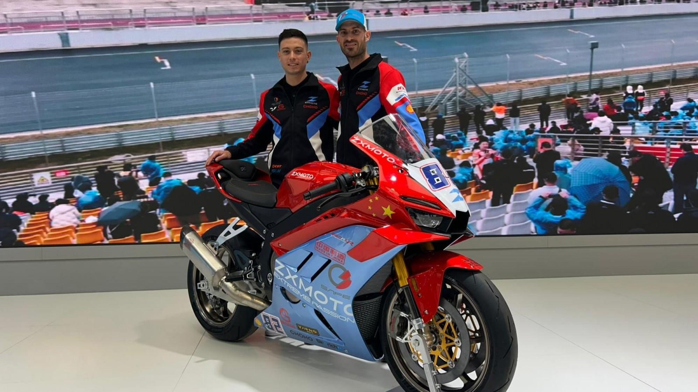

我们的报道里几乎忽略了他，

他是前Supersport组冠军，曾在2019/2020赛季两度夺冠，2026赛季加盟张雪负责数据调校和稳定发挥。

昨晚的比赛，Caricasulo第15起跑，数据稳定，为张雪820RR-RS调校提供关键反馈。

他这种“稳定型”发挥对新车队很重要，不是闪光但可靠。

昨天写了回答，补充一点开头、结尾：

昨天是我人生第一次看摩托车世界赛事直播，还专门下载了软件去看，

我的第一感受是，你注意力会关注张雪机车嘛，同时还看到整个生态，

我看到飞车出去，摔车的那几个车手，好比Caricasulo走下来坐在那里，看到他在头盔里的眼神有失落感，

那个瞬间，感觉这些人好累好危险，在想这职业要是没有热爱，怎么经得住反复飞驰、跟地面摩擦？平常得练多久啊？好疯狂啊，简直不敢想象。

就有一种奇异的感觉，坐电脑前不管怎么工作，你觉得也是辛苦的，但都不会有这种皮肉之苦………………

然后有评论区朋友谈说装备很昂贵都是有保护的，我去了解了下，也分享，这样不用太过共情那些摔车和飞出去，可以更专注看比赛，

**这种顶级赛事，越专业越有防护：**

赛道是封闭的，周围有防滑区、缓冲带、轮胎墙、护栏这些东西，车手摔出去不会撞到观众或其他车。而且有专业团队一直在监控。

车手身上的装备也是整体的防护系统，连体皮衣特别耐磨，摔了能滑行。还有气囊系统，0.045秒就能充气，保护脖子和胸部。加上头盔和护具，摔车的时候可以滑行、翻滚，把力卸掉，不是直接硬撞上去。

医疗也跟得很快，有移动诊所随时待命。黄旗一出，后面的车手就得减速，不能追了。

安全车也会马上到位，受伤了立刻评估。一般都是轻伤，能继续比赛，或者很快就能恢复。

所以看着摔得挺吓人，**但其实整个系统都在保护车手。**

**这是（4.17）昨晚看比赛时记录**

正在看！有德比斯的一个慢放镜头，很帅。

目前一直在19位的位置，刚突然冲到第3，**最后结果是第2！**

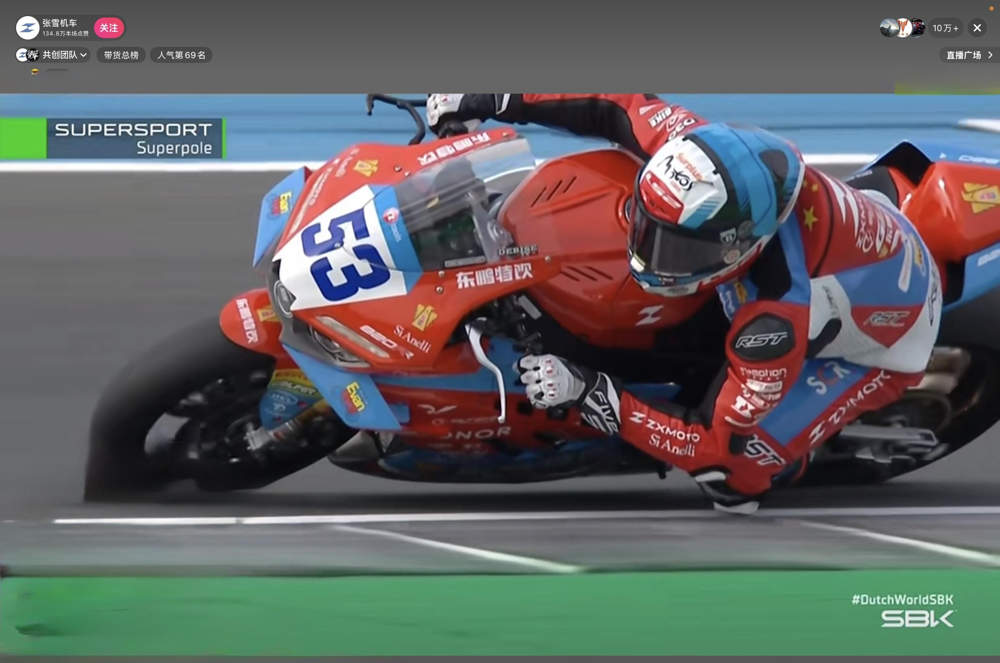

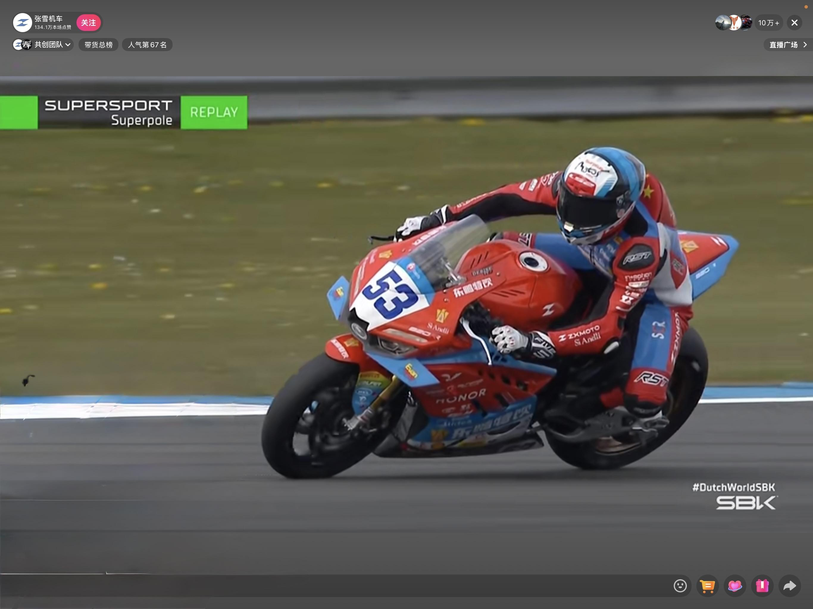

4.17是排位赛，4.18是正赛。

这一场，第一名是LucasMahias，这个人是法国老将，也是Yamaha阵营里很典型的Supersport车手。

他经验丰富，比赛阅读能力强，属于那种很会找超车窗口的选手，

更关键的是，他和ValentinDebise都是法国车手，在赛道上**既是同乡，也是最容易被拿来比较的对手，**

说是他们有发生过**激烈冲突**，在法国站Race2发生过碰撞。

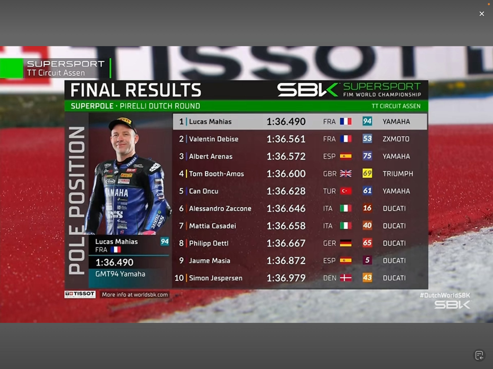

WorldSBK官方视频标题

"Thingshottedupontrackbetweenhome-heroesLucasMahiasandValentinDebiseaftertheirdramaticcrashinRace2"Thingshottedup"就是"场面变得火爆"的意思，说明碰撞后赛**道上的气氛一下子就紧张起来了。**

但这并不算是私人恩怨，就是**法国主场两名同乡车手的赛道对抗。**

摩托车比赛里，碰撞、并轮、擦碰、互怼都是家常便饭，

官方用这种标题是为了突出比赛的激烈性。

但这种"**同乡英雄在主场碰撞**"的叙事，让两人更容易被拿来比较，也让**他们的故事更有戏剧性。**

咱们有好戏看了，明天正赛见。

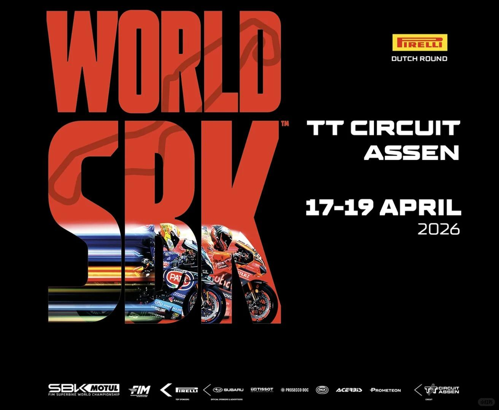

## 平常心

这次，张雪赛前先给大家泼了盆冷水：

**”夺冠是希望，夺不了冠也正常。”**

葡萄牙站的成功，也可能直接带来两个后果：

一是张雪机车从“新人黑马”变成了被重点研究的对象，

二是性能平衡机制有可能进入更严格的调整窗口。

这一站环境各方面都不算友好，**比赛难度明显上升。**

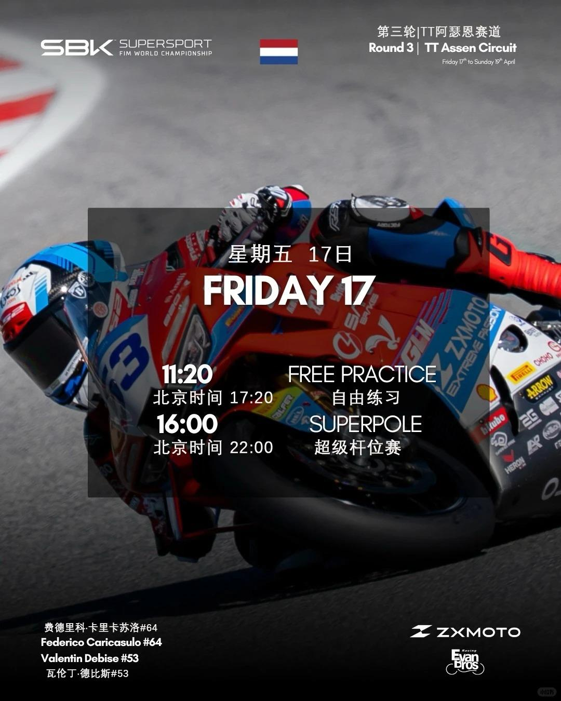

4.17第一天观赛时间表格

## 赛道

荷兰阿森站，素有”速度大教堂”之称。

阿森站本身也不友好：4.542公里，18个弯道，右弯占多数，对轮胎管理、悬挂韧性和整车平衡要求都很高。

我看到很多说法，说BOP，比如葡萄牙站表现太强势后，张雪机车在荷兰站前已面临明显的性能约束，油门开度限制仍在，后续还有可能继续加码。

这相当于一边跑一边还得给车绑着负重，好比给一个夺冠运动员绑上沙袋在赛道上跑。

这个消息看到时候，很为他们感到紧张。

不过根据目前信息来看，并没有发生。

但一个是BOP是WSBK的通用规则，就是为了防止哪台车太猛了把比赛搞得一边倒。并不是针对压制，是为了赛制平衡进行。

另一个是葡萄牙站双冠之后，外界一直在猜测张雪机车会不会被加码。

昨天在比赛讲解时，讲解员专门说了，他采访到了张雪，说这场并没有被加BOP。

后面会如何还不知道。

车队心态很好，**张雪自己也说得很清楚：”胜败乃兵家常事。“**

据说车手德比斯在比赛开始之前，在模拟器训练中，已经能跑出接近赛道纪录的圈速。

## 核心对手对比

更关键的是，这条赛道是老牌厂商的主场。

Ducati在这里拿过94次领奖台、34场胜利，Yamaha、BMW、Honda都有深厚的数据积累。

厂商技术路线阿森优势公开可见的对张雪压力Ducati典型四缸平台，历史数据极厚Assen历史奖台最多，94次奖台、34胜。弯速和整车平衡经验很强，且规则博弈能力成熟。Yamaha四缸平台，偏稳定与顺滑Assen历史奖台30次、3胜。对节奏型赛道经验足，擅长连续弯。BMW四缸平台，近年竞争力上升Assen历史胜场不多，但近年常被视为冲击力强。若匹配成功，单圈速度威胁大。Kawasaki/bimota四缸平台，具体团队差异大历史积累深，但近年结构变化较多。更看重轮胎和中段弯速。Honda四缸传统强队历史奖台不少，但近年起伏较大。若找到稳定设定，赛道经验仍有威胁。张雪机车的优势是三缸发动机的轻量化、重心低、弯道出速快。

但如果BOP继续收紧，这些优势会被部分抵消。剩下的，就是”设定更准、车手更稳、比赛更干净”。

中国厂商在欧洲赛场的历史表现，公开能确认的“高光级别”并不多，所以张雪机车这次的意义更像是一次“样板战”。

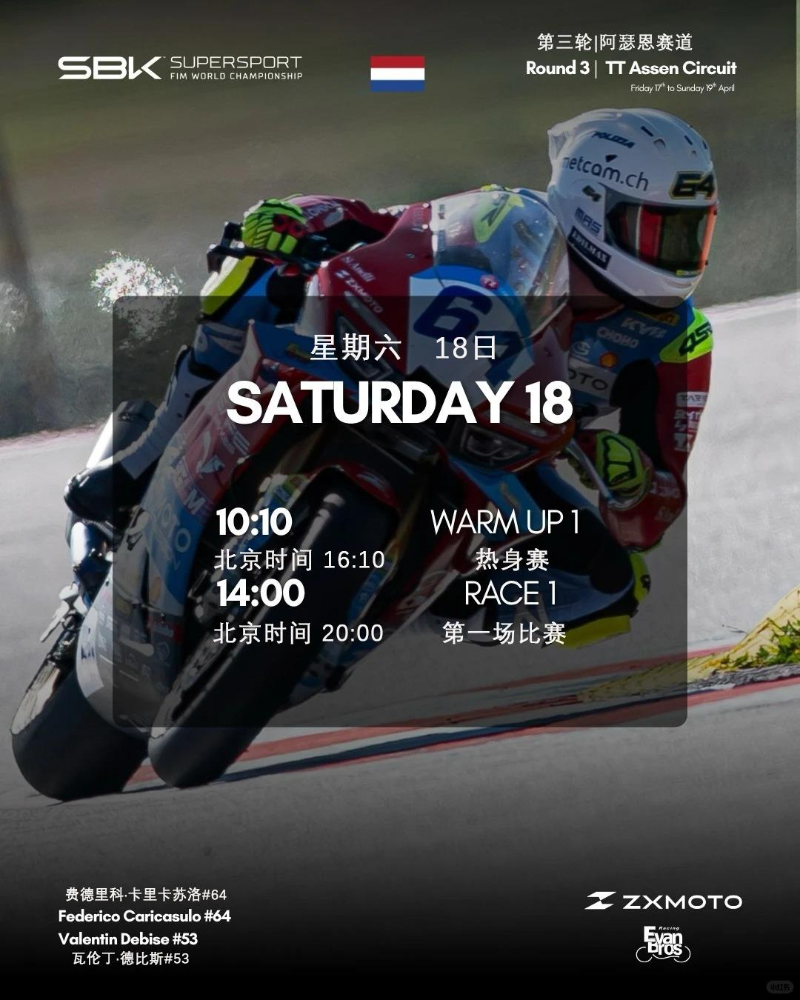

4.18第二天观赛时间表格葡萄牙站的双冠，证明了张雪机车有世界级竞争力。

今晚的比赛，夺冠当然是最好的结果。

但就算拿不到冠军，也都已经证明了一件事：

**中国厂商并不是来刷存在感的，是来真正竞争的。**

## 中国摩托车品牌

**三家中国品牌同时出现在世界赛场上。**

张雪机车在WorldSSP拿了葡萄牙双冠，QJMOTOR也在同一组别参赛，凯越则在其他组别出战。

三家的打法完全不同。

张雪靠世界赛成绩直接出圈，QJMOTOR走的是持续参赛、体系化推进的路线，凯越则是从越野和拉力起家，积累耐久口碑。

**这是中国摩托车品牌第一次以”多品牌、多路径”的方式，集体出现在世界顶级赛事里。**

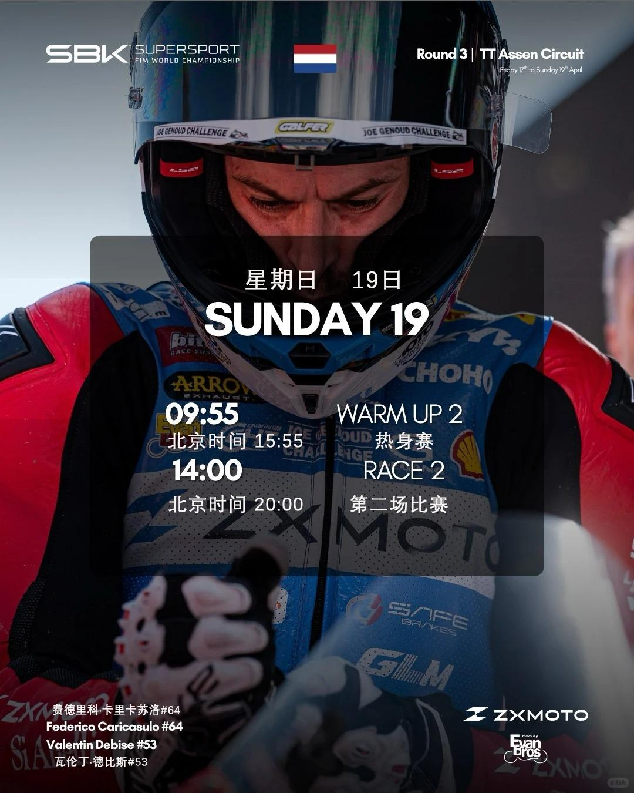

4.19第三天观赛时间点

## 看点

这场比赛之所以难，不只是赛道难，也是对手强、规则紧、每一圈都要算得很细。

这次荷兰站，还有一个容易被忽略的看点：**这是一个多组别同时开赛的世界级周末。**

WorldSBK、WorldSSP、WorldWCR、WorldSPB四个组别交错进行，

**欧洲老牌厂商、中国新品牌、女子组车手一起出现在同一个舞台上。**

## 这位女赛车手是谁

我今晚去看了下官网，发现只有一位女摩托赛车手在里面，就好奇她是谁呀，看了下成绩和职业履历，有意思。

她的故事，居然和昨天给牙哥那篇建议那块还有点呼应，

**就是她面对着一路资金不足，不断去解决问题，跑成了世界冠军。**

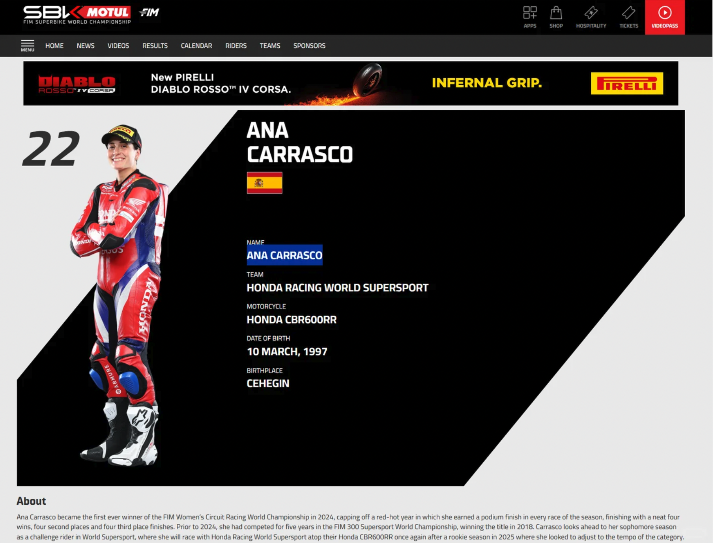

## Ana Carrasco：从众筹到世界冠军

2018年，AnaCarrasco站上了WorldSSP300的冠军领奖台。

那一刻，她成为史上首位单人场地摩托世界冠军女性。

她最厉害的地方，是把”女车手”这件事，变成了世界冠军级别的实绩。

**但很少有人知道，那一年她是靠众筹才把赛季跑完的。**

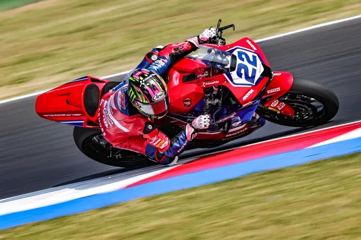

## 最难的起点到夺冠传奇

AnaCarrasco的职业路径，起起伏伏。

2013到2015年，她跑过Moto3，最好成绩做到过第八名。

2018年赛季开局，AnaCarrasco遇到了最现实的问题：钱不够了。

她的故事里最打动人的，一路在资源很少的情况下，依然能跑出来。

赛车这项运动很残酷。

没钱，拿不到好车队；拿不到好车，很难证明自己；证明不了自己，更没人愿意给钱。

专访里提到，她在2018年开局时甚至一度是靠众筹去维持赛季，因为资金突然出了问题。

她后来回顾说，那一年最早要解决的问题是”赛季能不能继续下去”。

但她没有停下来。

她先用众筹和有限的赞助，争取把赛季跑完，再用成绩换信任。

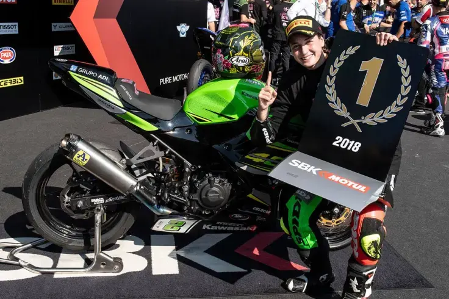

真的在2018年，她拿到了WorldSSP300世界冠军。

那次夺冠很有传奇性。

**她那一年一路拿到多个领奖台，最后在赛季末站上世界冠军的位置，成为历史上第一个在单人摩托车世界级比赛里夺冠的女性。**

更多赞助商开始找她，其中一些合作一直延续到后来。

**她最强的地方，是一直能让自己”还有下一站”。**

她后来在采访里说得很直接：

”刚进世界锦标赛时，最难的不是伤病，是要让人们相信我有资格站在那里。而且我每年都要换车队、想办法延长职业生涯。”

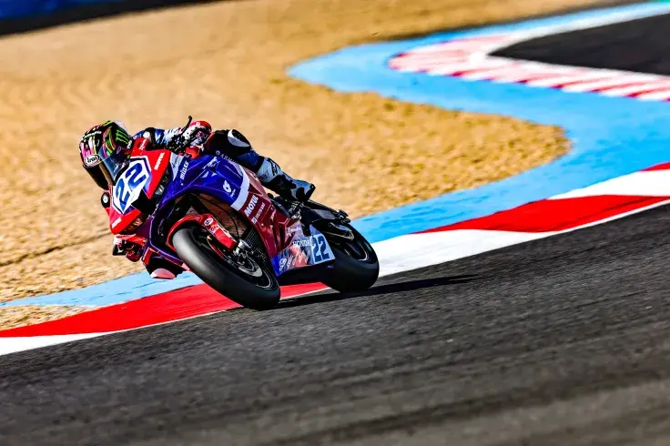

## 会被现实打回去，但还能继续回来

更难得的是，她并没有因为一次成功就停下来。

**之后她又经历了回到Moto3、伤病、调整、再回归职业赛场这些起伏。**

2024年，她又拿到首届WorldWCR冠军。在WorldWCR拿下首冠，说明她已经证明自己具备国际顶级公路赛的竞争力。

2025年，她转入WorldSSP——这是一个更高强度的组别，她需要适应600cc级别的比赛节奏。

2026年，她继续代表HondaRacingWorldSupersport出战。

在一项体力、对抗、节奏和风险都很高的比赛里，

**女性车手能进入同一组别并不是靠“象征意义”，**

**是凭借着长期比赛成绩、技术适应和职业累积。**

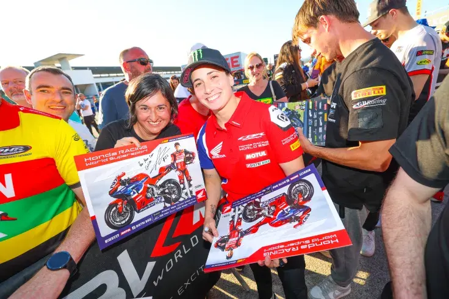

## 好车手也需要好赞助

AnaCarrasco是真正的职业选手：并不是一直顺风顺水，被现实打回来，但还能继续回来。

她的采访里还很有力量的一点，是她并没有把自己讲成“女性代表”，

说她自己就是一个**普通车手**：**我也需要赞助、需要更好的车、需要适应更高组别，也需要用速度说话。**

**她的职业路径，从一开始就是在男女同场的世界锦标赛里，一路跑出来的。**

在摩托车赛事里，钱很重要，但成绩会是把钱变成机会的钥匙。

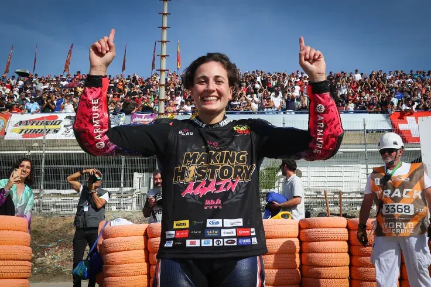

## 她的故事还在继续

2026年，AnaCarrasco继续代表HondaRacingWorldSupersport出战。

她和张雪机车在同一个组别竞技，这本身就说明WorldSSP已经是一个真正按实力说话的世界级赛场。

**她的故事，是一个从资金紧张、长期质疑、组别转换到两次世界冠军的职业逆袭。**

**4.18补充**

我昨天很偶然看到这个故事，觉得是女子力量吧，是给热爱者的强心针。[爱]

其实她的故事里，那些"资源不好、支持不够、钱也有限"的情况下，怎么把梦想继续下去，这个思维对大家会有帮助，所以要分享出来。而且她的成绩罕见。

性别只是她的一个标签，但解决问题的坚韧、方式是通用的。

也觉得应该给女子选手更多支持，这样环境更理想。

因为女子选手在力量速度类赛事中确实面临生理劣势，许多组织通过资金资源支持来鼓励参赛，但“特殊规则照顾”（如让分、起步优势）几乎没有，是为了维护竞技平衡。

但看这位车手的情况，她的支持资金不稳定，生存条件、资源也没有很充足，就只能自己想各种办法。

**希望更多人看到她的故事后，产生做事情的勇气，**

**而不是总想着等所有条件都完美了，才开始行动。加油！**

今晚的看点，我会关注张雪机车能跑到哪一步，也**包括三家中国品牌在同一世界级赛事周末里的集体亮**相，以及AnaCarrasco这样的车手，怎么在同一个舞台上讲出另一种职业故事。

期待今晚，会很精彩。

写这个回答时候有收获，过程心情愉悦。

享受今晚比赛！GoodLuck！祝福祝福。

**观赛时间**

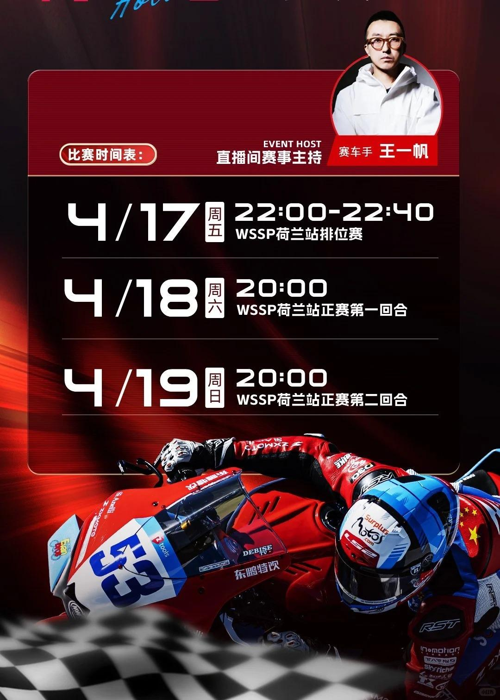

Cr.张雪机车
