# 张雪机车的64号车手卡索罗，过往战绩如何？为什么老摔车？现在到底什么情况？

> 来源：知乎专栏「张雪机车 | 极致热爱」
> 作者：耿悦

他是一位具备顶级竞争力的进攻型技术车手，曾经差6分拿世界冠军。

如今换了一台全新赛车，在当年夺冠的赛道上一圈圈摔。已完全更新。

Federico Caricasulo 基本信息

1996年4月6日生于意大利拉韦纳（Ravenna），艾米利亚-罗马涅大区——Vale Rossi 的老家就在附近，这片土地上长大的孩子，骨子里都带着摩托车基因。

现年30岁，正值车手黄金期。

江湖人称"卡里卡（Carica）"，近170场 WorldSSP 出赛经验让他成为该组别最老资格的车手之一，WorldSBK 官方叫他"常青树（stalwart）"。

技术优势

① 弯道进攻力极强

他的标志性动作是晚刹车切入——比其他车手晚半拍刹车进弯，压低重心，在弯道中段完成超车。2019年荷兰站夺冠那场，就是这套打法的教科书演示。

② 赛道阅读能力

169场WorldSSP出赛，这个数字在该组别无人能敌。他能在几圈热身内摸清轮胎状态窗口，这是"赛道智识"型车手的核心本事。

③ 多品牌适应经验

Yamaha R6、Ducati V2、MV Agusta四缸，换哪台车都能上手就拿积分。对工厂调教师来说，这种车手是宝贝。

④ 杆位能力

生涯13次杆位，说明他的单圈速度在精英级别完全能打。这不是"慢车手"的数据。

Cr. Evan Bros 官网
职业生涯阶段划分
上升期（2014–2017）

年轻，激进，进攻型骑行。2016年首秀就登台，2017年拿到职业首胜，妥妥的"新秀奇才"。

但问题是资源有限——Honda非工厂支持，积分竞争力不稳定，摔车偶尔有，但不频繁。

巅峰期（2018–2019）

与Evan Bros/GRT的Yamaha组合达到完美配合。2019年207分、3场胜利，骑行风格成熟，兼顾进攻与节奏。

但最后一站，他被队友Krummenacher以6分之差压制（213分 vs 207分），世界冠军擦肩而过。心理代价极大。

试错期（2020–2022）

WorldSBK升级失利 → 回归SSP → 换队（GMT94 → Ducati），频繁换车、换队、换级别。

失去稳定平台，无法长期积累。与GMT94决裂是重要转折点。

平台期（2023–至今）

Ducati时代成绩短暂回升后又滑落。2025赛季积分仅64分，2026年加盟张雪机车，成绩平淡。

核心问题是换车型太频繁——R6 → R1 → R6/V2 → V4 → MV Agusta → ZXMOTO，每次都从零适应。

看到有人说他右手腕受过伤，去搜了下，是23年的，但那年成绩很出色，到现在也有几年了。

右手腕伤病——被忽视的隐患？

2023年2月18日，就在新赛季开始前，Caricasulo 在西班牙训练时摔车，右手腕骨折并位移。

关键事实：

时间节点：赛季前备战期，最糟糕的受伤时机
伤情：右手腕骨折+位移，以及其他部位骨折
右手腕的重要性：油门、前刹车、入弯精度控制——全靠右手

矛盾的是：2023年他带伤拿下258分，全年第4，成绩相当出色。这说明当时伤病并未严重影响发挥。

但问题在于：右手腕骨折后的微妙后遗症——力量、灵敏度、疼痛阈值的细微变化——可能在几年后与新车磨合时被放大。医学上，这种"看似痊愈但精度下降"的情况并不罕见，尤其是在需要毫秒级反应的极限运动中。

目前无法确认：Caricasulo 和车队均未公开声明右腕是否仍有影响，但这是一个不能忽视的变量——尤其是当他在入弯时频繁失控时。

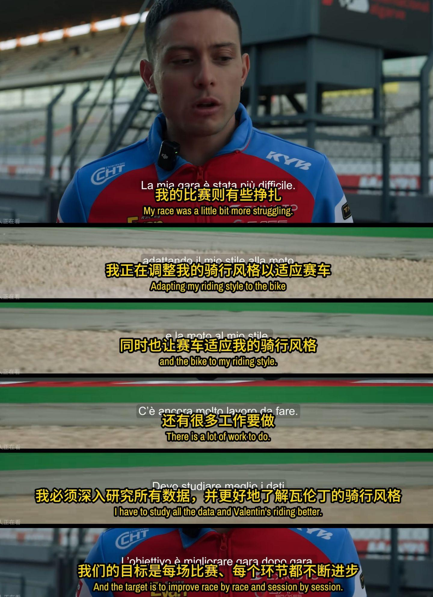

Cr.张雪机车夺冠纪录片
为什么他现在看起来"不行"？

新车磨合期的风格冲突。

频繁摔车的两个可能原因：

1. 换车太频繁，肌肉记忆来不及重建

R6 → R1（WorldSBK）→ Ducati V2 → MV Agusta四缸 → ZXMOTO，每换一台车，他都要重新校准骑行边界。

问题是他的进攻风格激进——晚刹车、压弯、切入，这套打法在熟悉的车上是绝活发挥，在不熟悉的车上就是在摸边界，一不小心就摔。

2. 心理压力可能在放大问题

2021年GMT94提前分手，2025年赛季中换队，这两次决策都发生在成绩不佳的时候。

这说明他在压力下容易冲动决策，而冲动决策又会带来新的适应期，形成恶性循环。

与世界冠军擦肩

这个赛车手有个心理的难点：

他在巅峰时刻：2019 赛季 拥有了3场胜利（荷兰、西班牙、葡萄牙），207 分，是世界亚军。

最后一站卡塔尔，他输给 Krummenacher 6分，屈居亚军。这是他职业生涯最接近世界冠军的时刻——奖杯近在咫尺，却又最痛苦。

这个残酷在于：在12站比赛中，任意一站多进步1-2个名次，或者避免在法国的退赛（一次丢失16分），那么那一年的世界冠军就是他的了。

2019年亚军留下的"心理债"：

距离世界冠军仅6分，这种"差一点"的压力在心理学上往往比大差距的失败更难消化——它会让人反复回想"如果当时……"，成为挥之不去的执念。

这份遗憾刻在了他整个职业生涯后半段的底色里。此后他频繁换队换车，似乎始终在追寻"重现2019辉煌"的可能性。

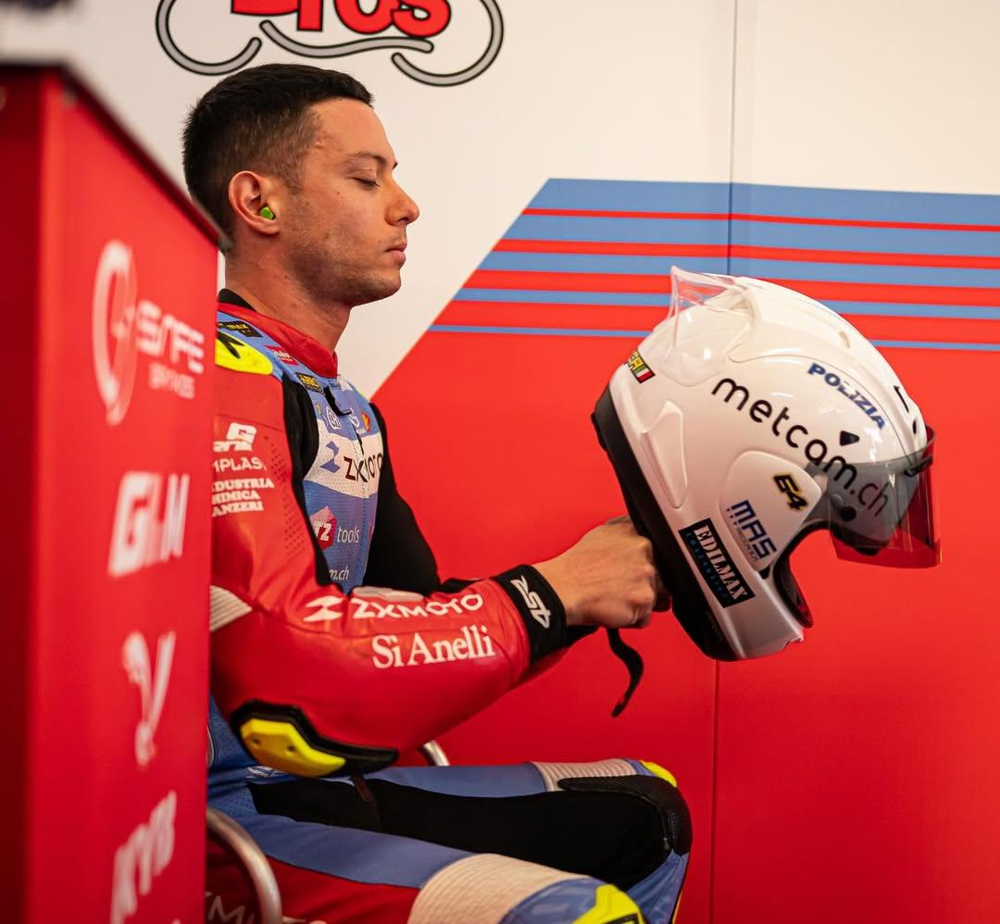

2026年，一个车队，两种命运

目前赛季刚刚开始，Caricasulo仅完成了3站比赛。

按行业经验，这正是磨合期最困难的阶段——新车、新车队、新调校，一切都在摸索中。

真正的观察窗口是 2026 年下半赛季（第 8-12 站），而不是现在。

队友Debise已经夺冠，而Caricasulo还在摔车。

这种反差让外界质疑声四起，恨不得帮他把车修好。

但车队内部的判断更为冷静，相信他的实力，正在找解决方案，正在和新车磨合。

2019年荷兰阿森：0.032秒的最后一圈奇迹

WorldSBK 官方记录：

"A determined ride at Assen in 2019 saw Federico Caricasulo clinch a satisfying victory by 0.032 seconds over his teammate Randy Krummenacher."

这场胜利的关键是什么？

要理解这 0.032 秒，先理解他当时骑的车——Yamaha YZF-R6。

R6 是一台四缸高转速赛车，特点是：

前轮反馈极为清晰、线性，车手能精准感知抓地力边界
刹车响应直接，适合"晚刹车入弯"的进攻打法
转向灵活，弯中可以大幅度调整姿态

Caricasulo 在 Evan Bros 车队与这台车磨合了整整两年（2018–2019），对阿森赛道每个弯道的刹车点、入弯角度、出弯时机都建立了精确的肌肉记忆。

最后一圈的 0.032 秒，是他在这套熟悉系统里发挥到极致的结果。

他知道在哪个弯可以晚 0.1 秒刹车，他知道前轮在这个力度下不会打滑。

这是精确计算和极致练习后的夺冠。

七年后，2026 年，他回到了曾经的夺冠福地，就是刚刚结束的荷兰阿森站，

2019 年，他在这里以 0.032 秒的优势夺冠；

2026 年，他在这里连续摔车，

这个反差，令人感到震惊。

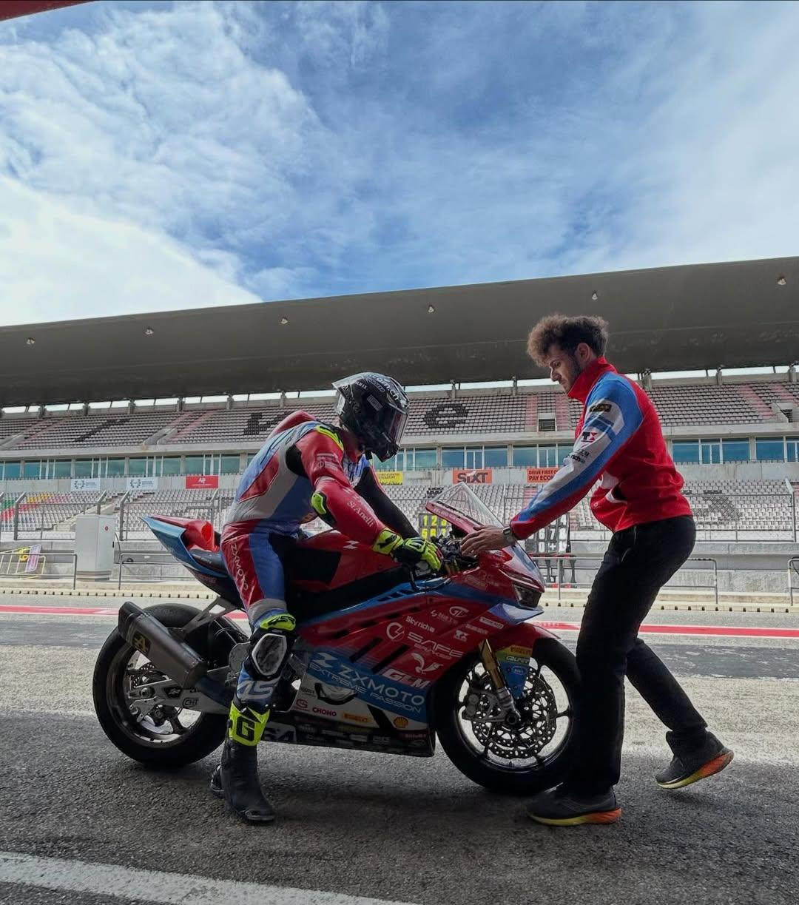

2026年阿森：同一条路，完全不同的地图

七年后，他回到了同一条赛道，但手里的"地图"变了。

ZXMOTO 820RR-RS 的关键参数差异：

特性	Yamaha R6（2019）	ZXMOTO 820RR-RS（2026）
气缸数	四缸	三缸
排量	599cc	818.8cc
最大转速	~16,000rpm	~13,000rpm（峰值功率转速）
动力特性	高转爆发、线性输出	中低转扭矩更大，动力输出更集中
前轮反馈	经过2年调教，极为熟悉	全新车型，数据库空白

这是我现学的知识：

三缸和四缸的本质区别，在于动力输出特性不同。
ZXMOTO 820RR 的三缸发动机排量更大（818cc vs 599cc），中低转扭矩更强，

加上不同的 ECU 调校，从油门到刹车的过渡阶段，减速感和引擎制动的反馈都与 R6 的四缸高转引擎完全不同，这会直接影响进弯时的车头稳定性。

而 Caricasulo 的招牌动作——"晚刹车入弯"——恰恰是在这个最敏感的窗口发力。

2019 年，他的大脑在运行这套指令：

"阿森第 8 弯，在 150 米标志处刹车，前轮会咬住，可以切进去。"

2026 年，他的身体还在运行同样的指令，但车辆给出的反馈变了：

ZXMOTO 820RR 在同样的力度下，前轮反馈不同，引擎制动感不同，边界不同。

七年的肌肉记忆，成了障碍，而不是财富。

队友 Debise 没有这个问题——因为他没有"阿森用 R6 的七年记忆"需要覆盖，

他是在一张白纸上学习这条赛道与这台车的组合。

2019年，他赢得0.032秒，靠的是对车辆和赛道的毫秒级熟悉。

2026年，他摔车，因为那套精确的肌肉记忆在新车上变成了错误预判。

经验也是双刃剑，在这里反而成了他的负担——有时候，轻装上阵比背着包袱更容易找到状态。

个人碎碎念

这是我今晚看到的，看张雪也在关心64号，对网友的疑虑，事事有回应👍

这小伙在国内中文世界里还没啥报道，我边看边写略感唏嘘。

在刚刚结束的荷兰阿森站，2019年他在这里夺过冠军。

每个人都有自己的不甘心、不熟悉，谁也不想摔车，都是一副血肉之躯，都是把自己的人生交付给了赛车。

他和Evan Bros车队是老乡，一起成长起来，车队也在帮他调整着，

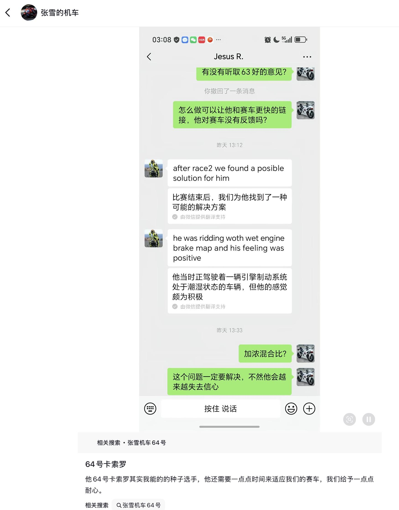

Cr.张雪的DY

现场争先恐后和德比斯合影的朋友们，看到他也打打招呼嘛，鼓励鼓励。

现在同一个车队，同时出发，他之前的成绩其实比德比斯还好，目前两种命运，天壤之别。

他的心理压力肯定更大，落差更大了。

而且他俩的位置，最初的设定更像是，德比斯是数据采集反馈，他才是夺冠选手人选。但现在逆转了。

其实这些外界都看不到他的心理，如果是人物纪录片，那这个人正在经历自己的职业风暴。

你想啊，当年这个赛道的冠军，谁不想重回当年巅峰风采，

结果一圈圈摔，然后大家追着他说，白吃饭的，这人在干嘛呢，去把他换掉赶紧。

现在不好说，只能看看他后面找状态如何吧。

后面我陆续看到他的新消息就更新在这里。

他在知乎也没有自己的提问，我放回答都没有地方，我还得自问自答。

想起来以前刚换一个新工作面对那种处处坎坷的时候了，你们代入一下，压力很大的。

但观众再着急也帮不了他。对了，我今天去看评论区，有人说"我昨天愁得一夜没睡着，张雪，64号的车调好了吗"，又看笑了。中国网友好可爱。

希望这个回答让你晚上能睡个好觉。

4.22新写

昨天说到，Federico Caricasulo 是一位天赋出众却屡遭命运折磨的意大利中量级斗士。

我在看车队（Evan Bros. Racing Team）的采访时，他们提到了对车手的喜爱，

当时我很喜欢这一句采访，想把“我们一起走过了四年，就像一场梦”的美好捕捉。

但我再读的时候，发现这并不是在说德比斯，原来是在说另外一个车手，车队这么喜欢他，他在哪里？

我才产生了好奇：我们怎么还没有看到这个人呢？这肯定也有故事。

那时候我们只认识德比斯。

所以后来，当 53 号热度极高时，我才看到了摔车走下来，坐在角落里失落眼神的64 号，也就有了这一篇。

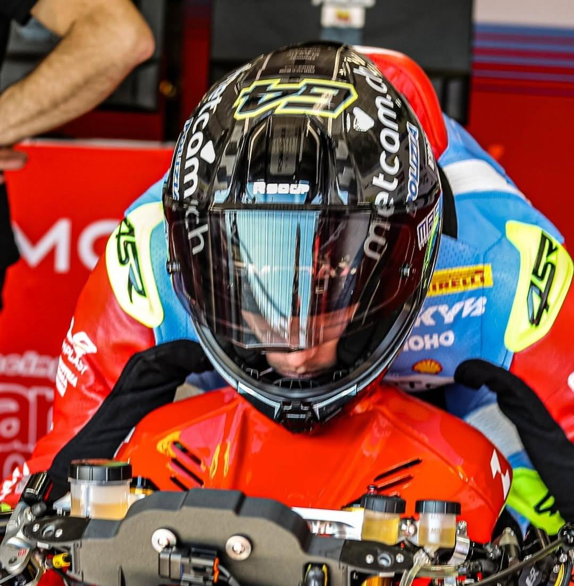

对Federico Caricasulo来说，Evan Bros是他的老东家：

这是我最初成长起来的车队。

我在这里拿到了最好的成绩。

我们一起走过了四年。

所以对我来说，这就像一场梦。

首先，我认为他们是最好的；
第二，我觉得他们更像朋友。

车队采访，对于他重新归队时的开心：

至于 Federico Caricasulo，有时候我喜欢说：我们几乎是亲手把他塑造成了一名职业车手。

因为他在很年轻的时候就和我们一起开始了。

在他身上，我们一起经历过非常多美好的时刻。

从亚洲赛事开始，我们很快就赢得了胜利。2014年，我们迎来了非常美好的时刻。2016年，当我们进入世界超级运动组时，在澳洲站，我们立刻就拿到了第二名。那是不可思议的成绩。

如果回看10年前，如今在10年后还能再次和他并肩作战，

我觉得这既美好，又非常重要。真的非常重要。

技术主管说，

他知道费德里科·卡里卡苏洛有冲领奖台甚至赢比赛的实力，只可惜没给他一台专属赛车。

关于测试表现：

尤其是 Federico，圈速同样不差。

车手自己也在说，他正在和车互相适应，一步一步找节奏。

他有实力，也争夺过不错的成绩，只是还在和这台新车820RR正在磨合。

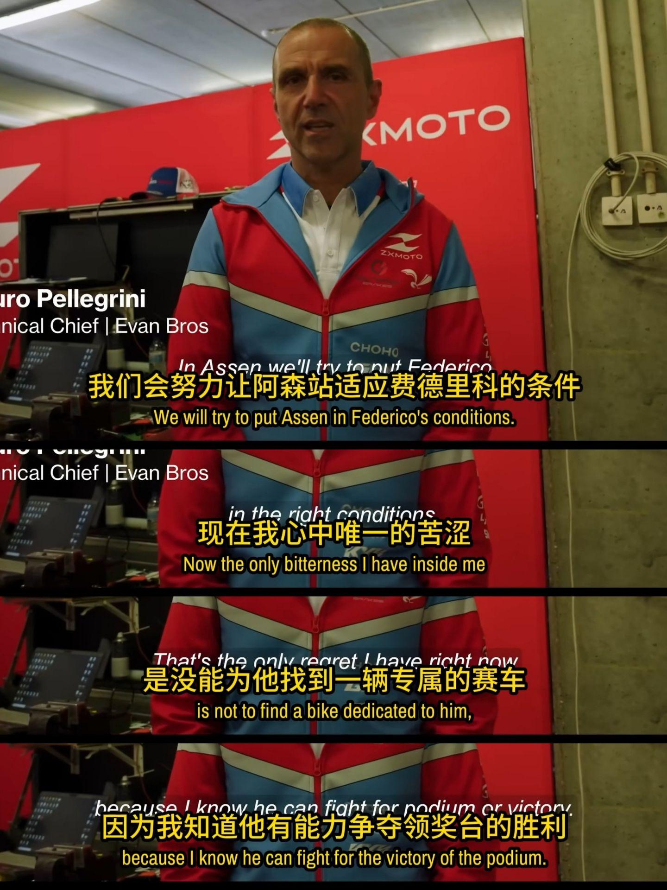

这是在葡萄牙第一次夺冠后，对车队的采访：

您所使用的摩托车与原厂产品有多大差距？

“这辆摩托车与从经销商处购买的完全一样：

外观漂亮，做工也相当精良，而且许多赛车级的解决方案已直接应用于量产车型，比如转向柱倾斜角度的调节与进阶系统。”

你们的目标发生了怎样的变化？

“经过两场比赛，我们还不应安想赢得世界冠军。

现在还为时过早，尽管我们当然可以怀揣梦想，但说我们已做好准备去夺取总冠军，却为时尚早：

这样一个全新项目，仍存在太多未知因素。

显然，在第二场比赛中拿到50分，更让人懊恼此前在澳大利亚丟掉的那些分数。

要想争夺世界冠军，未来某些比赛我们不得不学会知足。”

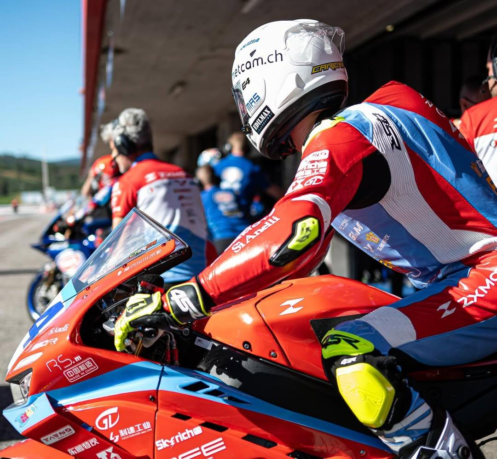

德比斯速度极快，卡里卡苏洛只偶尔露面，你觉得他也能追上吗？

"在波尔蒂芒，我们的目标是瓦伦丁跻身前五，费德里科路身前十。

在第一场比赛中，我们成功达成了这些目标。

卡里卡苏洛对调试赛车提供了很大帮助，而两位车手的首席技师毛罗·佩莱格里尼也充分利用他的数据和建议，为瓦伦丁为机车进行调校。

我希望在米萨诺，他也能继续与这位法国车手并肩作战。

Cr.张雪机车
调车

以下信息来自赛前网络评论， 目前进度不详。

每个车手的骑行风格不同，车辆设置也不一样。

这个车队是意大利顶尖车队，但目前先保证调好一台车53号。

64号（Caricasulo）的车能调多少是多少，据说还有零件没到位。

车队去年11月才拿到车，而且当时他们好像是打算先好好了解车，到27年再比赛，但今年就提前快速参赛了。

资源有限，这两个车手共用一个工程师，调校方向主要按照德比斯的风格来。

原因是德比斯采集的数据更精准，能更清晰地向工程师反馈问题，提出调校需求。

有了准确的数据，车才能调得更强。

但好在他们的优势，在于能够按照他们的需求，在背后有张雪的工厂全力以赴配合车手去进行修改。

德比斯和他经过更长的数据采集，可以把摩托车越调越适合自己的风格。一站站来，会越调越好的。

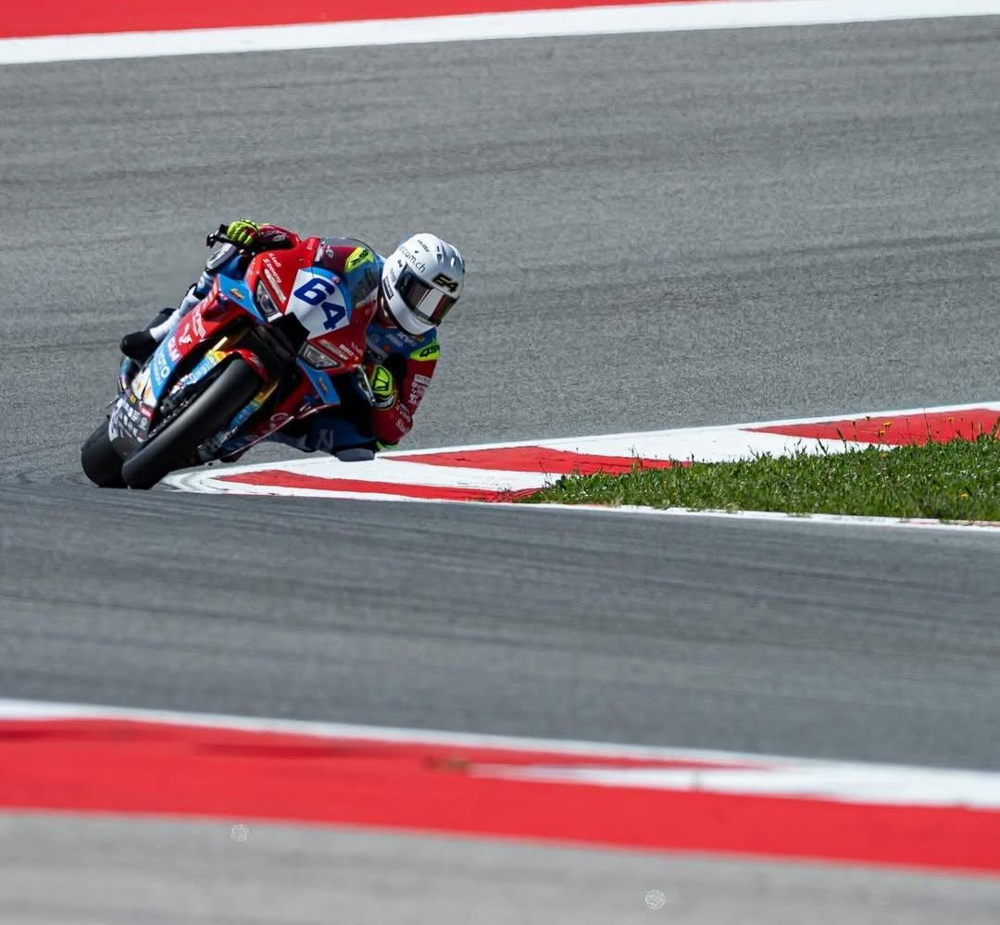

数据采集：用摔车换来的经验库

之前写了，中国机车的性能已经很好了，产业链也很丰富，但相比国际老厂牌，经验库和数据还欠缺。

老牌车队有几十年的数据积累，张雪机车没有。 ZXMOTO 820RR-RS 是全新的三缸车，没有历史数据可参考，每一次上赛道都是在填补空白。

每一次摔车，都在探索车辆的极限边界。

这台车在什么情况下会失控？这些问题，只能通过实战来回答。

就好比一个人去测试喝酒，看自己能喝多少酒才会醉倒，这说法也有意思。

摔车是研发新车必须付出的成本。

在赛道上面，Caricasulo 的核心任务可能是用极限尝试，帮车队摸透新车与新赛道的边界——弯道刹车能延迟到什么程度、出弯加速到多少转速会失控、湿滑路面的抓地力阈值在哪里。

这些用摔车换来的数据，会直接用于优化——德比斯的赛车设定。

他们各自专注于各自分工，也有这种可能，只能说目前彼此配合。

欧洲工作效率

我在意大利有过心惊肉跳的旅行回忆，当然这个扯远了，就是写到这里想到了。

回想起来，就是当地办事的节奏非常慢，旅行就还行，万一丢个东西慢的我要崩溃。

可能是欧洲人习惯了轻松的工作时间。但欧洲也不是铁板一块，爱沙尼亚、荷兰、瑞士效率高，而意大利、希腊、德国等"罗曼语系国家"普遍被认为是欧洲最慢的。

这几个是我之前旅行经常去的，深有感触，在中国当天问题当天解决"的速度，但在欧洲一些地方，工作和生活申请逻辑，是"流程走完才算完"。

这个背后是有文化结构原因的，和个人态度问题无关，就是社会整体的工作体系的节奏就是如此。

比如你在国内，基本两个小时或两天就能处理完的一些申请，在欧洲那边差不多得两个星期，甚至两个月都有可能。

比如你装个宽带，在中国师傅马上上门吧，最多一到三天，但是在意大利，

要先去门店办理登记、签合同各种，留下家庭地址，
等路由器邮寄到家里，意大利邮政速度极慢，这一段等待本身就要一两周。
收到路由器后，等运营商主动联系预约上门安装，这个具体多少天看情况，还可能需要主动去催，否则就干等着没人来。
技术人员最后上门安装（预约后还要再等）

大概要等一个月左右才能用上网，申请进度都非常慢。

我之前合作过几个意大利客户做内容，就是邮件会在一种意想不到的方式出现。

当你和国外合作，除了语言，有很多意想不到的流程的折腾折磨，

我有时候一天到晚都在处理这些流程……当然这只是我的个人记忆、个人案例，并不是说所有都这样。

像国内风驰电掣般的推进体验，还是相对少一些。我在意大利丢的东西都没有找回来。

不过看纪录片感觉这个车队效率很棒。

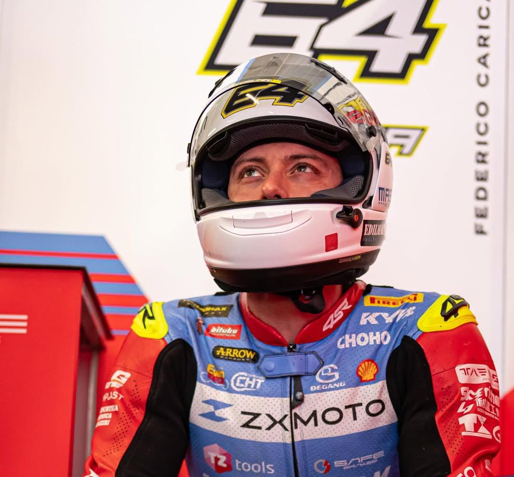

两面性：换车频繁，也是经验丰富

任何事情都有两面。这是我的感觉。

他用过很多辆车，换车频繁，但从另一个角度看，他的测试车型经历非常丰富。

这就好比一个人，好玩的产品都体验过顶尖的，日积月累，她个人的Taste品味就是顶级的。

那么此人再使用一个新产品，给出的标准和反馈，自然比完全没有经验的人要高级得多、丰富得多。

所以他在高强度试错方面的积累，就是个宝库，那很适合目前的张雪机车。

受伤

说到受伤，其实德比斯也受伤过。

之前我写的那篇里有提到，他当年是完全飞出去的，有视频。

他的伤更严重，但其实优秀的摩托赛车运动员们，都有伤病，各种各样的骨折。

马奎斯也是右臂骨折，养了好几年，恢复时间更漫长。

这些都是一样的道理，就像舞蹈演员在台上跳得特别好，你跳得有多好，伤就有多深。你不可能要求一个人是顶尖的，然后浑身一点伤都没有。那可能就是 AI 吧，人是不可能的。

当网友看到64号右手有些许旧伤，说「如果能有专业中医针灸去给他治，应该会更好」，看这建议，中国网友真的热心肠。

第三部分我准备是下次发，但今天就直接发了吧

说到新车磨合，为什么大家对64号这么着急，觉得两三站就该出成绩了？

可能是因为德比斯（Debise）适应得飞快，

他在完全陌生的三缸新车上，用1个月时间完成适应，葡萄牙站以"碾压式优势"夺冠，展现出惊人的学习曲线，

大家就觉得应该都这么快，但每个人磨合程度不一样。

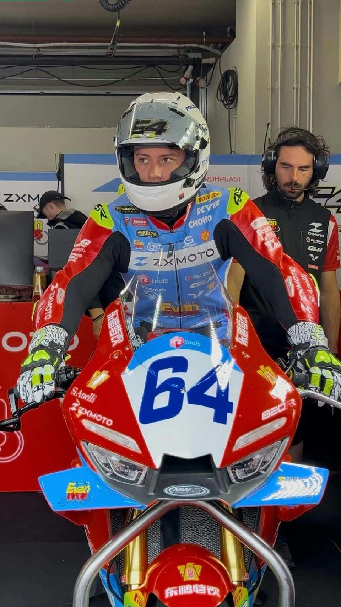

我搜了一下过往的案例，很多车手换新车其实都要磨合很长时间。

MotoGP/WorldSBK 级别的普遍规律：

换品牌（比如从 Yamaha 换 Honda）：通常需要一整个赛季甚至更长。

同品牌新车型：通常需要半赛季到一个赛季。

全新品牌首款赛车（比如 ZXMOTO）：磨合时间更加不容易去进行预估，因为没有任何历史数据参考。

真实案例：

有一些车手，竟然花了一整年、两年，都还在适应新车。甚至有一些还是世界冠军，但也没有回归水准。

Joan Mir 加盟 Repsol Honda（2023–2024）

Mir 是2019年 MotoGP 世界冠军，2023年加盟 Repsol Honda 后，整个赛季频繁摔车、成绩低迷。

他本人承认

"适应 Honda 的困难与我当年加入 Suzuki 的菜鸟赛季类似"。

他公开表示：

"摔车必须停下来，但摩托车在慢慢进步。"

2023年全年未进前十，2024年小幅改善但仍未回到冠军水准。

Luca Marini 加盟 Repsol Honda（2024）

MotoGP 官网对他第一年的评价是："一整年都在适应 RC213V"，第二年才开始建立成绩。

Marc Marquez 的反向案例（2024离开 Honda）

另一个更戏剧的案例是马奎斯 在 Honda 的最后几年（2020–2023）——他在2020年 Jerez 因推进过猛摔车导致右臂骨折，此后接受4次手术，3年大部分时间都在伤病和适应之间挣扎，但王者归来，回来后车神又夺冠了。

Marquez 在 Honda 上待了12年，换到 Ducati Gresini（旧款 GP23）后，第一年（2024）即夺得多场胜利——这恰恰说明：问题不在车手本身，而在车辆。

他在 Honda 后期频繁受伤摔车，换车后立即焕发第二春。但马奎斯的强，是不能适用于一切赛车手的。

Hamilton 换队规律（F1）

经过多年数据观察，业界总结出"第一年磨合、第二年爆发"的规律：

Hamilton 2007加入 F1 第二年（2008）夺冠；

2013加入 Mercedes，2014夺冠。

Oliveira & Petrucci 加盟 BMW（2026）

同样在2026赛季，MotoGP 报道写道："潮湿的冬季并没有帮助两位 BMW 新车手加快适应"，测试中持续摔车和找不到节奏是共同现象。

对64号 的启示

根据以上行业规律：

Caricasulo 驾驶的 ZXMOTO 820RR 是全品牌首款量产赛车，比任何历史换队案例都更极端。

队友 Debise 能夺冠说明车辆本身完全有竞争力、潜力和发展上升的空间。

Caricasulo 在磨合中频繁摔车，可能是不同角色进行数据采集的新车试错任务，他甘做幕后英雄，也可能与他激进的晚刹车风格和三缸车在刹车反馈上的差异有关。

按照"第一年磨合、第二年爆发"的规律，2027年如果他留队，才是真正的观察窗口。

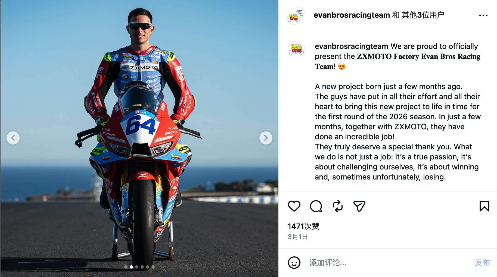

我去看了下卡索罗在ins上的分享，有很多张ZXMOTO的照片，

感觉到他很热爱这个车队、品牌，那种喜悦溢出言表。

几乎张雪车队制作的每一个合影、视频都会分享出来，感觉到他很开心，也是个用心人。

看看图片里的最后一句：

我们做的不只是一份工作，这是真正的热爱。
是挑战自己，是赢，有时候不幸也会输。

形容得很美，特别是最后那句"sometimes unfortunately, losing"

——承认失败但不回避，很真实。

他估计不知道他在这边被冲的够呛，我并不是在为他辩护，

我的故事很中立，谁都不认识，只是看见了一个灵魂，还没有看得很清楚，所以我的判断也仅仅一面之词。

然后心理和伤病等那些我也没有主动想要去搜索，就是信息搜索里，就会包含一部分运动员的综合信息，那也是他们的勋章和受伤，也并不一定就是定论，

因为这种"看见"，想把他的故事还原出来。

网友说，我不是不关注他，我是看不见他啊，因为他不是摔车，就是目前名次靠后，

明白。故事也算一种先看见吧。

这个Evan Bros车队是亲手塑造卡索罗，把他从新人一路带到世界亚军的地方，

他兜兜转转、各种辗转到今年又回归，又和张雪合作，都是强强联合。

这也有可能是一个人梦想的某种必有回响，也不好说。

现在有那么多扁平化的言论，对他毫不了解，立刻想弃之若敝。

很多人因为不了解一个人，就把自己的想法投射到对方身上，然后进行一种期盼，毫不留情地打压、抛弃，其实这很残忍。

竞技体育每个人都想赢，能理解。每个人都受过伤，也都是一路奋战到这里，都不容易。既然有缘分成为我们的车手，你也可以去了解一下他的故事。

我只是把他的故事呈现出来，他本身就有那些闪光点，那些成绩和飞扬，无需质疑。

我其实相信他有黑马之姿，和赛车磨合的足够精细之后，会有好成绩。

但是赛车手和赛车的磨合是很久的，以年计算。

而且一个职业选手生涯里的故事点很多，我选出来的还是我觉得能感染到我的。

其实还有一些别的角度，你们感兴趣可以自己去找，丰富起来不就好了吗。

后面会怎样，真的是谁也说不准。

可能会是你预期中的爆发，也可能就是这样一边摔一边收集数据，也可能更加平淡，也可能慢慢找到状态。

每一种可能都存在。

所以，可能真的要给他足够的时间和耐心。

他在不断进步，在不断改善。

无论如何，希望他能在这条赛道上，像你我一样，找到自己的答案。
