# 骑张雪机车夺冠的34岁老将瓦伦丁，曾被视为已完全告别主流摩托赛事，这是一个怎样的故事？为何他们能合作？

> 来源：知乎专栏「张雪机车 | 极致热爱」
> 作者：耿悦

在两年前的冬天，瓦伦丁·德比斯站在法国南部的猎猎寒风中，手里捏着一张解约通知。

你太老了，跑不动了，我们要培养新人。雅马哈赛事总监的判词比寒风更让人觉得冰冷，德比斯很清楚这意味着什么。

2008年，德比塞夺得法国125cc级别冠军时，他曾被视为高卢雄鸡在摩托赛场上对抗强敌意大利的希望。2009年，尚未成年的德比斯就进入MotorGP（最顶级摩托赛事）参与激烈的角逐，拿到第21名年度排名。

然而在极其烧钱的摩托赛场，人脉、背景和广告金主的重要性丝毫不亚于赛车实力本身。来自摩托运动相对边缘的法国，缺乏重磅资源支持的德比斯在参加完2012年完整赛季后，竟然开启了长达十年的“流浪地球”模式：他远走美国参加美锦赛、回老家横扫法国联赛、去各种耐力赛里拼命挑战体能极限。总之他在圈内人眼里已经完全告别了主流摩托赛事。

2023年，“饮冰十年”的德比斯宣告回归，加盟了雅马哈官方工厂车队。2024年他继续驾驶着雅马哈赛车，不过转投了埃文兄弟车队。对当时的他来说能够效力雅马哈体系其实已经不错，对于被雅马哈“优化”这件事，我想他是有心理准备的。

当然接受现实并不意味着否定自己，他也在寻找下一份机会证明自己。

他不会想到同样在2024年，在中国有一个叫张雪的人离开了他亲手创建的公司，而这个人将打造一台能证明他真正实力的神车。

由于技术和经营理念的分歧，张雪离开了自己亲手创建的凯越，在中国“摩托车之都”重庆成立了自己的个人品牌“张雪机车”（ZXMOTO）。命运的齿轮悄悄转动，当时谁也没有想到这两人能在日后站在世界之巅。

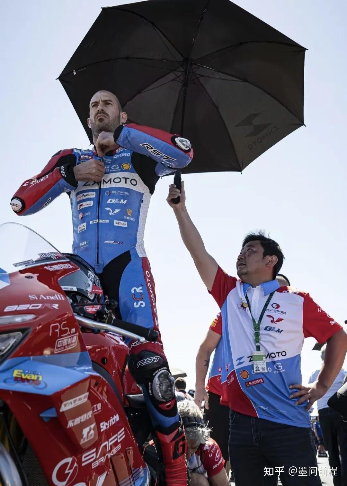

德比斯和张雪团队初遇时，他眼前没有豪华的研发中心，他只看见堆满零件的车间以及一群熬夜啃技术手册的中国人。

他很清楚眼前的这些人和他一样，他们不想输，他们想证明自己。

张雪给了他绝对话语权，让他可以参与赛车研发，主导赛车调校。

德比斯多年的赛车经验显然在调校赛车时起到了关键作用。

重刹要更稳，出弯要更快，电控要像我的手一样听话。

德比斯在圈内被送上绰号“苦工”（Thegrinder），形容他搏命的风格和喜欢亲自调试赛车的习惯。中国工程师们通宵达旦的工作着，技术团队在30天内完成发动机高转优化、底盘刚性调校、牵引力控制升级四大核心改进。

他日以继夜的在模拟舱里反复打磨走线，在健身房里锤炼体能——因为他很清楚要用这34岁的身体驾驭这辆狂暴的人造野兽，一定要做到人车合一。

很显然这次的团队带给了他不一样的感觉，他知道这是全力必须把握的机会。

我不是在为自己跑，我是在为所有被低估的人跑。2026年3月初，澳大利亚揭幕战，因车队经验不足，赛道干湿交替，出现了雨胎跑完全程的决策失误，导致赛车在比赛末段抓地力尽失，他不得不被迫进站换胎，最终导致张雪机车首秀失利，仅获第14、19名。

“国产不行，车手太老，张雪吹牛”等冷言冷语也随之产生。

但德比斯和张雪团队没有理会外界的噪音，他们很清楚目前整个团队只是欠缺赛道经验。

德比斯和工程师们在酒店房间里复盘到天亮，把每一个失误刻进心里。

后来的事我们也看到了，在WSBK葡萄牙站德比斯骑着张雪820RR拿下两连冠，而雅马哈成了张雪机车主要的背景板。

第一场比赛从发车开始就处在领跑位置的雅马哈车手奥努翻车了，这让张雪机车厂队车手德比斯拿到了领跑位置，至此一路领跑彻底和后面的所有对手拉开了距离。

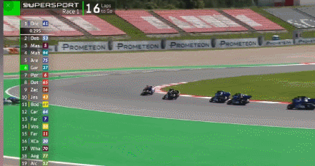

那副世界名画也至此诞生。

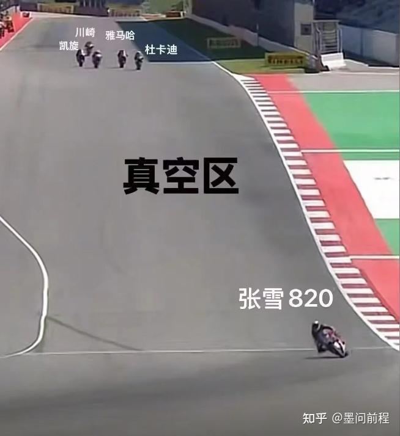

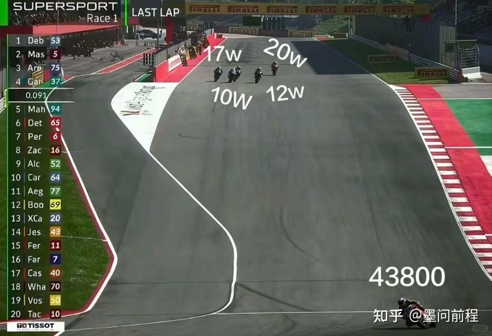

我要是德比斯可能会忍不住和雅马哈车手开一句玩笑——你开雅马哈，难怪你翻车。

由于这个小插曲导致第一场比赛未能完全发挥出张雪机车的实力，而第二场德比斯则是对雅马哈车队完成了戏耍。

在第二场比赛比较早的阶段，张雪车队选手德比斯就比较早的建立了领先位置。

大家可以体会下这个回合，不得不说820RR在直道上的优势实在是太夸张了。

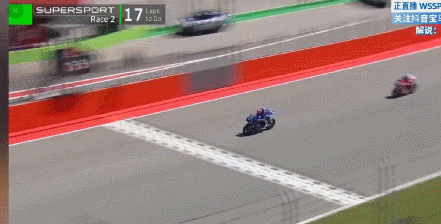

而到临近末尾的时候，张雪车队车手德比斯过弯时出现失误，被两位雅马哈车手反超。

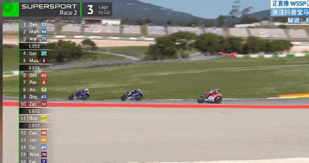

这个时候被反超按理来说是非常被动的，毕竟比赛没有几圈了。

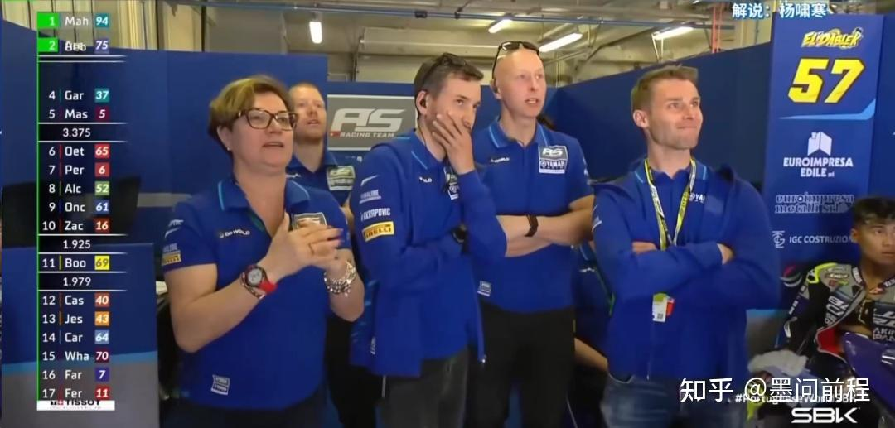

解说也是惊呆了，连连发出不理解的惊呼，大喊什么情况，表达了对张雪车队可能痛失好局的惋惜。

哪知道随后张雪车队的德比斯就在直道上迅速追赶上了前车，并且在后续第一个弯道就实现了反超。

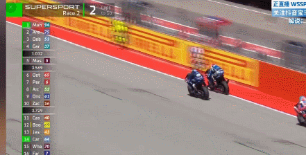

这有点太夸张了，从落后到反超简直就如同探囊取物一般轻松，对手的工作人员们完全被这一幕惊呆了，一副你不要过来啊的表情。

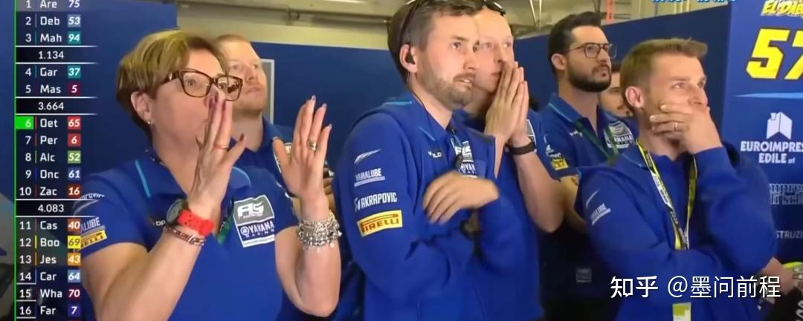

德比斯追雅马哈的场景，总会让我想起下图这个画面，哈哈哈哈哈哈。

超的就是雅马哈，蛤蛤蛤蛤蛤！

真就给这些老牌车企开开眼，什么叫展示容错？这就叫展示容错。

后续德比斯也是演都不演了，直接轻松带开车距，让后面的车手感受绝望。

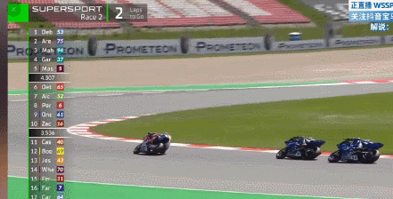

你挑的嘛赛事总监。

最后也是没有发生了任何反转啊，虽然雅马哈三台车内斗试图抢戏，但与张雪车队也没什么关系了，大家可以体会下德比斯冲过终点线的时候其他车手们距离他有多远。

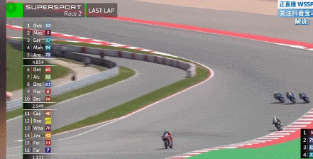

这第二场可以说是完全让德比斯扬眉吐气的一场比赛，他终于有底气大胆的说——老子以前拿不到冠军，主要是因为车不行。

接下来给大家放一些德比斯对张雪机车，和张雪本人的评价。

我一向喜欢挑战。当我第一次遇到张雪机车这个品牌时，我就被它吸引了。并且早在我了解张雪机车这个品牌之前，我就认识张雪本人，那时他还是另一个品牌（张雪先前创立的凯越机车）的老板。所以当我明白他们想要付出巨大努力进入一个特别的领域，并且目标是成就伟大时，我就情不自禁地加入了。

我还喜欢张雪机车做事的思维方式。其他一些制造商只会说：他们想马上获得胜利；但张雪会说：他想先拿积分，然后排名进入前十，再进入前五。在他看来，不管需要做什么来让车变得更好，他都愿意去做。因此我知道，这些人一定会全力以赴地把车调校到最快。

我们原本计划着慢慢来，但实际上没费什么时间就赢得了比赛。这更加证明了张雪机车的节奏是对的、是高效的。

他是个很好的人。我过去效力的所有品牌，从来都见不到老板本人——因为他们总是坐在办公室里，不会经常来赛道。但张雪不一样，本赛季第一场比赛（澳大利亚站）他就来现场了，而且不光是来看比赛——他在澳大利亚整整待了一周。

他一下飞机就直接来我们住的地方一起吃晚饭——就是我们自己做的、很简单的家常饭，全队像一家人一样坐着。他就这么来了，和我们一起吃饭、喝酒，和我们一样享受那个夜晚。这立刻带给我非常积极的感受。

我还记得在澳大利亚第三次练习赛时排名第三。回维修区的时候，我在赛道边看到他，而他就在那儿疯狂地朝我挥手——这种场面真得很少见，让我印象特别深。看到老板这么投入，我也想在赛道上做得更好、让他骄傲。

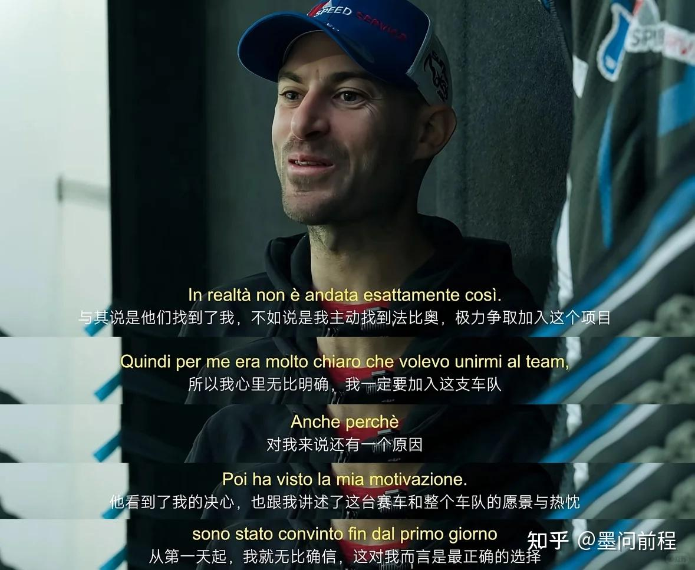

两人同样用对摩托车赛事的热爱抵抗了岁月漫长，最终一起用无与伦比的专业能力为自己加冕为王。

事实证明，人类在热爱这件事情上是没有国界的，任何国家都有一时失意的人，而真正能够靠热爱改变命运的人无一不是坚持到底的人。

小西天封不了真大圣，张雪为了赛车梦离开凯越，瓦伦丁·德比斯被雅马哈“优化”，却反而让他们走到了一起。

真正能打破国界的东西是什么呢？我想他们已经给出了答案。

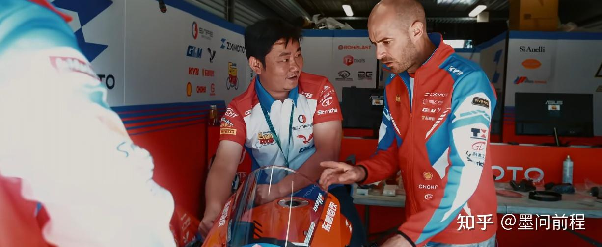
