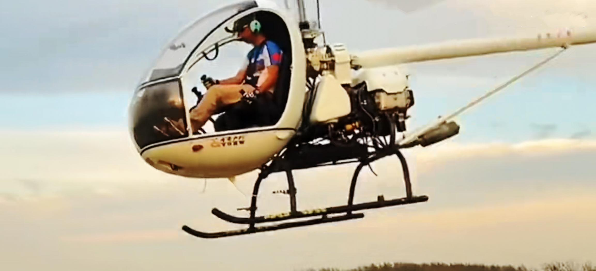
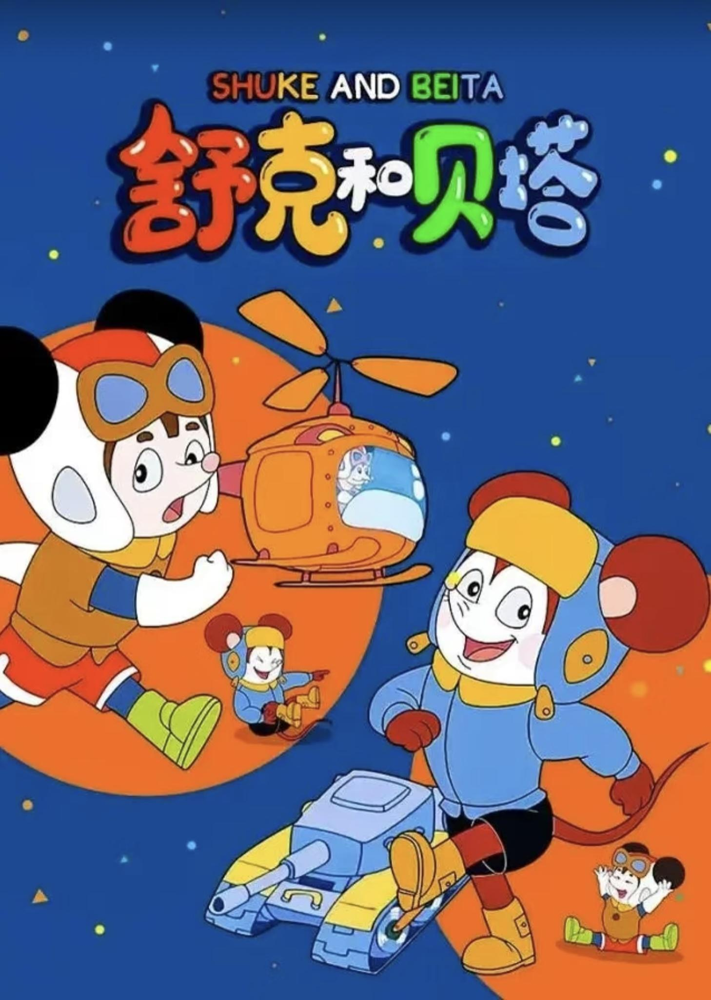
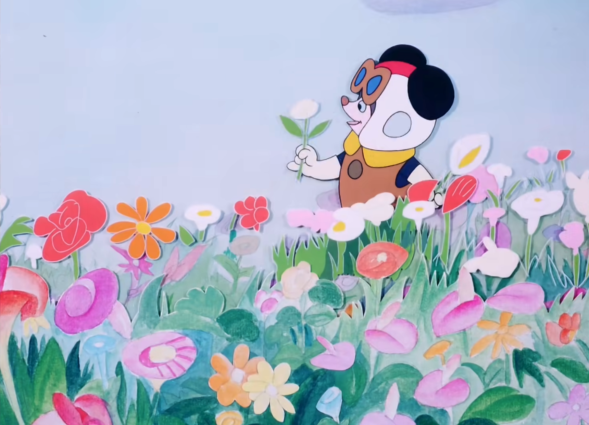
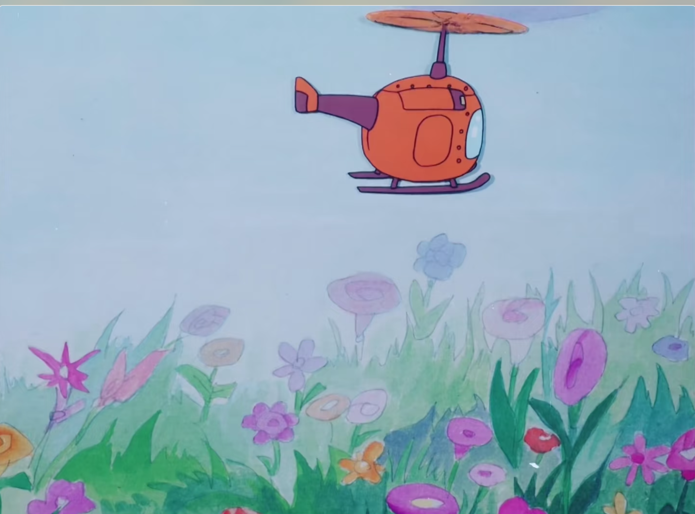
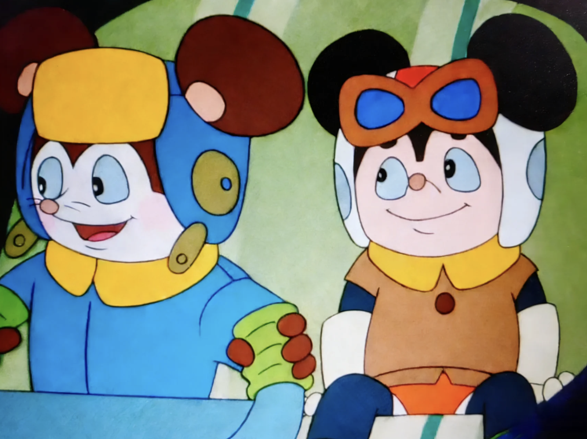
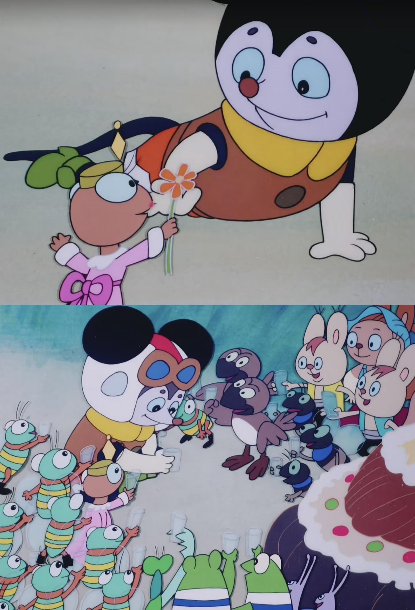

# 张雪师父「牙哥」说曾因缺钱陷入绝境，而张雪夺冠救了自己的飞机梦，如何看待两人为梦想「死磕」的坚持？

> 来源：知乎专栏「张雪机车 | 极致热爱」
> 作者：耿悦

想真正看懂张雪在干什么，得先看懂牙哥。

不夸张地说，**他俩绝对是史诗级的电影师徒设定。**

在湖南卫视《晚间》播出之后，张雪关掉了修车铺，出去找师傅，想成为真正的职业赛车手。

他被车队看见能入行，但当时大部分的车队拒绝了他。

年龄太大，路子太野，没有系统训练过，理由一大堆。

就在张雪快要彻底绝望的时候，有一个人站了出来。

职业摩托车赛车手张继星，圈里人叫他牙哥。

**“中国职业越野摩托老一代鼻祖级车手兼极限工程狂人”。**

有人这样评价：牙哥是张雪宗门真正的灵魂。

张雪是狠人，作为师傅牙哥同样是狠人。

牙哥生长于安徽五河农村，从小就喜欢冒险，喜欢追逐速度。

他家在县城算是首富。

十七八岁那会儿，牙哥自己全款买了辆摩托车，骑着满县城跑，觉得自己天生就是追风的料。

那时候的梦想，是站在世界之巅。

可21岁那年，命运却给他开了个玩笑。

家里公司破产，一夜之间，他什么都没了。

没钱吃饭，牙哥只能卖掉摩托，换口饭吃。

但他不信命。

他借了5000块路费，一个人出去找车队。

没有背景，没有钱，没有经验。

从首富之子，变成一无所有的穷光蛋。

**但牙哥还有一颗什么都不怕的胆。**

职业摩托车赛车手普遍是什么时候开始练的？

十几岁，甚至更早。

但牙哥24岁才第一次摸职业赛车的门槛。

**在讲究童子功的赛车圈，起步比同龄人晚了近10年。**

这个年纪才进职业体系，圈里人看了都得摇头。

身体机能、反应速度、对赛道的肌肉记忆，哪样都比别人晚了10年起步。

圈内人当时没人看得起他，这跟找死没什么区别。

放在100人身上，这个开局基本就已经宣布结束。

但牙哥偏不信这个邪。

一个20多岁才职业入行的老新人，硬是从最底层一步步打上去。

2003年到2009年间，他在全国越野摩托车锦标赛的赛场上反复夺冠。

14次全国越野摩托锦标赛冠军。

这个数字，让他成为中国本土职业越野摩托早期成就最高的一批车手之一。

**被圈内称为”国内较早一批职业摩托车赛车手”，”机车圈传奇”，”名震全国越野摩托圈的人物”。**

这时他终于可以跟命运说一句：

**去你的鸟命，我命由我不由天。**

有人问牙哥你怎么做到的？

他只用了几个字：**刻在骨子里的执着，难以理解的狂热。**

他叫张雪”神经病“。

他俩都是神经病：

就是喜欢一样东西的时候，

你就不考虑后果，而且还一定要实现。

**他形容这种热爱：**

从早上起床开始，你就一直盯着车，

然后保养。

保养完以后下午就赛车手训练，

骑车训练的过程你会很兴奋，

训练完以后呢晚上还会盯着车。

有时候一夜不睡觉。

他也不知道这车有什么问题，

总觉得这个地方也不对，那个地方也不对。

就想给它调整。

然后就是那种训练的刻苦程度。

**一跑起来也不显累。**

不管手上起多少泡，泡中泡，然后泡中泡中泡。

破就破，反正肯定是疼。

**但跑起来就不疼了。**

当你下来的时候手套摘不掉，血都凝上面了。2007年，在江苏的一场比赛期间。

牙哥遇到了四处碰壁、被各车队拒绝的20岁张雪。

年龄太大，路子太野，没有系统训练过，理由一大堆。

几乎所有车队都拒绝了他。

（曾经不要张雪的那个车队，这两年，张雪反而在赞助这个车队）

**但牙哥一眼就看出张雪身上有股”疯劲”。**

他和我一样。

张雪对他说，他们都不要我，

牙哥对张雪说：我也没人要。

他更感动了。别人不收你，我收你。

牙哥不顾行业人士的反对，破例第二次收徒，收了这个天赋并不出色的大龄摩托车手。

将其”收留”在车队，成为他的入行师父。

这一年，也正是20年两人”疯魔故事”的起点。

别人都说牙哥是傻子，收了一个”宗门废材”，还不顾一切地培养。

当时行业里学赛车学费昂贵，普通家庭根本无力承担。

但牙哥一分没收。

那一年他带着张雪去了老家，一周5000的学费全免，车、住全帮他搞定，并将自己的入弯控车技巧倾囊相授。

他还把那个至少3000块的摩托车头盔送给了张雪。

不仅管吃管住，还帮张雪租房。

但这还不是最狠的。

**牙哥做为贵人，亲手帮张雪改命。**

张雪跟着牙哥练了两三年，非常努力，练赛车当然很辛苦，但是实现了梦想，练得无比开心。

但牙哥心里越来越清楚一件事：这孩子的赛车天赋，距离世界冠军还有很大差距。

他找张雪谈了一次话，说了一些听起来很残忍、但却改变他一生的话。

你放弃车手梦吧，你成不了世界冠军。

牙哥并不是想要打击他，反而是要把他从死胡同里拽出来，

帮他找到了真正的赛道，让他看到另一条发光的路。

你对发动机、对机械的悟性，比骑车强太多了。

你不可能成为赛车冠军，但你可以造车。

**造一辆车，让别人骑着你的车去拿世界冠军。**

牙哥太清楚了，中国赛车要站起来，光靠车手不够，得从造摩托车开始。

对于赛车手，都特别希望能骑到好车，

你在赛车上就收手吧，不可能超过我；

但在造车上，一定要大胆去做。

造车，才是张雪成为世界冠军的唯一可能。

就算整个赛车圈都不喜欢你，师父也会挺你。在张雪决定创业造车后，当时初涉飞行圈的牙哥，手上并不富裕，自己积蓄的5万元，加上向哥哥借的3万元，共计8万元，全部给了张雪作为启动资金。

但这只是开始。

造车、创业这些年，张雪的现金流经常断。

半夜打电话向牙哥借几千几万，前前后后借了几十次，几乎从不写借条。

有时候是几千块，有时候是几百块，牙哥从来没说过一个”不”字。

张雪车祸受伤住院、做手术，有几次费用也是牙哥先垫付。

他自己手上没那么多钱，就去找朋友周转，再往医院打钱。

牙哥后来说：反正在我这是无条件的，因为他在帮我完成心愿。

十几年里，牙哥把自己在机车圈积累的所有资源，全部转给了徒弟，还安排他去制造厂学习技术。

牙哥的思维是这样的。

他一直觉得中国的极限运动落后于欧美，这事他不服。

他自己是赛车冠军，也想过去国外跟那些世界高手跑一跑，试一试。

后来真去跑了几场世界锦标赛，看完之后他心里明白了：没办法，差距还是有的。

但他不是那种认了就算的人。

他想，我自己现在想成为世界冠军，可能性不高了，那就从徒弟开始。

收徒弟，帮他们实现这个梦想。

所以牙哥带张雪，不只是带一个徒弟。

牙哥像是在带一个很野的”宗门”。

一个宗门，可以有无数天赋异禀的弟子，可以拿无数冠军，也可以站上无数领奖台。

牙哥的大徒弟在造船，二徒弟张雪在造车，他自己在造飞机。

一门三杰，一个比一个瘾大。

**地上追风，天上逐云，海上破浪。**

而且最妙的是，这三个人干的都不是普通意义上的”做生意”。

他们像是都着了同一种魔：非要把自己喜欢的东西，做到极致，做到别人觉得不可能。

所以牙哥这个人最厉害的地方，不只是他拿过14次全国冠军。

**而是他把一种很罕见的精神和行动传了下去。**

传递技术、眼光、野心，还有那股”不服”有梦想就一定实现的劲。

张雪在直播里说，快去看看我师父，他现在在造飞机。

一开始我听到这话，觉得可能就是个玩笑，或者是那种”组装个航模”的意思。

结果点开视频一看，一架小飞机真的起飞了，给我吓一跳。

画面里是一群人，在厂房边、空地上，围着一架小飞机在调试。

牙哥从小就有两个梦想：赛车和飞机。

2008年左右，他还在赛车生涯的时候，就开始接触直升机了。

2009年退役之后，他慢慢迷上了滑翔伞、热气球、轻型运动飞机这些空中项目。

他先从滑翔伞、动力伞开始玩，通过国家体育总局航空管理中心进行系统培训学习。

慢慢地他意识到，飞行项目才是他真正想要追求的方向。

于是开始买配件，自己组装飞机。

2017年底，他带着七个人的团队，在家后院几个棚里，花了整整三个月，组装出了自己的第一架小型旋翼飞机。

如今牙哥的野心更大了。

他想打造一个集飞行体验、装备制造、维修、培训与赛事的低空经济产业生态圈。

不是简单的组装，而是要做一个完整的产业。

**他现在是一个从地面杀到天空，再从天空杀回地面创业的连续破局者。**

在看牙哥的视频，说这几天”他从头到尾都在哭“。

有点委屈的感觉。为什么？不知道。

**终于，这么多年没有任何人能看懂我们。**

**我们跟谁说谁都不相信我们。**

**终于不需要我解释了。**

多少年了你觉得？对于我来说是20多年了。

我们不想跟任何人去解释我们在做什么。

我们想用行动告诉你。

太多人看不懂我们。

这口气是不是憋了很久？

对。

还有个在几年前我也没什么感觉，特别是最近这段时间。

因为我从2023年到现在，我经历了太多的磨难。

其实一开始我不是很理解张雪，我无法理解张雪的难度到底有多难。

就特别是20年以后。因为我知道我23年到现在我有多难。

所以说我们这种哭，这种认可，就是理解吧。

**我终于理解张雪。****他实现了我的梦想。**

那你自己的梦想呢？

我现在的梦想就是让中国的……

我造飞机是我低空经济五分之一的项目。

我不是在做生意，跟赛车一模一样。

**张雪造车他也不在做生意。**

**我造飞机也不在做生意。**

**所以我想引领一个时代。**

我们计划是要建几百个飞行营地，上千个。看完牙哥的故事，很出乎意料，有些震惊，也特别佩服。

震惊的是，真的有人在干这件事，而且还越干越好，把那种听起来有点虚幻的梦想，一点一点干成了。

佩服的是那颗敢想敢干的心。

我想到的都是以前飞行史上的那些人，比如莱特兄弟，在所有人都觉得不可能的时候,硬是把飞机造出来了。

他说：

**大不过一颗敢想敢干的心。**

这个方向定了，就不能不去。

我们遇到A问题，解决A问题。

遇到B问题，解决B问题就行了。

不要怀疑自己的方向。

也不要怀疑什么可不可以，是不是行不行。

不用怀疑。就定好了，

就那个山顶我就要去。

什么时候到，那我先不管他。

一步一步往前挪。张雪创业这些年，多次在讨薪失败、没钱吃饭、研发遇阻时打电话求助："师傅我这边撑不住了。"

牙哥则多次主动说"我再帮你想想办法"，几十次慷慨解囊，还帮他追回被加工厂拖欠的工程款。

牙哥说，投资的是他的未来，

**他和张雪是极致热爱的同类人，更看中他"不跑、不躲、肯死磕"的性格。**

后来，牙哥为了飞机梦，也跟张雪借过钱。

去年我其实也不懂，我就以为他这边还很好，然后就跟他借钱。其实他也挺难的。

2022年有一次两万块钱，我当时都有点感觉，我还说你是不是借少了。

现在才知道，其实两万块钱对他说不是问题，但在他那么艰难的情况下，不应该再去跟他找麻烦。

其实我们蛮内疚的，因为我不知道张雪也那么困难。

其实他也是最近才解决了问题。

在上热搜之前，我估计他也可能在这个边缘徘徊。

牙哥有愧疚，也有理解。

都在各自的梦想里死磕的这两个人，

互相借钱，他俩在一起经历二十年的风雨起伏了，**这也是一种深刻的交情。**

以前是师傅帮徒弟，后来是徒弟帮师傅。

都二话不说帮忙解决问题，因为他们都懂对方在干什么，在为什么拼搏，和坚持。

想起来这几天看牙哥的视频和采访，有一个弹幕飘过，

有人说，这一对师徒就是我们现实版的「舒克和贝塔」。

当时给我笑的，

牙哥开飞机，张雪造车，一个在天上，一个在地上。

牙哥很硬核，认知透彻，说话句句在点，透过现象看本质。

张雪相比师傅，就有点傻乎乎的，但那种可爱劲儿，实在。

后面这段我在搞笑（忽略）

舒克舒克舒克舒克舒克舒克舒克舒克，开飞机的舒克。

贝塔贝塔贝塔贝塔贝塔贝塔贝塔贝塔，开坦克的贝塔。

舒克舒克舒克舒克舒克舒克舒克舒克，勇敢的舒克，聪明的舒克。

贝塔贝塔贝塔贝塔贝塔贝塔贝塔贝塔，勇敢的贝塔，聪明的贝塔。

自己的路，自己走，

谁要我们帮助，只要叫声舒克贝塔。

开飞机的舒克，爱劳动的舒克，

开坦克的贝塔，爱友谊的贝塔，

**这就是好样的舒克贝塔。**

我昨天专门去重温了一集《舒克和贝塔》。

发现童年看过很多次的动画片，蛮好看的，

之前忘记了含金量，现在确认，国产佳片！

相互奔赴，又互相成就。

剧情紧凑，每一集都有新的冒险和挑战，

充满想象力，传达了积极向上的价值观：

通过自己的努力，去改变命运，获得世界的认可。

就像牙哥和张雪。

**祝愿：理想主义者&实干者们，圆梦！**

昨天看到牙哥亲自来知乎答题了，开心。

牙哥的人生很酷，现在造飞机也需要很多钱。

我写这些问答完全是自发，就是希望热爱的人能真的实现梦想，

因为这些人很稀缺，而且他们坚持了如此多年，为了毕生梦想，

这一路走来磕磕绊绊，深深浅浅，心心念念，但是心甘又情愿。

希望能有投资人能看到他们，这么大的梦想需要支持。

但他需要5000万，这个数字可不小，可能需要时间。

我刚想到，能不能换个思路？

比如设置一个类似众筹，5000万人一人一块钱，或者500万人一人十块钱。

哪怕人少一点，只是心意，也能积攒一些资金，给团队发工资，或者帮他们撑过关键阶段。

积少成多，就像平常捐公益基金一样，只要账目清晰，给公众有交代就行，同时也不耽误继续找投资。

只是我个人瞎想，就是祝福他们能把这么难的事情撑得更久一些。

祝福祝福。
