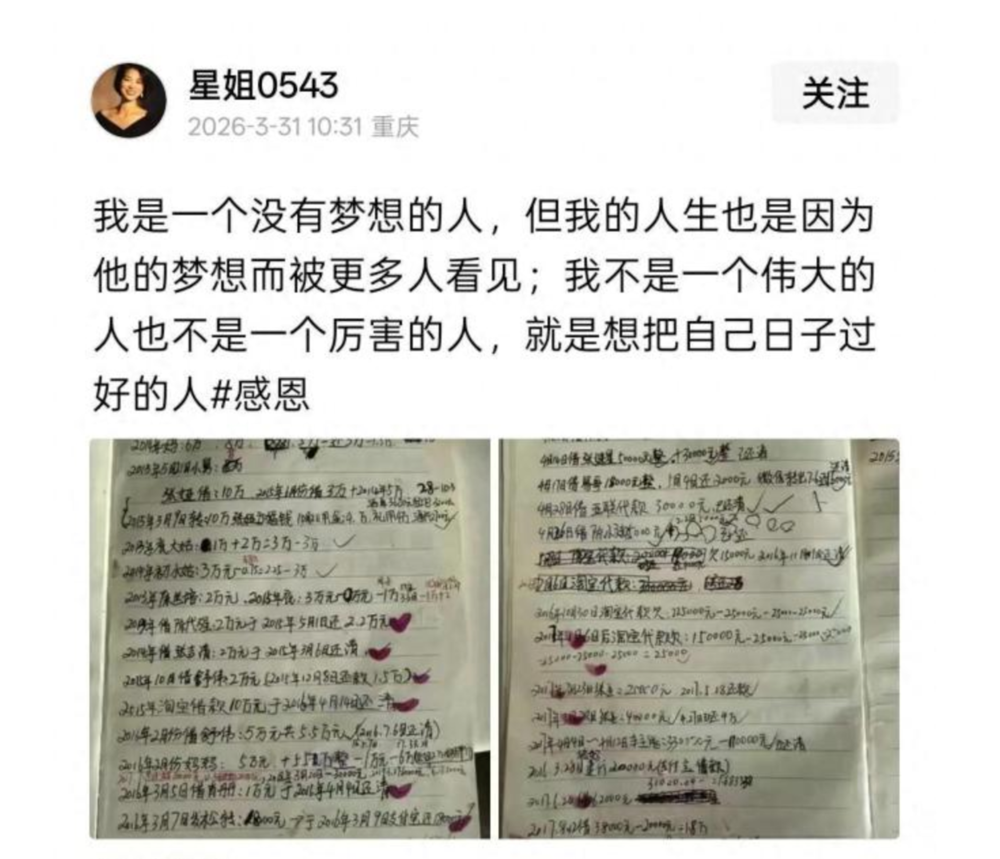

# 如何评价张雪，以及他的创业经历？

> 来源：知乎专栏「张雪机车 | 极致热爱」
> 作者：耿悦

（已更新） 张雪的故事像个武侠故事——有人情味，有侠义之情，一群理想主义者一起造梦。

每个人都性格鲜明，编织成星云，故事一环接一环，喜欢张雪的，这篇必看。

这几天看张雪相关新闻，有一种很奇妙的感觉：像在看连环画。

我很久没有为新闻动容了。最初以为就是"看完一个热血的追梦故事"就很好了。

偶然顺着线索去看他一路经过的各个贵人、陪伴和师傅，就好像你打开不同的故事盒，每一个都很有意思。这个故事不是一个人的独角戏。每个人都有自己的不寻常。

这种感觉就像看连环画一样，看完一本主体的书，再去读扩展的书，每一部分都很好看。

我喜欢看武侠小说，所以看他的故事时，总觉得有点武侠的味道——一个追梦少年，在江湖里遇到一个个愿意拉他一把的人。

他周围的人，都很有性格，都是性情中人，有情有义。那种江湖感，就是大家至情至性，一起造梦。

每个人都不是背景板，都是这个故事的一部分。

就这次，我被一种久违的东西打动：人情味，人味。

第一颗星：奶奶

张雪三岁的时候，父母离异了。

爸爸离开了，母亲去求学，家里很穷，他和妹妹与奶奶相依为命。

住在漏风的”窝棚”里，弱不禁风的奶奶坚持着把他们养大。

2006年那个纪录片里，有张雪紧紧拥抱着奶奶的镜头。

那次去看望奶奶，他身上只有300块，给奶奶买营养品后只剩8块钱。

张雪让人很诧异的，是他吃了如此多苦，但没有苦难感，

在匮乏的生活环境里，他竟然有一种慷慨感，奶奶对他的爱，是童年照亮他的光，给了他安全感。

这样想来，一位女性，也很伟大。这是张雪最早感受到的世界关系，童年的关系模式是一个人的心理底层，会治愈一生。

第二颗星：易军

其实我最开始觉得故事好看的人，是记者易军。

一集二十年前的晚间新闻纪录片，我竟然能一口气看完，还拖着进度条回看了片段。

易军是当年《湖南经视》《湖南卫视晚间》的一线记者。2006年，《晚间》已经是湖南卫视的黄金节目。

影像，真的太重要了。

如果没有这部纪录片，如果没有那个19岁少年在雨中追车的画面，我可能只是看个新闻，鼓个掌，觉得”这老板挺有情怀”，然后就完事了。

正是因为有那部片子，才有了一种”少年的梦想被实现”的斩钉截铁的感觉。

看了几个易军的访谈，还原了当年的故事。

2006年，19岁的张雪在怀化修摩托，他连续给《湖南卫视·晚间新闻》节目组打了一星期电话，自称能完成各种”很牛很难”的动作，希望电视台来拍他。

接线员一开始以为他在吹牛，但被他反复”忽悠”动了，最终把这条线索转给了记者易军。

一次”可能上当了”的采访

10月24日下午，易军带着摄制组从长沙驱车近10小时，赶到怀化郊外一块荒地，让张雪骑那辆破旧摩托表演。

镜头一开，他发现现场效果远没电话里说得那么“牛”，几个动作都完不成，他心里直犯嘀咕：是不是被骗了？

他问张雪：“是车太破，还是你技术不过关？”

然后很职业地做了一个“退场安排”：我们先回宾馆休息，你再练练，看情况再说。

对节目组来说，这本来就是一次准备放弃的采访。

他没再追问，我们却没走掉

张雪没放弃。那天晚上，摄制组去吃饭，他自己一个人在外面接着练车。

晚上七点多，易军回到宾馆，收到一条像素很差的彩信，是张雪练车的照片，后面跟着一串短信：

“你们如果真不打算拍，就这么回去了，我会疯的。”

“我知道你们住哪，我明天早上来堵你们的门。”

易军形容，当时自己觉得“有点好笑，这小孩怎么还来威胁我们”，没回消息，打算第二天按原计划去麻阳拍别的题材。

第二天早上 7 点 20 分，他下楼上车，又看见张雪发来的短信：

“我在你们车边上等你们。”

一番纠缠之后，他只好先去张雪的修车门店看一眼。

那次现场，让他有了些触动——这是一个真正在用力抓住机会的年轻人。

他答应：先照原计划去麻阳，再回来拍张雪。

张雪还是不放心，骑车一路跟在采访车后面，说“送送你们”。

“车在天上飞，人在地上滚”

接下来，就是后来那段广为流传的“追车”画面。

采访车开出三十多公里，车上人以为已经甩掉了他。

在一个 60 度大转弯加下坡的路段，对面来了三台大车，易军从后视镜里看到：张雪又追上来了。

那天在下雨，他全身湿透，脸冻红了，还在往前贴。

易军说，自己那一刻“又担心、又同情、又焦躁”，但也就在那时候，心里彻底决定——这条片子一定要拍。

离麻阳还有十来公里，他们在路边一间农家乐停下吃饭，让张雪烤衣服、喝姜汤驱寒。

就在这里，张雪对他说：

“只要车队给我一次机会，我去端茶倒水也心甘情愿，总有一天能摸到车。”

“如果这辈子我进不了车队，就让儿子帮我完成这个梦想。”

吃完饭，他回麻阳简单交接完原来的两个题材，把主要精力全部调回到拍张雪身上。

那天在下雨，张雪的表演也不顺利。

但易军他们说:“不管你想表演什么，我们都给你拍。”

在福寿广场，张雪在大雨间隙表演抬头、翘脚，又湿又冷，动作反复失误。

在江边沙洲，他用那辆旧车做极限动作，”车在天上飞，人在地上滚”，一头摔下去，摔得很重。

第一次摔车时，摄制组愣了几秒才反应过来跑过去问他有没有事；

第二次再摔时，大家几乎是本能地冲上去。

张雪怕他们不拍了，反过来安慰：“摔跤是常事，我身上带了药。”

到了冲水坑的段落，他两次熄火，鞋子灌满水，身上粘满草，像个“刺猬”。

浑身沾满泥泞，脸庞被雨打湿，但眼睛很亮，觉得很有战斗力。

拍完动作，易军让他“说一句心里话”。

张雪看着镜头说：

“有梦想，就要追。因为勇敢，我的人生更精彩。”

这也是热爱与热爱的双向奔赴。

他的片子让你看起来，有二十年前的那种质感，有电影的镜头感。

你会发现这些记者非常会拍新闻，为人也很朴实，是那种为了好故事而努力的实在人。

从长沙到怀化，大约8~9小时车程。这样一个炙手可热的节目，易军会因为一个籍籍无名的小伙子，和他的团队开车9个小时从省会去到怀化采编。

以前的片子真情扑面，当年的新闻居然拍得如此扎实、好看，比如今那些综艺质量高很多。我们现在变冷漠了就是因为没啥真心实意的触动。

他对故事主角有耐心，对故事有好奇心，才能问出张雪为什么执着，"上电视不重要，但是有人看见很重要，这才能够进车队"。

他们一块的摄像也很棒，好像是叫毛毛老师，无论各种角度持机都很稳地记录那些镜头，整体感觉很敬业。易军回忆说，那个摄像师也已经有了意识，会拍下对故事好的所有素材。

现在这种新闻内容也没有了，所以这个东西让我想起了一些新闻的质量和新闻人的温度。

你能看到记者也是纯粹的、善良的人。

哪怕天公不作美，哪怕那台二手摩托车临时罢工，哪怕张雪的表演频频失误，易军都没有放弃深入挖掘。

他有记者的好奇心，和人与人之间的平等之心。能看见人的执着，没有偏见。

他选择给予机会，愿意用时间陪他，耗费时间，没有决绝地离去。

而且在广场拍完，又驱车跟着他去了那个练车的秘密基地，让故事进行升华。

张雪摔车后说：“摔跤是常事，我身上带了药。” 说能让我们看看吗，一看就懂捕捉新闻细节。

后来拍完张雪，易军他们马上往回赶。

当时已经天黑了，肯定不能再去爬山，过雪峰山也很危险。所以他们最后采取了一种绕行的方式，相当于在湖南绕了一个大圈，一千多公里赶回来。一路上都非常着急，真的是一分一秒地在赶。

易军回忆说，在赶回来的路上，他就在想，这个片子一定要做好。

音乐必须自己来选，要把音乐真正配到这个主题上。

“你们今天再回头看的时候，会觉得那个音乐特别贴切。

其实那都是在做这个故事的时候，我一点一点挑出来的。

我觉得音乐是有灵魂的，得配得上这个主题真正的内核。”

片子做完后，当天审核就通过了。

易军说审片的时候以为审片人没看，结果当晚就播出了，播出以后获得很大反响。湖南台当时审新闻的负责人很有水平。

20年过去了，当年的节目带早就很难找到了。现在很多电视台的备份都没了，但易军一直保存着这些。

播出后不久，他就给片子刻了DVD，生怕丢了。

电脑格式化了四次，他每次都把片子救回来。

为了备份这些素材，他自己花了八万块钱。

他说：

“那个视频我保存了20年，我自己每次回头看也会哭，当作自己的人生故事看。

一个人在最苦难的漩涡和泥淖里，拼命抓住每一次机会、每一根救命稻草，拼命想浮出水面、想爬上岸，

我想每个人都会被这样的画面感动，都会想到原来他当年是这样走过来的，

他能做到的，我也能做到。”

后来两人成了朋友，失联多年后在新疆重逢。

2023年，新疆的赛场上，另一位记者白云龙采访张雪。张雪看到湖南卫视的台标，就问他:“你认识易军吗?”

一路打听到联系方式，两人才在17年后重新加上微信。

易军把当年的片子通过QQ传给张雪。第一次还发错了，张雪看到后说:“大哥，这不是我。”第二次才发对。

2026年春节前夕，在麻阳高铁站，两人真正完成了那次”约了很久”的见面。

出站口的黑暗广场上，易军喊”张雪”，对面有人应声，他们走近、拥抱，都哭了。

在后来的采访中，被问到”是不是改变了张雪的人生，是不是他的贵人”，

易军说：

“那次拍摄对他当然重要，它把一个人最底层、连’零’都不算的时刻记录下来，让大家看到他20年一直是这样坚持。”

“但我从不觉得自己是他的贵人。我只是做了记者该做的事。”

“张雪的贵人是他自己。每个人人生的贵人，都是那个二十年如一日追自己事业的自己。”

易军曾经问张雪：”如果没有当年那次采访和播出，你今天会是什么样？”

张雪回答了四个字：”殊途同归。”

易军说，他很认同这个答案。

想看易军本人如何回忆这段故事，可以看这个采访：BV19JDMBuE1k

我看了这期视频，觉得他很朴实。他的态度让我肃然起敬，让我对他更加欣赏。

主要有两段话最让我感动：

关于身份的定位：

他完全可以说自己是张雪的第一个贵人，这么好的一个话题量，他根本不卖弄。

他说：

”20年前张雪的故事，我只是一个记录者，做了一个记者的本职工作。

我从不觉得自己是张雪的贵人，

张雪的贵人是他自己，每一个人的人生贵人都是独一无二的自己。”

“我只是让故事找到它的主人。”

像易军这种"无相布施"——帮了别人，却不把自己放在恩人位置——其实是稀缺的。

关于名利的态度：

那个18分钟的片子，明明是有它自己的能量的。

别人问他：”你为什么不发抖音？你可以发财、涨粉啊。”

他说：

”我从那时候起就没这么想过，我今天也不会这么想。

我一直觉得，我是靠自己的能力吃饭的，我是靠自己的专业水平吃饭的。

你让我去拍别的片子，我现在一样可以拍。我为什么一定要借着大家打上来的这一波关注，去做这个事情？”

“就像张雪那样，我现在把车卖好，把客户服务好，把比赛打好，不就是这个逻辑吗？”

“我真正想的，从来都不是这个片子能给我带来什么’横财’。

我们知道，真正会让大家来关注的，不是别的，而是我们到底在做什么样的事，能不能为这个社会、为大家创造一点价值。

只有这个东西，才会真正引起大家的关注。这才是关键。

别的那些东西，我觉得都没有那么重要。”

两个人，都是靠自己吃饭的人。

2026.4.13 更新

第三颗星：星姐

陈星伊，外号"星姐"，

看她的视频，你会觉得被一种氛围包围，感觉到她的心态特别好。

一说话就是笑脸盈盈，眼睛弯弯，面相舒服，

我看到她采访就会笑，这两口子心态真太好了，心宽天地广，

两个都是很好很好的人，朴实踏实。说话直爽，性格相近。

其实你看一种东西，最终喜欢的还是那种氛围。比如张雪说他做的东西一定会让人能感受到一种乐趣。你刚骑这个车，就能感受到性格。

有一种气氛，就是创始人的性格，不憋屈，非常畅快。

开心就好。

记者都会去问一些套路问题，生活和事业如何平衡啊，您现在如何经营婚姻啊，

她直接就说我不知道啊，我也不知道为什么，基本都是我没怎么想过这个问题。

没多想，有钱有有钱的活法，没钱有没钱的活法，放平心态，有口饭吃就行。

心很大条，粗矿。

说我想着那个车能跑完一圈不要爆缸就行了，完整跑完全程就好啦。

他们吃了各种苦但都没有苦大仇深。

有个细节：2006 年节目组来拍张雪，连他女友也一起拍了。但当时不确定身份，只留了一个模糊的背影。

他们是同班同学，还曾是同桌，张雪调皮，灵光，总喜欢逗她。

她一开始"最讨厌这种人"，后来觉得他"他对奶奶特别好，挺重情义，重情义谁有事都上，这点我喜欢"。”看他也是挺委屈的，觉得有点可怜。“

星姐颜值也好，越看越漂亮，就心里感觉很亮堂可开心。

"14 岁起陪他患难与共"。

2011 年，两人结婚，当时两人 24 岁，家境"一穷二白"，

但星姐那时就蛮独立，自己养活好自己，做服务员同时帮他看店铺。

现在出现很多人说他命好，会相夫，

她说，"我哪里是命好，我是跟着他从苦日子里一点点熬出来的。"

她强调：他们是真正到最近两年，债才基本还清，生活才宽裕一点；前面十几年一直在还各种债。

2013年起账本开始记录“张雪从2013年起借过的每一笔钱以及是否还清”，

每次还掉一笔就画上一颗爱心❤️。

星姐这里就是好好过日子。等于说是各种借债，撑起家庭内务，

易军讲过星姐的状态：这二十年她的底色就是"总觉得缺钱"。

每次手里一有点钱，她第一反应不是买东西，而是先买两袋大米放家里——只有看见米袋，她心里才踏实。

她在采访中说："去菜市场买菜，鱼专挑那种快翻白肚、马上要死的，菜专捡人家择剩下、最便宜的。"

菜吃得简单没关系，挖野菜也可以。关键是家里不断炊，有口热饭吃就行。

晒账本不是炫苦，而是想“说明他们走过的路。

最穷的时候，为 20 块钱的饭钱发愁。

那天只剩 20 元，他坚持在大雪天帮人拿货，把机油卖了 20 元，才凑够两个人的一顿饭钱。

有人问她：那么穷、那么累，有没有想过放弃或者"跑路"？

说是村子里处的第一个朋友，觉得就是得好好过下去，就是一种很朴实的人品，

现在大家看她发达了，说她"命好""会选人"，但她自己可能就是出于一种本分，一种很朴实的人品。

星姐很喜欢写日记，这么多年积攒了很多本，

她写，

爱他如他所愿，而非如我所愿。

他们识于微时，患难与共，彼此扶持，挺过了风风雨雨。

借钱、记账、买米、做饭，把家撑住，让他放心去造车。

这可能是让男人都很羡慕的那种妻子，一位极好的贤内助吧，

张雪的师傅牙哥，与张雪有20年交情。他说，

“想了解张雪，最好去找他媳妇星姐。因为张雪的成功，付出最大的是她。”

我刚看完张雪的《面对面》访谈。

评价星姐对他的支持，用了一个词：没有扯后腿。

按他的理解，他周围的同事或哥们儿要去创业时，另一半往往会犹豫，问“如果没有钱还月供怎么办”、“如果不成功怎么办”，这些顾虑一上来，劲就上不来了。

而欣姐是完全不给对方任何负担，直接让他心无旁骛地去闯，全力以赴往前去冲。

她的态度更像是：既然他真的想做这件事，那就让他去做；他不去折腾，反而不会快乐，那就让他去折腾吧，折腾了就高兴了。

在我看来，这种“没扯后腿”的评价其实太一般了，

因为星姐做的，这已经是她极其难得的、All in 式的奉献。

碰到这种能全力支持、全力托举的另一半，真的非常难得。

她们的品质、劳动、陪伴和全力托举，同样是最重要的。

我甚至会觉得，星姐应该被看见更多。

如果能让她多一点表达，多一点出镜，让大家看到她那种轻松、直接、甚至有点喜庆可爱的生命力，

这个故事会一下子从传统的"成功男人背后的女人"，变成一个真正完整的、现代的双人叙事。

而我们去写她，其实也是想把这些原本容易被忽略的女性经验，重新写回故事里。

活着就好了，活着肯定有机会啊。

就是能吃饭就好了，现在就是多几个人吃饭。

对于比赛平常心，就好好比完赛就很好了，其他的都不需要他操心哈哈哈哈哈哈哈。

看张雪和星姐的采访，全程嘴角上扬。

他热血，有信心，有斗志，有力量。她轻松、真实，很治愈。

你会觉得，好人就该过好日子，很祝福这样的人活得幸福。

现在的社会，什么都用计算衡量。

报专业要算性价比最好就业的，结婚要权衡利弊算对方算彩礼，交朋友要选有用的……

你能算出来20年后，这个人成功的可能性有多高吗，

但谁也不知道做的事情能否成，未来谁说得准呢，

她只是“怀着一腔热情嫁了过去”，“婚后15年几乎与债务相伴”，这种在小红薯上真的是马上劝分，

总之呢，社会上说的那些条件，那时的张雪都没有，只有一个想在东风和巨浪中创业的疯狂梦想。

怎么算一个女人愿意用 20 年青春，为一个看起来似乎无法兑现的狂热梦想的付出、托举和温柔呢？

就是把眼前的事情解决好。

人就是过好每天的日子。

伟大的平凡，就是一日三餐四季的感觉。

细想每一天都不容易，把苦难化为蜜糖。

第四颗星 妹妹

创业濒临绝境时，妹妹张娅毫不犹豫拿出准备买房的40多万首付倾囊相助。

之后的很多年，她一直租房，没能置业。

2016年，当张雪的机车团队只剩3个人，穷得叮当响时，母亲何琼把福州那套房子抵押给银行，贷出55万。

现在，张娅在卖张雪机车。张雪在采访里说：

"说实话我是非常不想她开店的，我可以养她一辈子。

当年妹妹房子都没买，拿出买房子首付的钱支持我创业，始终坚定支持我。我欠她的。"

张雪家的女性真的都是不遗余力，举全家之力托举这个梦想。

第五颗星 牙哥

在湖南卫视《晚间》播出之后，张雪关掉了修车铺，出去找车队，想成为真正的职业赛车手。

他被车队看见能入行，但当时大部分的车队拒绝了他。

年龄太大，路子太野，没有系统训练过，理由一大堆。

就在张雪快要彻底绝望的时候，有一个人站了出来。

职业摩托车赛车手张继星，圈里人叫他牙哥。

“中国职业越野摩托老一代鼻祖级车手兼极限工程狂人”。

有人这样评价：牙哥是张雪宗门真正的灵魂。

不夸张的说，他俩绝对是史诗级的电影师徒设定。

张雪是狠人，作为师傅牙哥同样是狠人。

甚至更狠。

牙哥生长于安徽五河农村，从小就喜欢冒险，喜欢追逐速度。

他家在县城算是首富。

十七八岁那会儿，牙哥自己全款买了辆摩托车，骑着满县城跑，觉得自己天生就是追风的料。

那时候的梦想，是站在世界之巅。

可21岁那年，命运却给他开了个玩笑。

家里公司破产，一夜之间，他什么都没了。

没钱吃饭，牙哥只能卖掉摩托，换口饭吃。

但他不信命。

他借了5000块路费，一个人出去找车队。

没有背景，没有钱，没有经验。

从首富之子，变成一无所有的穷光蛋。

但牙哥还有一颗什么都不怕的胆。

职业摩托车赛车手普遍是什么时候开始练的？

十几岁，甚至更早。

但牙哥24岁才第一次摸职业赛车的门槛。

在讲究童子功的赛车圈，起步比同龄人晚了近10年。

这个年纪才进职业体系，圈里人看了都得摇头。

身体机能、反应速度、对赛道的肌肉记忆，哪样都比别人晚了10年起步。

圈内人当时没人看得起他，这跟找死没什么区别。

放在100人身上，这个开局基本就已经宣布结束。

但牙哥偏不信这个邪。

一个20多岁才职业入行的老新人，硬是从最底层一步步打上去。

2003年到2009年间，他在全国越野摩托车锦标赛的赛场上反复夺冠。

14次全国越野摩托锦标赛冠军。

这个数字，让他成为中国本土职业越野摩托早期成就最高的一批车手之一。

被圈内称为”国内较早一批职业摩托车赛车手”，”机车圈传奇”，”名震全国越野摩托圈的人物”。

这时他终于可以跟命运说一句：

去你的鸟命，我命由我不由天。

有人问牙哥你怎么做到的？

他只用了几个字：刻在骨子里的执着，难以理解的狂热。

他叫张雪”神经病“。

他俩都是神经病：

就是喜欢一样东西的时候，你就不考虑后果，而且还一定要实现。

他形容这种热爱：从早上起床开始，你就一直盯着车，然后保养。
保养完以后下午就赛车手训练，

骑车训练的过程你会很兴奋，
训练完以后呢晚上还会盯着车。

有时候一夜不睡觉。
他也不知道这车有什么问题，
总觉得这个地方也不对，那个地方也不对。
就想给它调整。

然后就是那种训练的刻苦程度。
一跑起来也不显累。

不管手上起多少泡，泡中泡，然后泡中泡中泡。
破就破，反正肯定是疼。
但跑起来就不疼了。
当你下来的时候手套摘不掉，血都凝上面了。

2007年，在江苏的一场比赛期间。

牙哥遇到了四处碰壁、被各车队拒绝的20岁张雪。

年龄太大，路子太野，没有系统训练过，理由一大堆。

几乎所有车队都拒绝了他。

但牙哥一眼就看出张雪身上有股”疯劲”。

他和我一样。

张雪对他说，他们都不要我，

牙哥对张雪说：我也没人要。

他更感动了。别人不收你，我收你。

牙哥不顾行业人士的反对，破例第二次收徒，收了这个天赋并不出色的大龄摩托车手。

将其”收留”在车队，成为他的入行师父。

这一年，也正是两人”疯魔故事”的起点。

别人都说牙哥是傻子，收了一个”宗门废材”，还不顾一切地培养。

当时行业里学赛车学费昂贵，普通家庭根本无力承担。

但牙哥一分没收。

那一年他带着张雪去了老家，一周5000的学费全免，车、住全帮他搞定，并将自己的入弯控车技巧倾囊相授。

他还把那个至少3000块的摩托车头盔送给了张雪。

不仅管吃管住，还帮张雪租房。

但这还不是最狠的。

牙哥做为贵人，亲手帮张雪改命。

张雪跟着牙哥练了两三年，非常努力，练赛车当然很辛苦，但是实现了梦想，练得无比开心。

但牙哥心里越来越清楚一件事：这孩子的赛车天赋，距离世界冠军还有很大差距。

他找张雪谈了一次话，说了一些听起来很残忍、但却改变他一生的话。

你放弃车手梦吧，你成不了世界冠军。

牙哥并不是想要打击他，反而是要把他从死胡同里拽出来，

帮他找到了真正的赛道，让他看到另一条发光的路。

你对发动机、对机械的悟性，比骑车强太多了。

你不可能成为赛车冠军，但你可以造车。造一辆车，让别人骑着你的车去拿世界冠军。

牙哥太清楚了，中国赛车要站起来，光靠车手不够，得从造摩托车开始。

你在赛车上就收手吧，不可能超过我；但在造车上，一定要大胆去做。

造车，才是张雪成为世界冠军的唯一可能。

就算整个赛车圈都不喜欢你，师父也会挺你。

在张雪决定创业造车后，当时初涉飞行圈的牙哥，手上并不富裕，自己积蓄的5万元，加上向哥哥借的3万元，共计8万元，全部给了张雪作为启动资金。

但这只是开始。

造车、创业这些年，张雪的现金流经常断。

半夜打电话向牙哥借几千几万，前前后后借了几十次，几乎从不写借条。

有时候是几千块，有时候是几百块，牙哥从来没说过一个”不”字。

张雪车祸受伤住院、做手术，有几次费用也是牙哥先垫付。

他自己手上没那么多钱，就去找朋友周转，再往医院打钱。

牙哥后来说：反正在我这是无条件的，因为他在帮我完成心愿。

十几年里，牙哥把自己在机车圈积累的所有资源，全部转给了徒弟，还安排他去制造厂学习技术。

牙哥的思维是这样的。

他一直觉得中国的极限运动落后于欧美，这事他不服。

他自己是赛车冠军，也想过去国外跟那些世界高手跑一跑，试一试。

后来真去跑了几场世界锦标赛，看完之后他心里明白了：没办法，差距还是有的。

但他不是那种认了就算的人。

他想，我自己现在想成为世界冠军，可能性不高了，那就从徒弟开始。

收徒弟，帮他们实现这个梦想。

所以牙哥带张雪，不只是带一个徒弟。

牙哥像是在带一个很野的”宗门”。

一个宗门，可以有无数天赋异禀的弟子，可以拿无数冠军，也可以站上无数领奖台。

牙哥的大徒弟在造船，二徒弟张雪在造车，他自己在造飞机。

一门三杰，一个比一个瘾大。

地上追风，天上逐云，海上破浪。

而且最妙的是，这三个人干的都不是普通意义上的”做生意”。

他们像是都着了同一种魔：非要把自己喜欢的东西，做到极致，做到别人觉得不可能。

所以牙哥这个人最厉害的地方，不只是他拿过14次全国冠军。

而是他把一种很罕见的精神和行动传了下去。

传递技术、眼光、野心，还有那股”不服”有梦想就一定实现的劲。

张雪在直播里说，快去看看我师父，他现在在造飞机。

一开始我听到这话，觉得可能就是个玩笑，或者是那种”组装个航模”的意思。

结果点开视频一看，一架小飞机真的起飞了，给我吓一跳。

画面里是一群人，在厂房边、空地上，围着一架小飞机在调试。

牙哥从小就有两个梦想：赛车和飞机。

2008年左右，他还在赛车生涯的时候，就开始接触直升机了。

2009年退役之后，他慢慢迷上了滑翔伞、热气球、轻型运动飞机这些空中项目。

他先从滑翔伞、动力伞开始玩，通过国家体育总局航空管理中心进行系统培训学习。

慢慢地他意识到，飞行项目才是他真正想要追求的方向。

于是开始买配件，自己组装飞机。

2017年底，他带着七个人的团队，在家后院几个棚里，花了整整三个月，组装出了自己的第一架小型旋翼飞机。

如今牙哥的野心更大了。

他想打造一个集飞行体验、装备制造、维修、培训与赛事的低空经济产业生态圈。

不是简单的组装，而是要做一个完整的产业。

他现在是一个从地面杀到天空，再从天空杀回地面创业的连续破局者。

在看牙哥的视频，说这几天”他从头到尾都在哭“。

有点委屈的感觉。
为什么？
不知道。

终于，这么多年没有任何人能看懂我们。
我们跟谁说谁都不相信我们。
终于不需要我解释了。

多少年了你觉得？
对于我来说是20多年了。

我们不想跟任何人去解释我们在做什么。
我们想用行动告诉你。
太多人看不懂我们。

这口气是不是憋了很久？
对。

还有个在几年前我也没什么感觉，特别是最近这段时间。
因为我从2023年到现在，我经历了太多的磨难。

其实一开始我不是很理解张雪，我无法理解张雪的难度到底有多难。
就特别是20年以后。
因为我知道我23年到现在我有多难。

所以说我们这种哭，这种认可，就是理解吧。
我终于理解张雪。
他实现了我的梦想。」
那你自己的梦想呢？
我现在的梦想就是让中国的……

我造飞机是我低空经济五分之一的项目。
我不是在做生意，跟赛车一模一样。

张雪造车他也不在做生意。
我造飞机也不在做生意。

所以我想引领一个时代。
我们计划是要建几百个飞行营地，上千个。

看完牙哥的故事，很出乎意料，有些震惊，也特别佩服。

震惊的是，真的有人在干这件事，而且还越干越好，把那种听起来有点虚幻的梦想，一点一点干成了。

佩服的是那颗敢想敢干的心。

我想到的都是以前飞行史上的那些人，比如莱特兄弟，在所有人都觉得不可能的时候,硬是把飞机造出来了。他说：

大不过一颗敢想敢干的心。
这个方向定了，就不能不去。

我们遇到A问题，解决A问题。
遇到B问题，解决B问题就行了。

不要怀疑自己的方向。
也不要怀疑什么可不可以，是不是行不行。
不用怀疑。

就定好了，就那个山顶我就要去。
什么时候到，那我先不管他。
一步一步往前挪。

第六颗星：应儿（阿波罗老板）
"老板娘特别漂亮。"

离开牙哥后，张雪得找工作去学习造车。

当赛车手，如果做不到最顶尖的位置，其实赚不到多少钱，他几万块钱省着用过了几年。

更重要的是，他需要真正进入制造端，从图纸开始学习造车。

这时候出现的，是浙江阿波罗运动科技董事长应儿。

1973年出生的应儿，是一位颜值与实力并存的女企业家。

在越野摩托这个以男性为主导的世界里，她是唯一的越野车制造女掌门。

从创业开始，到一次次在行业危机中绝处逢生，

这个总是将"再勇敢一点"挂在嘴边的铁娘子，给了张雪一次改变命运的机会。

2003年辞职创业，2006年成立浙江阿波罗运动科技股份有限公司，总部在金华武义，做越野摩托车、电动越野车、青少年赛车。

2009年，体现她"勇"的时刻开启。

她收到了一封张雪手写的铅笔求职信。

在电子简历已经普及的2009年，张雪用铅笔写信，字体朴实，纸张普通。

信里他讲自己从小跟奶奶长大，父母离异，没有华丽履历。

只反复强调三件事：喜欢摩托车，修过车，想进厂学习造车，工资岗位"无所谓"。

"我喜欢摩托车，修过车，想去赛车。
工资、岗位都不在乎，能不能让我进你们企业上班？"

阿波罗当时正规化程度较高，研发岗位要求本科。

人力资源不支持一个"初中学历＋无履历"的青年进研发线。

应儿被这封信的"土法＋真诚"打动，破格录用，让他从最基础的下线维修工做起。

"按公司规定，他这种条件是进不来的，但我觉得他这封信写得太真诚了。"

在车间负责维修问题车，做质检和下线维修，维修效率和质量都很高。

他在阿波罗车间的修车速度和准确率远超平均，经常接手别人搞不定的问题车。

张雪刚进阿波罗不久，跟老板打赌说自己可以蒙眼把一台发动机装回去。

应儿根本不信，说"几十年老师傅都做不到"。

结果他真的在规定时间内装好了，震住了全厂。

"他赢了我一千块钱。要是没赢，我也认，这样的人，输给他一点也不亏。"

在阿波罗的四年，张雪彻底脱胎换骨。

从下线维修工作起步，凭着"蒙眼组装发动机"的绝活惊艳全场，逐渐成长为参与整车测试的骨干。

张雪从维修岗转向测试、试车，最终做到项目经理，参与甚至主导部分车型的研发和市场判断。

之前张雪对机械的能力，就是做修车铺老板，在做售后修车。修得再好，他也本质上是在做售后端，用逆向拆解的方法去研究、琢磨、认知摩托车。

跟师傅张继星学习赛车的那两三年，他帮着师傅做越野拉力摩托车的维修、维护、保养，比以前开修车铺主要接触民用摩托车，能更多了解赛车的结构。

而阿波罗能学习的，就是在制造端。

已经不是逆向拆解，而是正向的制造摩托车。

从没有实物的图纸开始，去学习研究造车。

以前不管是赛车生涯时期还是修理铺时期，都是从有到有，坏车到修理成好车。

阿波罗时就是从无到有，从图纸状态到把真车造出来。

这个骨子里有格局、有侠气的创业者，对张雪是真好。

在阿波罗的4年里，张雪在质量、工艺上很较真。

老板出差考察、去国外看展，经常带着他一起去，让他开眼界。

应儿带张雪去重庆调研供应链、走访配套厂，也带他参加国内外摩托展会，看整车、零部件与国际趋势。

他性格直，有时会跟工艺、质量、销售"杠"，对供应商也不客气。

但公司没有把他当"刺头"清掉，而是让他在项目里继续扛质量线。

应儿知道他两地分居，为了让他安心干活，干脆把星姐安排进厂里上班。

应儿觉得：只有家里安稳、孩子有人管，员工的心思能更好放在工作上。

在阿波罗那几年，张雪脑子里的"疯想法"没停过。

他提过很"疯"的想法，比如搞飞车、飞河、水上漂这种项目。

张雪提出要自己开发一款越野摩托车。

在多数同事和管理层反对下，应儿拍板同意，为张雪自己研发车型"单立项目"。

面对"摩托车水上漂"这种极易被嘲笑的点子，应儿出钱出物，帮他搭了水上实验台，让他试到失败为止。

"你先搞出个方案，安全上过得去，公司可以给你找地方试试。"

应儿真的给他找了厂外河边的地方练车，帮他把想象落在地上。

央视采访的那个水上车技台子就是她出钱的。

自主研发项目，让张雪第一次从头到尾做完一款车的设计、选型、装配、测试。

水上项目虽然没成功，但他"把造摩托车的全流程摸了个遍"，对动力、重量、结构和可靠性有了系统认识。

国际流行巴西本田某款车型，有客户希望阿波罗做类似产品。

应儿带张雪去重庆驻扎约一个月，跑遍当地供应链，采购30套配件回厂准备开发。

他跟着应儿住在重庆，跑了大量配套厂，从发动机、车架到小零件，逐一探路并统一采购了30套配件。

回厂核算后发现：材料成本已经高于出口售价，项目被叫停。

这是张雪亲眼看到"梦想和账本对撞"的瞬间，也为他后来的"算得很清"的风格埋了伏笔。

张雪第一次完整站在"老板视角"看项目，从调研到成本核算，再到砍掉项目。

这次经历直接连接到他后来的创业地点选在重庆、对供应链敏感的习惯。

因为对产品路线、项目方向存在分歧，后来张雪想去重庆，闯出自己的一片天。

面对爱将的离开，应儿不仅没有阻拦，反而在临行前送上了30套关键配件和2万元启动金，全力托举他"单飞"。

拿着2万元和30套配件，张雪和刚结婚不久的星姐从武义出发去重庆，开启造车创业之路。

张雪后来说：

"阿波罗就是自己的母校。正是那里的历练，才让我真正入了摩托车的门。"

"在阿波罗那几年，学到了很多，从结构、工艺到质量，都打了底。"

张雪在镜头前提到"阿波罗老板娘特别漂亮，人很好"，

这一句，让公众开始大规模"人肉"应儿，也把她从厂区后台推到了舆论前台。

这一类贵人，是"给土壤的人"。

她不只给职位，还给他试错权和项目权——允许他失败、允许他自己定义车的方向，还在他想离开时用资源推他一把而不是扣住不放。

应儿与张雪的关系，本质是一个看人无误、敢压上资源的企业家伯乐，

和一个从草根维修工成长为造车人的"千里马"，同时带着一点"母校与学生"的余味。

她慷慨地给予造梦的舞台，让张雪第一次真正进入工业体系，也真正学会了怎么造车。

张雪在阿波罗的四年，就是相当于上了一次机械制造专业方面的大学，

算是一次全面升维的深造。

应儿在采访里提过，"企业理念是'走出去，再勇敢一点'"。

反复提到"勇敢"这个词：

"所以在我们人生当中，其实碰到太多的困难与焦虑，都是自己把它自己放大。

所以有句话就是说，战胜自己才是最重要的。符合了阿波罗的精神：再勇敢一点。"

"那包括有一些困难的东西，其实很多的时候，我们自己把它放大了。当你真正去接触，其实也就这么一回事。"

"其实成功往往只需要向前一步。"

"其实就是人一生当中，我们会碰到各种各样的困难、恐惧，还有焦虑。
那其实我们一路走过来，都是要用'勇敢一点'这种心态去面对。
当你回头一看，其实是非常幸福的一件事情。"

"如何来防止这种不安全的环境下，我来如何还安全地通过，这才是正确的逻辑思维。
因为害怕，因为害怕受伤，因为害怕失败，而不去触碰它，他可能错过了很多的机会。"

再勇敢一次，再勇敢一点。

写到这里，我突然意识到一件事：

前面我们说的都是人情味，但真正让张雪把他的创业事业做起来的，

还有另一群人——那些给他钱、资源、陪他一起扛风险的好多人。

供应商、产业链、创业伙伴、投资人，还有他特别强调的那些摩托车车友。

这部分内容我也整理好了，做了个表格，

其实今天的这一部分，是我最开始最想写的一篇，

在梳理这些故事的时候，会被感动到：

一些人和人之间的奇妙相遇、强烈共振，一种很高能量的气场，疯狂、纯粹、信任和传递。

就是那种"你是什么样的人，就会遇到什么样的人"的震撼感。

那些真正进入你人生、留下痕迹的人，和那些因为频率不同而离开的人，对比起来很强烈。

连在一起看，会发现一个浩瀚的宇宙星云，一个漂亮的中国故事——信任、托举，一群人一起把一件事创造而成，变不可能成为可能。

明天见。

Hello，谢谢你读到这里。

看到这篇的阅读量是张雪系列最低的，但这篇故事是我最喜欢的。

等等吧，如果好文章在知乎无法被推荐起来，点赞收藏一般，我就暂缓一下，这几天还有太多工作要处理。

张雪系列还有三篇没发，今天新写的这篇借钱的故事，7000字。

这一篇里，我梳理了对张雪如此大量借钱的震惊，也写了之前看《流浪地球》时郭帆找吴京借6000万的印象。我好奇他们为什么借钱如此艺高人胆大？

我能想通造车烧钱，也在想那每个人在现有的条件下，我们怎么实现以较低成本地试错，去尝试把不可能变成可能。

阅读愉快：）
